# 09. 암호학 심화 그림정리

이 문서는 정보보안기사 `정보보안일반` 과목의 암호학 파트를 시험 대비용으로 더 촘촘하게 정리한 파일입니다. 출제기준의 `암호 알고리즘`, `해시함수`, `메시지 인증 코드`, `키 분배`, `전자서명`, `PKI`를 중심으로, 필기 선택지에서 잘 꼬는 표현과 실기 필답형 답안에 바로 쓸 수 있는 문장을 함께 정리했습니다.

## 시험장에서 먼저 떠올릴 지도

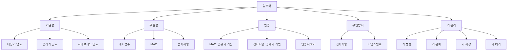

## 출제기준 매핑

| 출제기준 표현 | 공부해야 할 내용 |
| --- | --- |
| 암호 관련 용어 및 암호 시스템의 구성 | 평문, 암호문, 키, 알고리즘, 암호화, 복호화, 난수, 초기화 벡터 |
| 암호 공격의 유형별 특징 | 암호문 단독, 알려진 평문, 선택 평문, 선택 암호문, 전수조사, 생일 공격, 중간자 공격, 부채널 공격 |
| 대칭키 암호시스템 특징 및 활용 | 블록 암호, 스트림 암호, DES, 3DES, AES, SEED, ARIA, 운영 모드 |
| 공개키 암호시스템의 특징 및 활용 | RSA, Diffie-Hellman, ElGamal, DSA, ECC, 하이브리드 암호 |
| 인수분해 기반 공개키 암호방식 | RSA 원리, 공개키/개인키, 소인수분해 난해성 |
| 이산로그 기반 공개키 암호방식 | Diffie-Hellman, ElGamal, DSA, ECC |
| 해시함수의 개요 및 요구사항 | 일방향성, 제2역상 저항성, 충돌 저항성, 무결성 검증 |
| 해시함수별 특징 및 구조 | MD5, SHA-1, SHA-2, SHA-3, 해시 활용과 위험 |
| 메시지 인증 코드의 원리 및 구조 | HMAC, CMAC, CBC-MAC, GMAC, MAC과 전자서명 비교 |

## 암호학 5대 구분

| 구분 | 키 사용 | 제공하는 보안성 | 복호화 | 대표 |
| --- | --- | --- | --- | --- |
| 대칭키 암호 | 같은 비밀키 | 기밀성 | 가능 | AES, SEED, ARIA |
| 공개키 암호 | 공개키/개인키 | 기밀성, 키 교환 | 가능 | RSA, ElGamal, ECC |
| 해시 | 키 없음 | 무결성 보조 | 불가 | SHA-256, SHA-3 |
| MAC | 공유 비밀키 | 무결성, 송신자 인증 | 불가 | HMAC, CMAC |
| 전자서명 | 개인키/공개키 | 무결성, 인증, 부인방지 | 원문 복호화 아님 | RSA 서명, DSA, ECDSA |

시험에서 자주 꼬는 포인트는 `해시는 암호화가 아니다`, `MAC은 부인방지가 약하다`, `전자서명은 기밀성 자체를 제공하지 않는다`, `공개키 암호는 느려서 대용량 데이터는 대칭키로 암호화한다`입니다.

## 보안성별 암호기술 연결

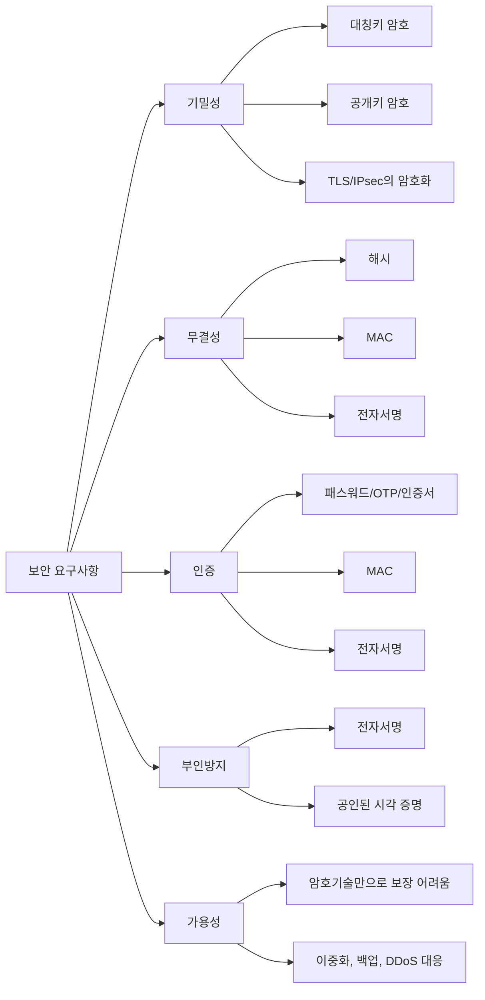

## 암호 시스템 구성요소

- 평문: 보호 전 원래 데이터입니다.
- 암호문: 암호화 결과입니다.
- 암호 알고리즘: 암호화와 복호화 절차입니다.
- 키: 암호 알고리즘의 실제 보안성을 좌우하는 비밀값입니다.
- 난수: 키, 초기화 벡터, nonce 생성에 쓰이는 예측 불가능한 값입니다.
- 초기화 벡터: 같은 평문과 키를 사용해도 다른 암호문이 나오게 하는 값입니다.
- nonce: 한 번만 사용해야 하는 값입니다. 특히 CTR, GCM에서 재사용하면 치명적입니다.

## 암호 공격 유형

| 공격 | 공격자가 가진 정보 | 핵심 |
| --- | --- | --- |
| 암호문 단독 공격 | 암호문만 있음 | 통계, 패턴, 알고리즘 약점 이용 |
| 알려진 평문 공격 | 평문-암호문 쌍 일부를 알고 있음 | 키나 규칙 추정 |
| 선택 평문 공격 | 원하는 평문을 암호화시킬 수 있음 | 암호화 장치를 이용해 규칙 분석 |
| 선택 암호문 공격 | 원하는 암호문을 복호화시킬 수 있음 | 복호화 오류나 반응 이용 |
| 전수조사 공격 | 가능한 키 공간 전체 | 키 길이가 짧으면 위험 |
| 생일 공격 | 해시 충돌 확률 | 충돌 저항성 약화 |
| 중간자 공격 | 통신 중간에 개입 | 인증 없는 키 교환에 취약 |
| 재전송 공격 | 이전 메시지를 재사용 | nonce, timestamp, sequence 필요 |
| 부채널 공격 | 시간, 전력, 오류 반응 | 구현 보안 문제 |

## 고전 암호

고전 암호는 현대 시험에서 계산 문제가 깊게 나오기보다 `대치`, `전치`, `혼돈`, `확산`의 개념을 이해하는 용도로 나옵니다.

| 구분 | 의미 | 예 |
| --- | --- | --- |
| 대치 암호 | 문자를 다른 문자로 바꿈 | 시저, 단일치환, 비즈네르 |
| 전치 암호 | 문자 위치를 바꿈 | 열 전치 |
| 곱 암호 | 대치와 전치를 결합 | 현대 블록 암호의 기초 |
| 일회용 패드 | 완전한 무작위 키를 한 번만 사용 | 이론적으로 안전하지만 키 관리 어려움 |

### 혼돈과 확산

- 혼돈: 키와 암호문 사이 관계를 복잡하게 만들어 추측을 어렵게 합니다.
- 확산: 평문의 작은 변화가 암호문 전체에 퍼지게 합니다.


## 대칭키 암호

### 핵심 특징

- 암호화와 복호화에 같은 키를 사용합니다.
- 속도가 빠르고 대용량 데이터 암호화에 적합합니다.
- 키를 안전하게 공유하고 보관하는 것이 가장 큰 문제입니다.
- 사용자 수가 많아지면 필요한 키 수가 급격히 증가합니다.

### 키 개수 계산

대칭키 방식에서 n명이 서로 각각 안전하게 통신하려면 필요한 키 수는 `n(n-1)/2`개입니다.

| 사용자 수 | 필요한 대칭키 수 |
| ---: | ---: |
| 2명 | 1개 |
| 3명 | 3개 |
| 4명 | 6개 |
| 10명 | 45개 |
| 100명 | 4,950개 |

공개키 방식은 각 사용자가 공개키와 개인키 쌍을 가지므로 n명 기준 키 쌍은 n개입니다. 이 차이가 공개키 암호가 키 분배 문제를 완화한다는 설명의 핵심입니다.

### 블록 암호와 스트림 암호

| 구분 | 처리 단위 | 장점 | 주의 |
| --- | --- | --- | --- |
| 블록 암호 | 고정 크기 블록 | 구조화된 표준과 운영 모드가 다양 | 패딩, 운영 모드, IV 관리 필요 |
| 스트림 암호 | 비트/바이트 흐름 | 실시간 통신에 적합 | 키스트림 재사용 금지 |

### 블록 암호 구조

#### Feistel 구조

DES 계열에서 대표적으로 등장합니다. 암호화와 복호화 구조가 유사하다는 점이 특징입니다.

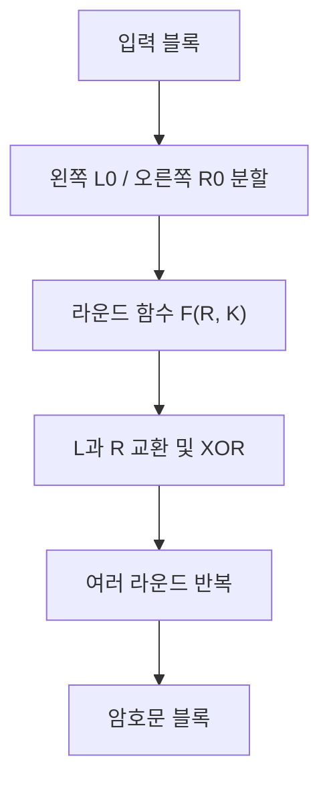

#### SPN 구조

AES 계열에서 대표적으로 등장합니다. 대치와 순열을 반복하여 혼돈과 확산을 만듭니다.


### 주요 대칭키 알고리즘

| 알고리즘 | 블록/키 | 구조 | 시험 포인트 |
| --- | --- | --- | --- |
| DES | 64비트 블록, 56비트 키 | Feistel | 키 길이가 짧아 현재 안전하지 않음 |
| 3DES | DES 3회 적용 | Feistel | DES 보완이지만 느리고 현대 사용은 제한적 |
| AES | 128비트 블록, 128/192/256비트 키 | SPN | 현재 대표 표준 대칭키 암호 |
| SEED | 128비트 블록, 128비트 키 | Feistel 계열 | 국내 개발 블록 암호 |
| ARIA | 128비트 블록, 128/192/256비트 키 | SPN 계열 | 국내 개발 블록 암호 |
| LEA | 128비트 블록, 128/192/256비트 키 | ARX 구조 | 경량/고속 구현에 적합 |

## 블록 암호 운영 모드

운영 모드는 블록 암호를 여러 블록의 긴 데이터에 적용하는 방법입니다.

### ECB

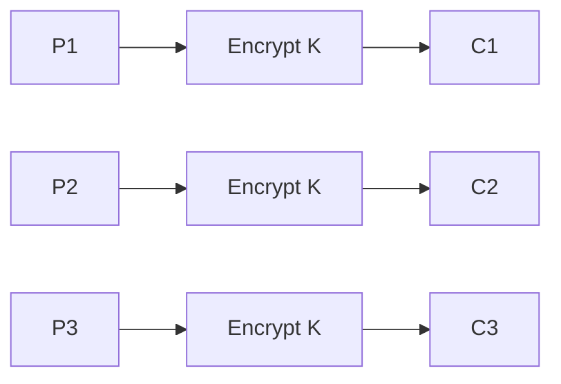

- 같은 평문 블록은 같은 암호문 블록이 됩니다.
- 패턴이 드러나므로 보안 목적에는 부적절합니다.
- 시험 함정: `구현이 간단하고 병렬 가능하지만 안전한 모드라고 보기 어렵다`.

### CBC

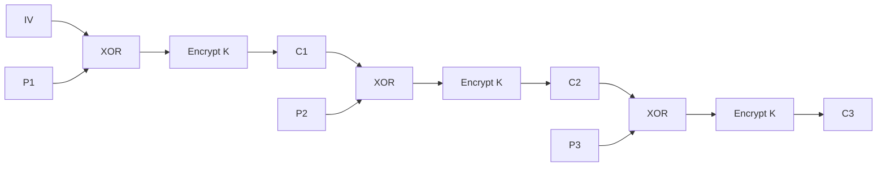

- 이전 암호문 블록을 다음 평문 블록과 XOR합니다.
- 첫 블록에는 IV가 필요합니다.
- 암호화는 순차적이지만 복호화는 일부 병렬 처리가 가능합니다.
- 패딩 오류를 노리는 padding oracle 공격을 조심해야 합니다.

### CFB

- 블록 암호를 스트림 암호처럼 사용할 수 있습니다.
- 자체적으로 패딩이 필요 없을 수 있습니다.
- 전송 중 일부 오류가 뒤 블록에 영향을 줄 수 있습니다.

### OFB

- 암호 알고리즘 출력으로 키스트림을 만들고 평문과 XOR합니다.
- 전송 오류가 해당 비트에만 영향을 주는 경향이 있습니다.
- IV 재사용은 위험합니다.

### CTR

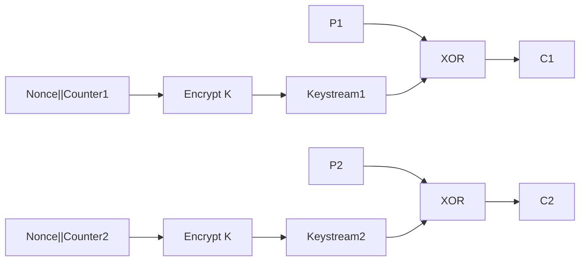

- 카운터 값을 암호화해 키스트림을 만듭니다.
- 병렬 처리에 유리합니다.
- nonce와 counter 조합은 절대 재사용하면 안 됩니다.

### GCM

- CTR 기반 암호화에 인증 태그를 결합한 AEAD 방식입니다.
- 기밀성과 무결성을 함께 제공합니다.
- nonce 재사용 시 기밀성과 무결성이 모두 심각하게 깨질 수 있습니다.

### 운영 모드 암기표

| 모드 | IV/Nonce | 병렬성 | 무결성 제공 | 시험 포인트 |
| --- | --- | --- | --- | --- |
| ECB | 불필요 | 가능 | 없음 | 패턴 노출 |
| CBC | IV 필요 | 암호화 순차 | 없음 | IV 예측/재사용 주의, 패딩 주의 |
| CFB | IV 필요 | 제한적 | 없음 | 스트림처럼 사용 |
| OFB | IV 필요 | 제한적 | 없음 | 키스트림 재사용 금지 |
| CTR | nonce/counter 필요 | 가능 | 없음 | counter 재사용 금지 |
| GCM | nonce 필요 | 가능 | 있음 | AEAD, 인증 태그 |

## 공개키 암호

### 핵심 특징

- 공개키는 공개하고 개인키는 비밀로 보관합니다.
- 키 분배, 전자서명, 인증서에 강합니다.
- 대칭키보다 느리므로 대용량 데이터는 보통 대칭키로 암호화합니다.

### 공개키 암호 사용 그림

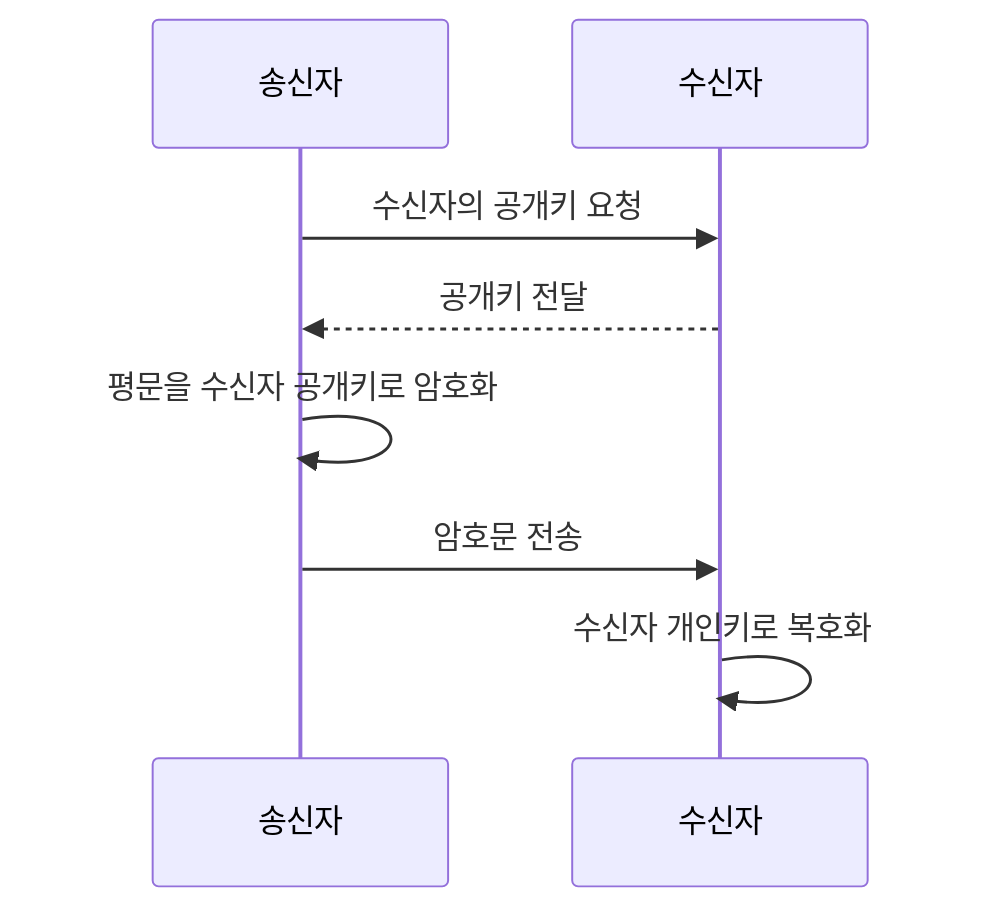

중요한 문장: `기밀성을 위해서는 수신자의 공개키로 암호화하고 수신자의 개인키로 복호화한다.`

### 전자서명 사용 그림

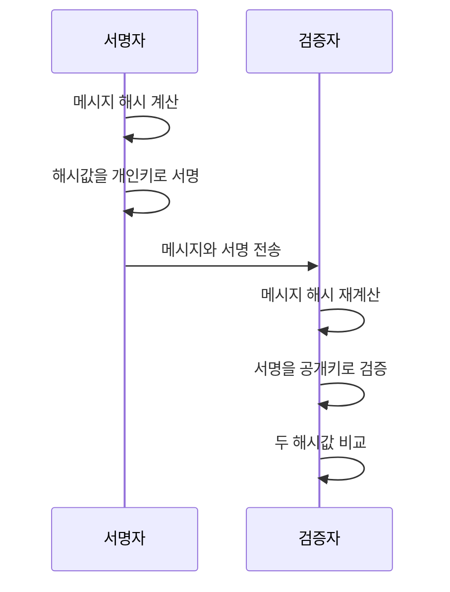

중요한 문장: `전자서명은 서명자의 개인키로 생성하고 서명자의 공개키로 검증한다.`

## RSA

### 원리

RSA는 큰 수의 소인수분해가 어렵다는 성질에 기반합니다.

1. 두 소수 p, q를 고릅니다.
2. n = p × q를 계산합니다.
3. φ(n) = (p-1)(q-1)을 계산합니다.
4. 공개 지수 e를 고릅니다.
5. e × d ≡ 1 mod φ(n)을 만족하는 개인 지수 d를 구합니다.
6. 공개키는 (e, n), 개인키는 (d, n)입니다.

### 아주 작은 계산 예시

실제 보안에는 절대 쓸 수 없는 작은 숫자입니다. 시험 원리 이해용입니다.

```text
p = 5, q = 11
n = 55
φ(n) = 4 × 10 = 40
e = 3
d = 27  -> 3 × 27 = 81 ≡ 1 (mod 40)

공개키: (3, 55)
개인키: (27, 55)

평문 M = 7
암호문 C = 7^3 mod 55 = 13
복호화 M = 13^27 mod 55 = 7
```

### RSA 시험 포인트

- 공개키로 암호화하면 개인키로만 복호화합니다.
- 개인키로 서명하면 공개키로 검증합니다.
- p, q, φ(n), d가 노출되면 위험합니다.
- 같은 메시지를 안전한 패딩 없이 바로 암호화하는 것은 위험합니다.
- RSA는 대칭키보다 느리므로 세션키 암호화에 주로 사용합니다.

## Diffie-Hellman 키 교환

### 목적

서로 비밀값을 직접 보내지 않고도 공통 비밀키를 만들기 위한 방식입니다.

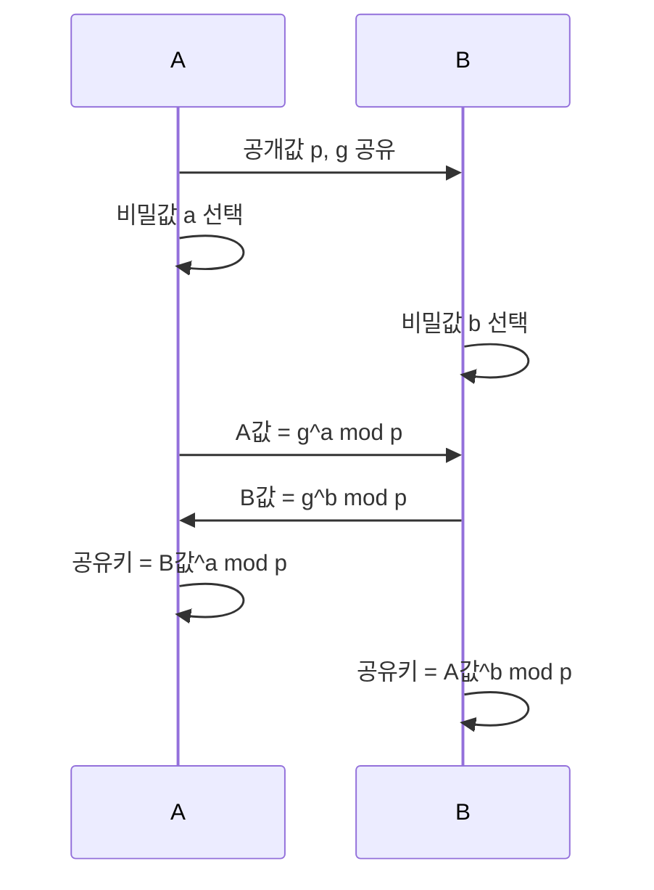

### 작은 계산 예시

```text
p = 23, g = 5
A의 비밀값 a = 6
B의 비밀값 b = 15

A가 보내는 값 = 5^6 mod 23 = 8
B가 보내는 값 = 5^15 mod 23 = 19

A의 공유키 = 19^6 mod 23 = 2
B의 공유키 = 8^15 mod 23 = 2
```

### 중간자 공격

Diffie-Hellman은 단독으로는 상대방 인증을 제공하지 않습니다. 공격자가 중간에서 값을 바꿔치기하면 A와 공격자, 공격자와 B가 각각 다른 키를 공유하게 됩니다. 따라서 인증서, 전자서명, 사전 공유키 같은 인증 수단과 함께 사용해야 합니다.

## ElGamal, DSA, ECC

| 방식 | 기반 문제 | 주요 용도 | 시험 포인트 |
| --- | --- | --- | --- |
| ElGamal | 이산로그 문제 | 암호화, 서명 | 암호문 크기가 커질 수 있음 |
| DSA | 이산로그 문제 | 전자서명 | 서명 전용으로 이해 |
| ECDSA | 타원곡선 이산로그 | 전자서명 | 짧은 키로 높은 보안 수준 |
| ECDH | 타원곡선 이산로그 | 키 교환 | TLS 등에서 사용 |

ECC는 같은 보안 수준에서 RSA보다 짧은 키 길이를 사용할 수 있어 모바일, IoT, 인증서 환경에서 유리합니다.

## 하이브리드 암호

실제 보안 프로토콜은 공개키와 대칭키를 조합합니다.

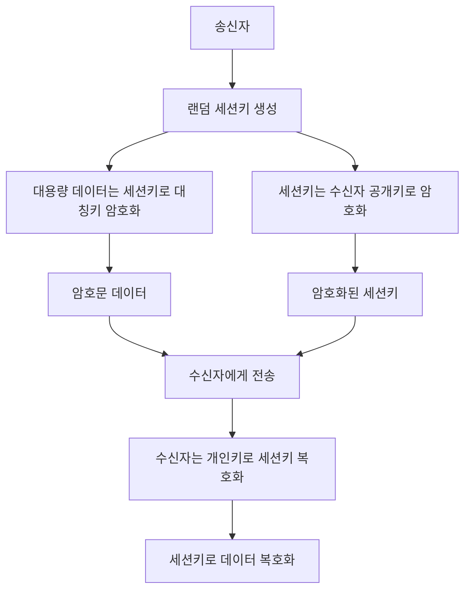

시험 문장: `대칭키는 빠르지만 키 분배가 어렵고, 공개키는 키 분배에 유리하지만 느리므로 실제 시스템은 하이브리드 방식을 사용한다.`

## 해시함수

### 핵심 요구사항

| 요구사항 | 의미 | 깨졌을 때 문제 |
| --- | --- | --- |
| 일방향성 | 해시값에서 원문을 찾기 어려움 | 비밀번호 원문 추정 |
| 제2역상 저항성 | 주어진 원문과 같은 해시의 다른 원문 찾기 어려움 | 문서 바꿔치기 |
| 충돌 저항성 | 같은 해시를 갖는 임의의 두 입력 찾기 어려움 | 위조 문서 생성 |
| 눈사태 효과 | 입력 1비트 변화가 출력 전체에 영향 | 패턴 분석 어려움 |

### 해시 활용

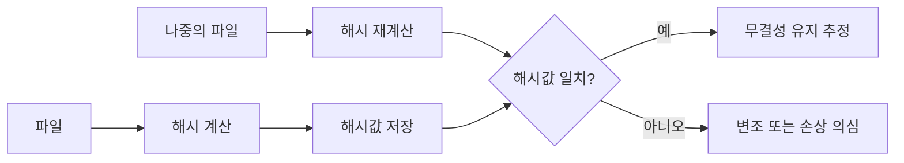

### 주요 해시 알고리즘

| 알고리즘 | 출력 길이 | 시험 포인트 |
| --- | ---: | --- |
| MD5 | 128비트 | 충돌 취약, 보안 목적 사용 지양 |
| SHA-1 | 160비트 | 충돌 취약, 보안 목적 사용 지양 |
| SHA-256 | 256비트 | SHA-2 계열, 널리 사용 |
| SHA-512 | 512비트 | SHA-2 계열 |
| SHA-3 | 다양 | Keccak 기반, SHA-2와 구조 다름 |

### 생일 공격

생일 공격은 해시값의 충돌을 찾는 공격입니다. n비트 해시의 충돌 공격 난이도는 대략 `2^(n/2)` 수준으로 이해합니다.

| 해시 출력 | 충돌 공격 난이도 감각 |
| --- | --- |
| 128비트 | 약 2^64 |
| 160비트 | 약 2^80 |
| 256비트 | 약 2^128 |

시험 함정: `256비트 해시는 충돌 공격 난이도가 2^256이다`라고 하면 일반적인 생일 공격 관점에서는 틀린 설명입니다. 충돌은 대략 2^128 수준입니다. 단, 특정 원문에 대한 역상 공격은 2^256 수준으로 봅니다.

### 비밀번호 저장

비밀번호는 암호화해서 저장하는 것보다 안전한 비밀번호 해시 방식으로 저장해야 합니다.

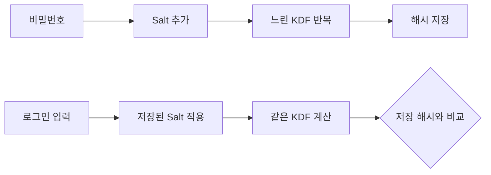

- Salt: 같은 비밀번호도 서로 다른 해시가 나오게 하는 공개 난수입니다.
- Pepper: 시스템이 별도로 보관하는 비밀값입니다.
- Key Stretching: 계산을 의도적으로 느리게 하여 대입 공격을 어렵게 합니다.
- 대표 방식: PBKDF2, bcrypt, scrypt, Argon2

## MAC

### MAC의 목적

메시지 인증 코드는 공유 비밀키를 이용해 메시지 무결성과 송신자 인증을 제공합니다.

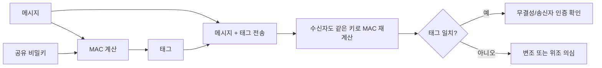

### MAC 종류

| 종류 | 기반 | 포인트 |
| --- | --- | --- |
| HMAC | 해시함수 | SHA-256 등과 결합 |
| CBC-MAC | 블록 암호 | 길이가 고정된 메시지에 적합 |
| CMAC | 블록 암호 | CBC-MAC 개선 |
| GMAC | GCM 인증 부분 | GCM과 관련 |

### MAC과 전자서명 차이

| 항목 | MAC | 전자서명 |
| --- | --- | --- |
| 키 | 송수신자 공유키 | 서명자 개인키, 검증자 공개키 |
| 무결성 | 제공 | 제공 |
| 송신자 인증 | 제공 | 제공 |
| 부인방지 | 약함 | 제공 |
| 제3자 검증 | 어려움 | 가능 |
| 속도 | 빠름 | 상대적으로 느림 |

시험 함정: `MAC은 송수신자가 같은 키를 공유하므로 제3자에게 누가 만들었는지 강하게 증명하기 어렵다. 그래서 부인방지는 전자서명이 담당한다.`

## AEAD

AEAD는 암호화와 인증을 함께 제공합니다.

- 대표: AES-GCM, ChaCha20-Poly1305
- 제공: 기밀성, 무결성, 인증 태그
- 관련 데이터: 암호화하지 않지만 무결성 검증에는 포함할 수 있는 데이터입니다.
- 주의: nonce 재사용 금지

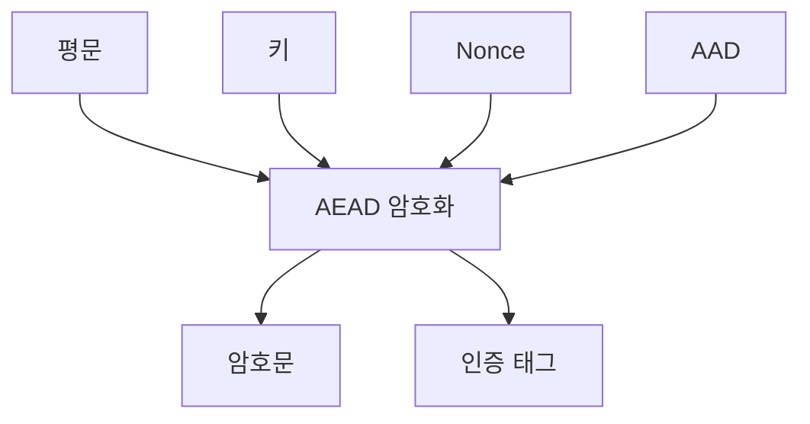

## 전자서명

### 전자서명이 제공하는 것

- 무결성
- 서명자 인증
- 부인방지

### 전자서명이 직접 제공하지 않는 것

- 기밀성
- 가용성

전자서명된 문서도 내용은 보일 수 있습니다. 내용을 숨기려면 별도 암호화가 필요합니다.

### 서명과 암호화 방향 비교

| 목적 | 사용하는 키 | 결과 |
| --- | --- | --- |
| 기밀성 | 수신자의 공개키로 암호화 | 수신자의 개인키만 복호화 |
| 서명 | 송신자의 개인키로 서명 | 누구나 송신자의 공개키로 검증 |

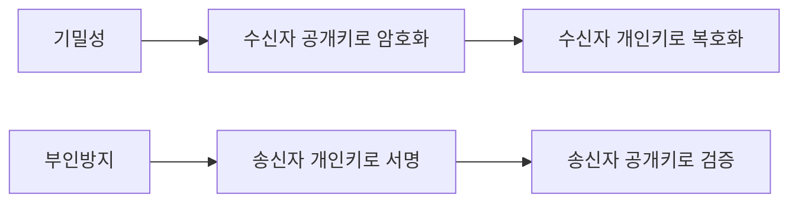

## PKI

### PKI 구성요소

| 구성요소 | 역할 |
| --- | --- |
| CA | 인증서 발급과 서명 |
| RA | 신원확인과 등록 업무 |
| 인증서 | 공개키와 주체 정보를 CA가 보증 |
| 저장소 | 인증서와 폐지정보 제공 |
| CRL | 폐지된 인증서 목록 |
| OCSP | 인증서 상태를 실시간 질의 |
| 이용자 | 인증서 발급, 사용, 검증 주체 |

### 인증서 검증 흐름

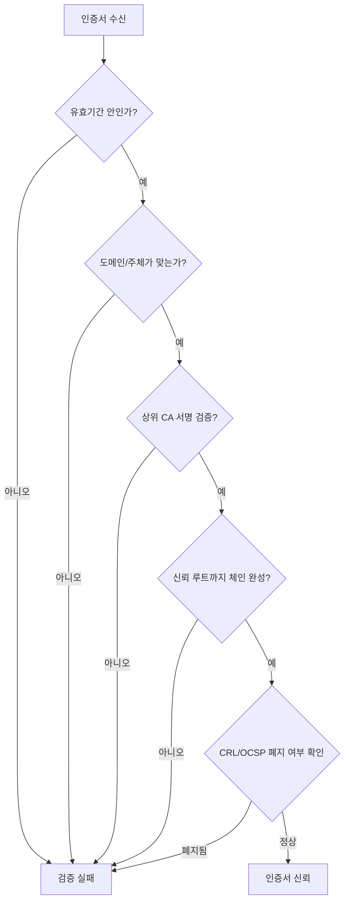

### 인증서 주요 필드

- 주체: 인증서 소유자 정보
- 발급자: 인증서를 발급한 CA
- 공개키: 주체의 공개키
- 유효기간: 시작일과 만료일
- 일련번호: 인증서 식별자
- 서명 알고리즘: CA가 인증서에 서명한 알고리즘
- 확장 필드: 키 용도, 주체 대체 이름 등

### CRL과 OCSP 비교

| 구분 | CRL | OCSP |
| --- | --- | --- |
| 방식 | 폐지 목록 다운로드 | 특정 인증서 상태 실시간 질의 |
| 장점 | 구조 단순 | 최신 상태 확인에 유리 |
| 단점 | 목록이 커질 수 있음 | OCSP 서버 의존 |
| 시험 포인트 | 인증서 폐지목록 | 온라인 인증서 상태 확인 |

## Kerberos

Kerberos는 대칭키 기반의 중앙 인증 프로토콜입니다.

### 구성요소

- Client: 사용자
- AS: 인증 서버
- TGS: 티켓 발급 서버
- Service Server: 실제 서비스 서버
- KDC: AS와 TGS를 포함하는 키 분배 센터
- TGT: 서비스 티켓을 받기 위한 티켓

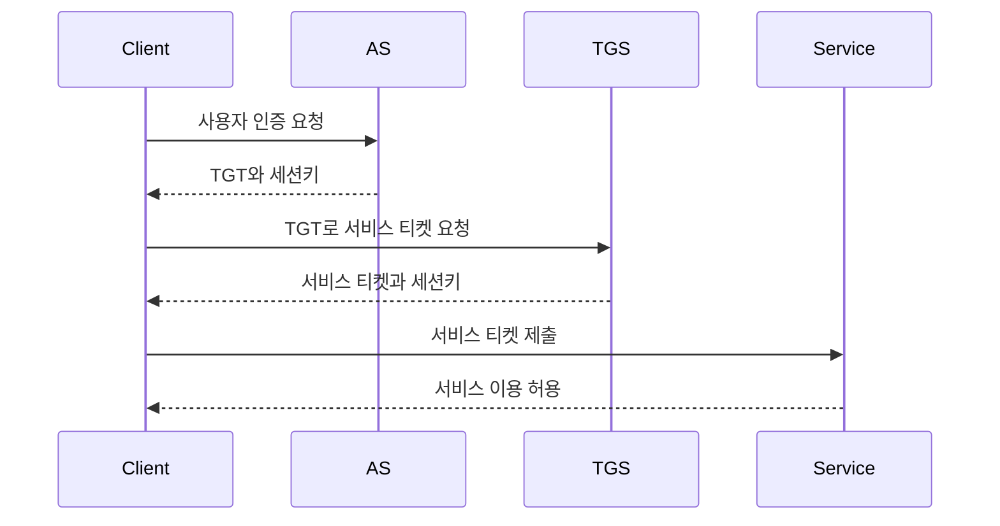

### Kerberos 시험 포인트

- 암호를 매번 네트워크로 보내지 않습니다.
- 티켓 기반 인증입니다.
- 시간 동기화가 중요합니다.
- KDC가 핵심 신뢰 지점입니다.
- 대칭키 기반이므로 키 관리가 중요합니다.

## TLS와 암호학

TLS는 여러 암호기술을 조합합니다.

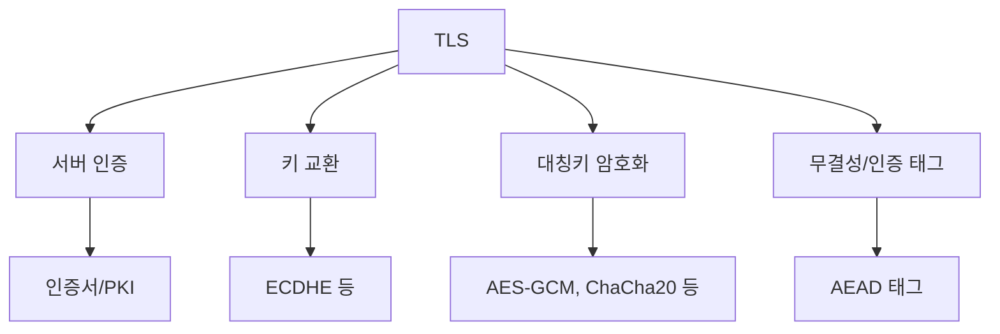

시험에서 TLS는 `인증서로 서버를 검증하고, 키 교환으로 세션키를 만들고, 실제 데이터는 빠른 대칭키 암호로 보호한다`로 정리하면 됩니다.

## IPsec과 암호학

| 항목 | 핵심 |
| --- | --- |
| AH | 무결성, 인증 중심. 암호화는 제공하지 않음 |
| ESP | 기밀성, 무결성, 인증 제공 가능 |
| 전송 모드 | IP 페이로드 보호 |
| 터널 모드 | 원래 IP 패킷 전체를 보호하고 새 IP 헤더를 붙임 |
| IKE | 보안 연관과 키 교환 |

```mermaid
flowchart LR
    A["IPsec"] --> B["AH"]
    A --> C["ESP"]
    A --> D["IKE"]
    B --> B1["인증/무결성"]
    C --> C1["암호화"]
    C --> C2["인증/무결성"]
    D --> D1["키 교환"]
    D --> D2["보안 연관 협상"]
```

## PGP와 S/MIME

메일 보안에서 함께 나올 수 있습니다.

| 구분 | PGP | S/MIME |
| --- | --- | --- |
| 신뢰 구조 | Web of Trust 성격 | PKI 기반 |
| 적용 | 파일/메일 암호화와 서명 | 이메일 보안 표준 |
| 시험 포인트 | 공개키 기반, 하이브리드 암호 | 인증서 기반 메일 보안 |

## 키 관리

### 키 생명주기

```mermaid
flowchart LR
    A["키 생성"] --> B["키 등록/배포"]
    B --> C["키 저장"]
    C --> D["키 사용"]
    D --> E["키 교체"]
    E --> F["키 폐기"]
    F --> G["폐기 기록"]
```

### 키 관리 체크

- 안전한 난수 생성기로 키를 생성합니다.
- 키는 용도별로 분리합니다.
- 개인키와 대칭키는 암호화하여 저장합니다.
- 접근권한을 최소화합니다.
- 키 백업과 복구 절차를 마련합니다.
- 키 유출 시 폐기와 재발급 절차가 있어야 합니다.
- 개발 코드, 깃 저장소, 로그에 키를 남기지 않습니다.

## 난수와 nonce

| 구분 | 의미 | 주의 |
| --- | --- | --- |
| 난수 | 예측 불가능한 값 | 약한 난수는 키 예측으로 이어짐 |
| IV | 암호 운영 모드 시작값 | CBC 등에서 예측/재사용 주의 |
| nonce | 한 번만 쓰는 값 | CTR/GCM에서 재사용 금지 |
| Salt | 비밀번호 해시 다양화 값 | 비밀일 필요는 없지만 고유해야 함 |

시험 함정: `IV는 항상 비밀이어야 한다`는 표현은 일반적으로 틀립니다. 많은 모드에서 IV는 비밀보다 `유일성`, `무작위성`, `예측 불가능성`이 중요합니다. 다만 모드마다 요구사항이 다릅니다.

## 자주 나오는 함정 문장

| 문장 | 판단 |
| --- | --- |
| 해시는 복호화할 수 있다 | 틀림 |
| 전자서명은 기밀성을 제공한다 | 틀림 |
| MAC은 무결성과 송신자 인증을 제공한다 | 맞음 |
| MAC은 제3자에 대한 부인방지가 강하다 | 틀림 |
| 공개키 암호는 대칭키보다 빠르다 | 틀림 |
| RSA는 소인수분해 난해성에 기반한다 | 맞음 |
| Diffie-Hellman은 단독으로 상대 인증을 제공한다 | 틀림 |
| ECB는 같은 평문 블록이 같은 암호문 블록이 된다 | 맞음 |
| GCM은 인증 태그를 제공한다 | 맞음 |
| MD5와 SHA-1은 충돌 취약점 때문에 보안 목적에 부적합하다 | 맞음 |
| Salt는 같은 비밀번호의 같은 해시 생성을 막는다 | 맞음 |
| 개인키는 공개해도 된다 | 틀림 |
| 인증서 폐지 여부는 CRL 또는 OCSP로 확인한다 | 맞음 |

## 필기 선택지 대비 압축 비교

### 기밀성, 무결성, 인증, 부인방지

| 기술 | 기밀성 | 무결성 | 인증 | 부인방지 |
| --- | --- | --- | --- | --- |
| 대칭키 암호 | 가능 | 단독으로 부족 | 단독으로 부족 | 부족 |
| 공개키 암호화 | 가능 | 단독으로 부족 | 수신자 관점 제한 | 부족 |
| 해시 | 불가 | 가능 | 불가 | 불가 |
| MAC | 불가 | 가능 | 가능 | 부족 |
| 전자서명 | 불가 | 가능 | 가능 | 가능 |
| AEAD | 가능 | 가능 | 가능 | 부족 |

### 암호 알고리즘 분류

| 분류 | 알고리즘 |
| --- | --- |
| 대칭키 블록 암호 | DES, 3DES, AES, SEED, ARIA, LEA |
| 대칭키 스트림 암호 | RC4, ChaCha20 |
| 공개키 암호 | RSA, ElGamal, ECC |
| 키 교환 | Diffie-Hellman, ECDH |
| 전자서명 | RSA 서명, DSA, ECDSA |
| 해시 | MD5, SHA-1, SHA-2, SHA-3 |
| MAC | HMAC, CMAC, GMAC |

## 실기형 답안 문장

### 비밀번호 저장 취약

```text
비밀번호를 평문 또는 단순 해시로 저장하면 DB 유출 시 사용자 비밀번호가 쉽게 노출되거나 대입 공격으로 추정될 수 있다.
사용자별 고유 Salt를 적용하고 PBKDF2, bcrypt, scrypt, Argon2 같은 느린 비밀번호 해시 함수를 사용한다.
또한 비밀번호 해시와 Salt 접근권한을 제한하고, 유출 의심 시 비밀번호 재설정과 로그 점검을 수행한다.
```

### TLS 인증서 검증 실패

```text
인증서 유효기간, 도메인 일치 여부, 인증서 체인, 폐지 여부를 검증하지 않으면 중간자 공격으로 위조 서버에 접속할 수 있다.
신뢰 가능한 루트 CA까지 인증서 체인을 검증하고 CRL 또는 OCSP로 폐지 여부를 확인한다.
클라이언트는 인증서 오류를 무시하지 않도록 정책을 적용한다.
```

### 암호화 키 노출

```text
암호화 키가 소스코드나 저장소에 포함되면 공격자가 데이터를 복호화하거나 위조 요청을 만들 수 있다.
키는 별도 비밀관리 시스템에 저장하고 접근권한을 최소화하며, 노출된 키는 즉시 폐기 후 재발급한다.
이후 저장소 이력, 로그, 배포 환경에서 동일 키가 남아 있는지 점검한다.
```

### ECB 사용

```text
ECB 모드는 같은 평문 블록이 같은 암호문 블록으로 변환되어 데이터 패턴이 노출될 수 있다.
민감정보 암호화에는 CBC, CTR, GCM 등 적절한 운영 모드를 사용하고 IV 또는 nonce가 재사용되지 않도록 관리한다.
무결성이 필요한 경우 GCM 같은 인증 암호 모드나 별도 MAC을 함께 적용한다.
```

### Diffie-Hellman 중간자 공격

```text
Diffie-Hellman 키 교환은 공통키를 안전하게 생성할 수 있지만 단독으로 상대방 인증을 제공하지 않는다.
공격자가 중간에서 공개 값을 바꿔치기하면 각 통신 주체가 공격자와 별도 키를 공유할 수 있다.
따라서 인증서, 전자서명, 사전 공유키 등 인증 메커니즘과 함께 사용해야 한다.
```

## 계산 문제 대비

### 모듈러 연산 감각

```text
17 mod 5 = 2
23 mod 7 = 2
2^5 mod 13 = 32 mod 13 = 6
```

### 서로소

두 수의 최대공약수가 1이면 서로소입니다. RSA에서 공개 지수 e는 φ(n)과 서로소여야 합니다.

```text
gcd(3, 40) = 1 -> 서로소
gcd(4, 40) = 4 -> 서로소 아님
```

### 모듈러 역원

`e × d ≡ 1 mod φ(n)`을 만족하는 d가 e의 모듈러 역원입니다.

```text
3 × 27 = 81
81 mod 40 = 1
따라서 27은 3의 mod 40 역원
```

## 암호학 마지막 30분 체크

- 대칭키는 빠르지만 키 분배가 어렵다.
- 공개키는 키 분배와 전자서명에 유리하지만 느리다.
- 실제 데이터 보호는 하이브리드 방식이 많다.
- 해시는 복호화하지 않는다.
- MAC은 공유키 기반이라 부인방지가 약하다.
- 전자서명은 개인키로 서명하고 공개키로 검증한다.
- 기밀성 암호화는 수신자 공개키로 암호화하고 수신자 개인키로 복호화한다.
- RSA는 소인수분해, DH/DSA/ECC는 이산로그 계열로 묶는다.
- ECB는 패턴 노출, GCM은 인증 태그와 nonce 관리가 핵심이다.
- MD5와 SHA-1은 충돌 취약점으로 보안 목적에 부적합하다.
- 인증서 검증은 유효기간, 도메인, 체인, 폐지 여부를 본다.
- CRL은 목록, OCSP는 온라인 상태 확인이다.
- 비밀번호는 Salt와 느린 KDF로 저장한다.
- nonce, IV, key 재사용은 모드에 따라 치명적이다.

