# 10. 빈출 그림요약

이 문서는 정보보안기사 필기 5과목과 실기 정보보안실무에서 시험에 자주 연결될 가능성이 높은 흐름을 그림 중심으로 정리한 빠른 회독용 자료입니다. 실제 문제는 회차마다 달라질 수 있으므로, 여기서는 공식 출제기준 안에서 반복적으로 묻기 좋은 구조와 함정 포인트를 모았습니다.

## 전체 출제 지도

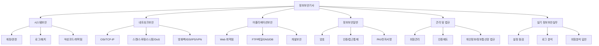

## A급 우선순위

| 과목 | 먼저 외울 것 | 이유 |
| --- | --- | --- |
| 시스템보안 | 계정, 권한, 로그, 원격접속, 패치 | 실기 설정 점검과 바로 연결 |
| 네트워크보안 | OSI, TCP 플래그, 포트, DoS/DDoS, 스푸핑 | 문제에서 로그/패킷 근거로 자주 꼬기 좋음 |
| 어플리케이션보안 | SQL 삽입, XSS, CSRF, 파일 업로드, DNS/메일 보안 | 공격명-원인-대응 연결이 명확함 |
| 정보보안일반 | 대칭키/공개키/해시/MAC/전자서명/PKI | 선택지 함정이 많음 |
| 관리 및 법규 | 위험관리, 사고대응, 개인정보보호 안전조치 | 실기 서술형으로 쓰기 좋음 |

## 시스템보안 그림

### 시스템 하드닝 흐름

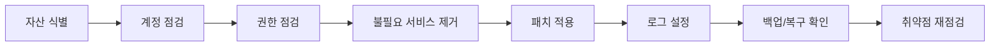

### 시스템 침해사고 흔한 흐름

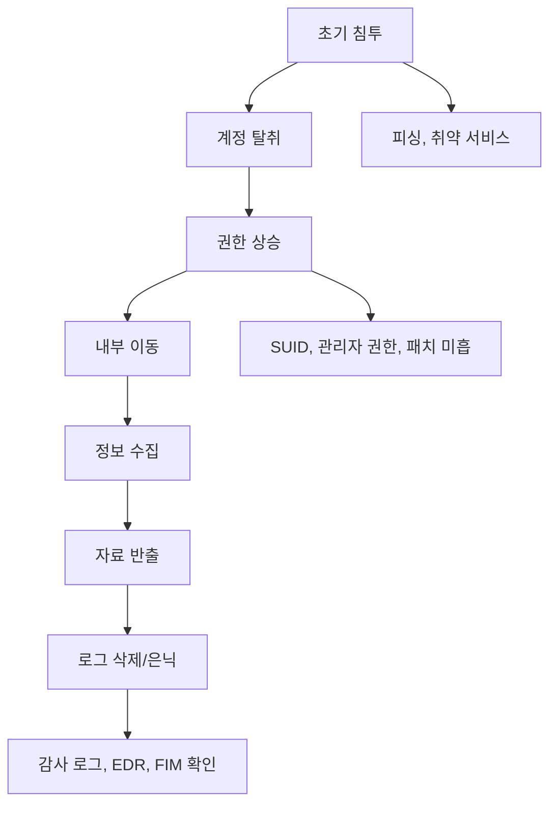

### 운영체제 점검 포인트

| 점검 | 윈도우 | 리눅스/유닉스 |
| --- | --- | --- |
| 계정 | `net user`, 관리자 그룹 | `/etc/passwd`, `/etc/shadow`, UID 0 |
| 권한 | NTFS 권한, 공유 권한 | rwx, SUID, SGID, Sticky bit |
| 로그 | 이벤트 뷰어 | `/var/log/*`, `journalctl` |
| 원격접속 | RDP, WinRM | SSH, sudo |
| 예약작업 | 작업 스케줄러 | cron, at |

### 실기 답안 공식

```text
취약 상태: [설정/로그/권한 문제]
위험: [비인가 접근/권한 상승/정보유출/추적 실패]
조치: [구체 설정 변경]
확인: [명령어/로그/재점검]
재발 방지: [정기 점검/승인 절차/모니터링]
```

## 네트워크보안 그림

### OSI 계층별 공격 연결

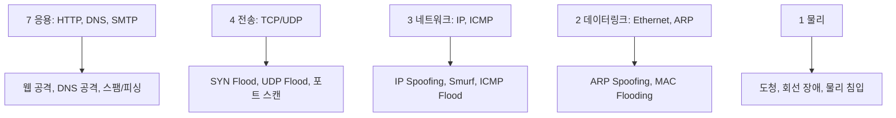

### TCP 연결과 SYN Flood

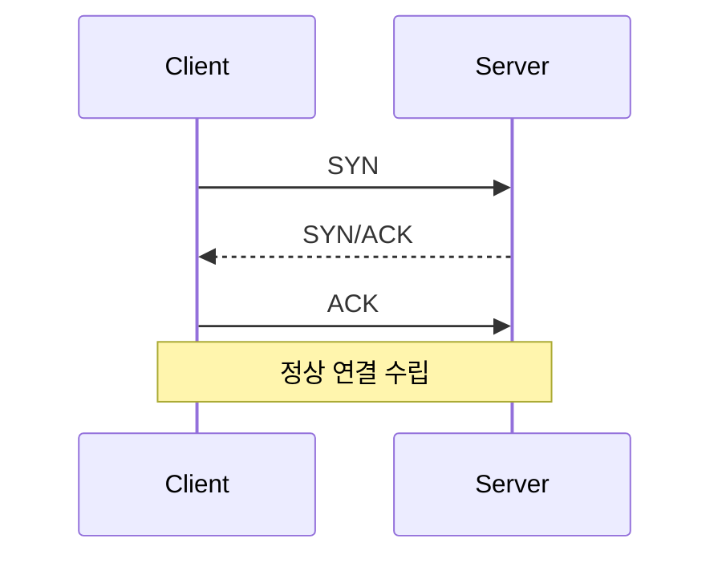

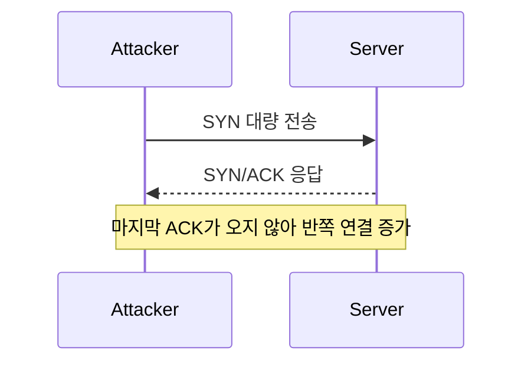

### 스푸핑/스니핑/하이재킹 관계

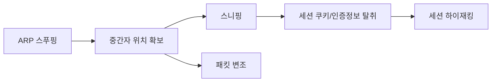

### 보안장비 위치 감각

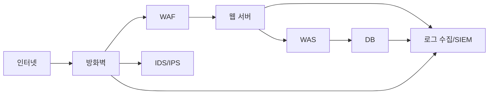

### 공격별 바로 대응

| 공격 | 로그/패킷 근거 | 1차 대응 | 재발 방지 |
| --- | --- | --- | --- |
| 포트 스캔 | 다수 포트 순차 접근 | 차단, 탐지 룰 적용 | 외부 노출 포트 최소화 |
| SYN Flood | SYN 급증, 반쪽 연결 | SYN Cookies, rate limit | DDoS 대응장비, 임계치 모니터링 |
| ARP 스푸핑 | ARP 테이블 변경 | 공격 단말 격리 | 포트 보안, 정적 ARP |
| DNS 증폭 | UDP 53 대량 응답 | 오픈 리졸버 차단 | 재귀 질의 제한 |
| 원격접속 공격 | 로그인 실패 반복 | 계정 잠금, IP 차단 | MFA, VPN, 허용 IP 제한 |

## 어플리케이션보안 그림

### 웹 요청 처리와 취약점 위치

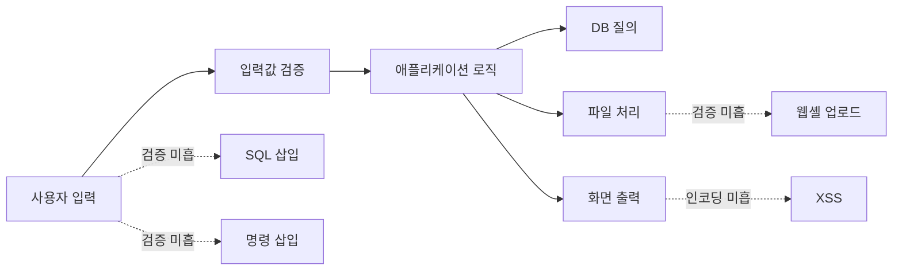

### SQL 삽입 흐름

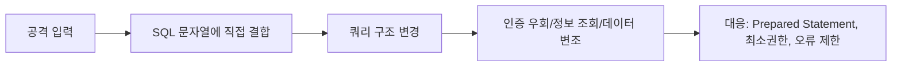

### XSS와 CSRF 차이

| 구분 | XSS | CSRF |
| --- | --- | --- |
| 핵심 | 스크립트가 피해자 브라우저에서 실행 | 피해자가 인증된 상태로 원치 않는 요청 |
| 원인 | 출력 인코딩 미흡 | 요청 위조 방어 미흡 |
| 피해 | 세션 탈취, 피싱 | 비밀번호 변경, 결제, 글쓰기 |
| 대응 | 출력 인코딩, CSP, HttpOnly | CSRF 토큰, SameSite, 재인증 |

### 파일 업로드 공격

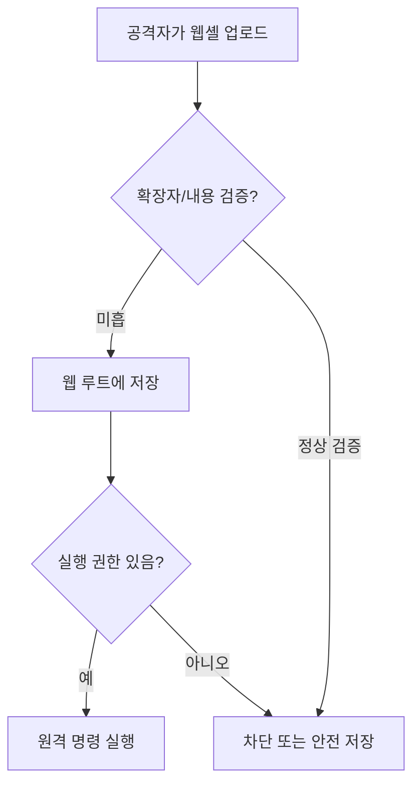

### DNS 보안

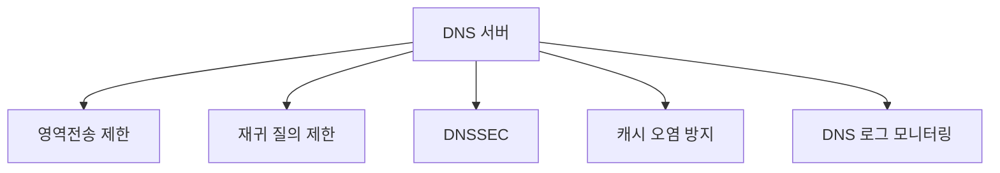

## 정보보안일반 그림

### 접근통제 모델 선택

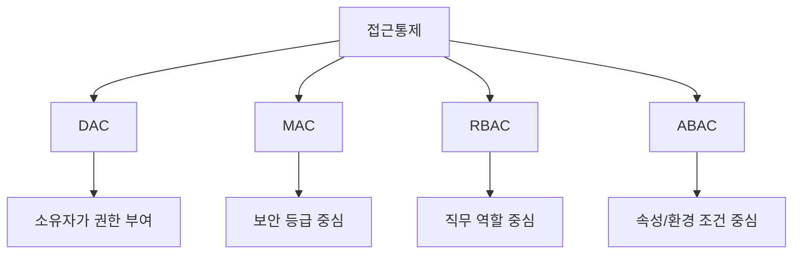

### 암호학은 09번 파일

암호학은 [09-암호학-심화-그림정리.md](09-암호학-심화-그림정리.md)에 별도 확장했습니다. 시험 직전에는 다음 5개 그림을 우선 봅니다.

- 암호학 전체 지도
- 하이브리드 암호
- 전자서명 흐름
- 인증서 검증 흐름
- 블록 암호 운영 모드

## 관리 및 법규 그림

### 위험관리 전체 흐름

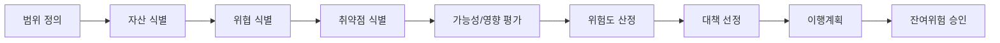

### 위험처리 전략

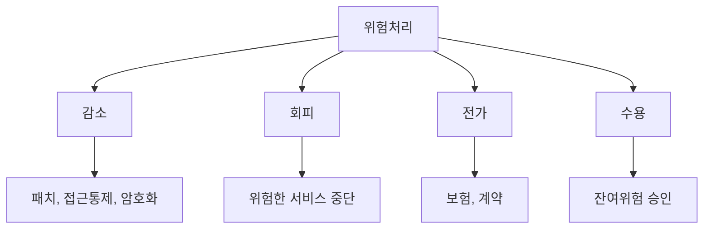

### 침해사고 대응

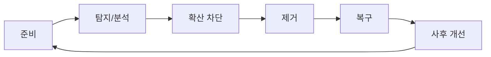

### 디지털 포렌식 핵심

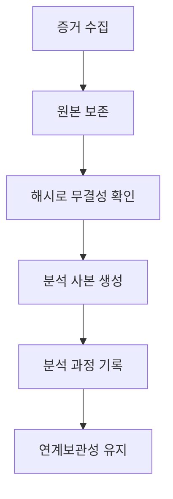

### 개인정보 처리 흐름

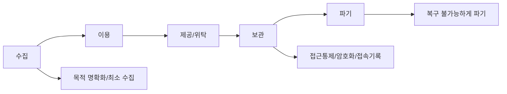

## 실기 종합 답안 구조

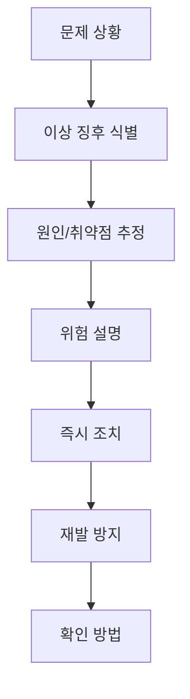

## 과목별 마지막 체크

### 시스템보안

- 불필요 계정과 기본 계정 제거
- 관리자 권한 최소화
- 원격접속 제한과 MFA
- 로그 활성화와 중앙 수집
- 패치와 취약점 조치 이력
- 백업과 복구 시험

### 네트워크보안

- OSI 계층별 장비와 프로토콜
- TCP 3-way handshake와 플래그
- 포트 스캔, 스푸핑, 스니핑, DoS/DDoS
- 방화벽 정책 검토
- IDS/IPS 탐지와 차단 차이
- VPN, NAT, VLAN, NAC

### 어플리케이션보안

- FTP 익명 접속과 평문 전송
- 메일 오픈 릴레이, SPF/DKIM/DMARC
- 웹 취약점 원인과 대응
- DNS 영역전송과 재귀 질의 제한
- DB 계정 최소권한과 암호화
- 개발보안: 입력검증, 출력인코딩, 인증/인가

### 정보보안일반

- 대칭키와 공개키 차이
- 해시, MAC, 전자서명 차이
- 접근통제 모델
- PKI 구성요소와 인증서 검증
- 암호 운영 모드

### 관리 및 법규

- 위험 = 위협이 취약점을 이용해 자산에 영향을 주는 가능성
- 위험처리: 감소, 회피, 전가, 수용
- 보호대책: 관리적, 물리적, 기술적
- 사고대응: 준비, 탐지/분석, 차단, 제거, 복구, 사후개선
- 개인정보 안전성 확보조치

