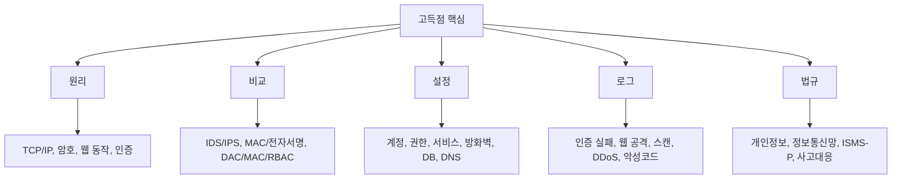
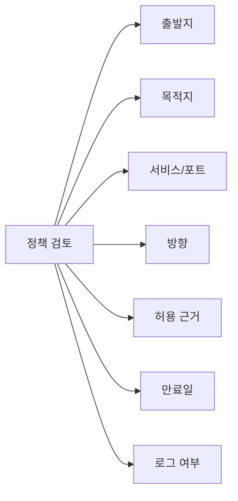
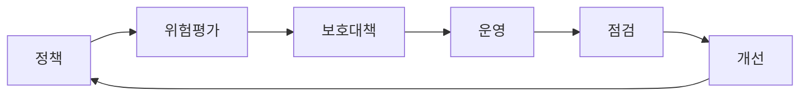

# 11. 전과목 심화 키워드맵

이 문서는 `나올 수 있는 모든 가능성`을 염두에 두고, 공식 출제기준 안의 키워드를 문제로 바꾸기 쉬운 형태로 다시 펼친 자료입니다. 시험은 회차마다 달라지므로 적중을 보장할 수는 없지만, 아래 항목은 선택지, 단답, 서술형, 로그분석, 설정점검 문제로 변형되기 쉬운 핵심입니다.

## 공부 우선순위 지도

## 시스템보안 심화

### 출제 가능 포인트

| 영역 | 문제화 포인트 | 암기 문장 |
| --- | --- | --- |
| 계정관리 | 불필요 계정, 기본 계정, 공유 계정, 휴면 계정 | 계정은 식별성과 책임추적성을 위해 개인별 최소권한으로 운영한다 |
| 인증 | 암호 정책, 계정 잠금, MFA, 인증 로그 | 인증 실패 반복은 대입 공격 징후일 수 있다 |
| 권한 | 관리자 권한, 파일 권한, SUID, 공유 권한 | 권한은 업무상 필요한 최소 범위로 부여한다 |
| 서비스 | 불필요 서비스, 원격관리, 배너 정보 | 서비스가 적을수록 공격 표면이 줄어든다 |
| 로그 | 인증, 권한변경, 서비스 변경, 시스템 오류 | 로그는 사고 원인 분석과 책임추적의 핵심 증거다 |
| 패치 | OS, 미들웨어, 라이브러리, 펌웨어 | 알려진 취약점은 패치 지연 자체가 위험이다 |
| 백업 | 주기, 암호화, 오프라인, 복구시험 | 백업은 존재보다 복구 가능성이 중요하다 |
| 악성코드 | 랜섬웨어, 백도어, 루트킷, 키로거 | 감염 시 격리, 증거보존, 제거, 복구, 재발방지 순서로 대응한다 |
| 클라우드 | IAM, 보안그룹, 공개 저장소, 키 관리 | 클라우드는 계정권한과 공개 설정 오류가 주요 위험이다 |
| IoT/프린터 | 기본 암호, 펌웨어, 원격관리 | 비전통 단말도 네트워크 진입점이 될 수 있다 |

### 윈도우 상세 체크

- 로컬 관리자 그룹에 불필요한 사용자가 있는지 확인합니다.
- Guest 계정과 기본 계정 상태를 확인합니다.
- 공유 폴더에 `Everyone`, `Users` 쓰기 권한이 과도하게 부여되어 있는지 확인합니다.
- 보안 로그 크기와 보관 정책을 확인합니다.
- 계정 잠금 정책과 암호 복잡도 정책을 확인합니다.
- RDP 접근 허용 대상을 제한합니다.
- PowerShell 로깅, 스크립트 실행 정책, 원격 실행 흔적을 확인합니다.
- 서비스 계정에 과도한 권한이 부여되지 않았는지 확인합니다.
- 작업 스케줄러에 의심 명령이 등록되어 있는지 확인합니다.

### 리눅스/유닉스 상세 체크

- `/etc/passwd`에서 UID 0 계정이 root 외에 있는지 확인합니다.
- `/etc/shadow`에서 빈 암호나 잠금되지 않은 불필요 계정을 확인합니다.
- `sudoers`에서 전체 명령 허용이 과도하지 않은지 확인합니다.
- SUID/SGID 파일 중 불필요한 파일이 있는지 확인합니다.
- `/tmp`, `/var/tmp`의 Sticky bit를 확인합니다.
- SSH에서 root 로그인, 암호 인증, 허용 사용자, 접속 포트를 확인합니다.
- cron, systemd timer, rc.local 같은 자동실행 위치를 확인합니다.
- `/var/log/auth.log`, `/var/log/secure`, `journalctl`에서 실패 로그인과 권한 상승 흔적을 확인합니다.

### 시스템 로그 해석

| 징후 | 의심 | 대응 |
| --- | --- | --- |
| 짧은 시간 로그인 실패 반복 | 암호 대입 | 계정 잠금, 출발지 차단, MFA |
| 실패 반복 후 성공 | 계정 탈취 가능성 | 해당 계정 잠금, 세션 종료, 접속지 확인 |
| 비업무 시간 관리자 로그인 | 내부자 또는 탈취 | 승인 여부 확인, 명령 이력 확인 |
| 새 관리자 계정 생성 | 권한 상승 | 계정 비활성화, 생성 주체 확인 |
| 로그 삭제 또는 중단 | 은닉 시도 | 중앙 로그 확인, 증거보존 |
| 웹 루트 파일 변경 | 웹셸 또는 변조 | 파일 격리, 해시 비교, 접근 로그 확인 |

## 네트워크보안 심화

### 프로토콜별 핵심

| 프로토콜 | 정상 기능 | 취약/공격 포인트 | 대응 |
| --- | --- | --- | --- |
| ARP | IP를 MAC으로 해석 | ARP 스푸핑 | 정적 ARP, 포트 보안, 탐지 |
| ICMP | 진단과 오류 보고 | Ping flood, 정보수집 | 불필요 ICMP 제한, rate limit |
| IP | 패킷 전달 | IP 스푸핑, 조각화 공격 | ingress/egress 필터링 |
| TCP | 신뢰성 있는 연결 | SYN flood, 세션 하이재킹 | SYN cookie, 난수화, TLS |
| UDP | 빠른 비연결 통신 | 증폭 공격 | 오픈 서비스 제한 |
| DNS | 이름 해석 | 캐시 오염, 영역전송, 터널링 | DNSSEC, AXFR 제한, 로그 분석 |
| DHCP | 주소 자동 할당 | 불법 DHCP 서버 | DHCP snooping |
| SNMP | 장비 관리 | 기본 커뮤니티 문자열 | SNMPv3, 접근제어 |
| NTP | 시간 동기화 | 증폭 공격 | monlist 제한, 업데이트 |

### 라우팅/스위칭

- 라우터는 네트워크 계층에서 목적지 IP와 라우팅 테이블을 기준으로 전달합니다.
- 스위치는 데이터링크 계층에서 MAC 주소 테이블을 기준으로 전달합니다.
- VLAN은 논리적 네트워크 분리 기술입니다.
- Trunk는 여러 VLAN 트래픽을 운반합니다.
- 잘못된 Trunk와 기본 VLAN 사용은 VLAN hopping 위험이 됩니다.
- STP는 루프 방지에 사용되지만 BPDU 공격을 고려해야 합니다.
- 포트 보안은 허용 MAC 주소를 제한하여 불법 단말 접속을 줄입니다.

### 공격 유형 더 촘촘히

| 공격 | 동작 | 식별 포인트 | 대응 |
| --- | --- | --- | --- |
| TCP SYN Flood | 반쪽 연결 고갈 | SYN만 급증 | SYN cookie, backlog 조정 |
| UDP Flood | UDP 트래픽 대량 | 무작위 포트/대량 PPS | rate limit, ACL |
| HTTP Flood | 정상 HTTP처럼 요청 | 특정 URL 요청 급증 | WAF, 캐시, rate limit |
| Slowloris | 연결을 오래 유지 | 느린 헤더 전송 | 타임아웃, 연결 제한 |
| DNS 증폭 | 작은 질의로 큰 응답 유도 | 위조 출발지, UDP 53 | 오픈 리졸버 차단 |
| ARP 스푸핑 | ARP 캐시 조작 | 게이트웨이 MAC 변경 | DAI, 정적 ARP |
| IP 스푸핑 | 출발지 IP 위조 | 비정상 출발지 대역 | ingress/egress 필터 |
| DNS 터널링 | DNS 질의에 데이터 은닉 | 긴 도메인, 높은 질의 빈도 | DNS 로그 분석 |
| 포트 스캔 | 포트 상태 탐색 | 다수 포트 순차 접근 | 차단, 허니팟, 스캔 탐지 |
| 세션 하이재킹 | 세션 식별자 탈취 | 동일 세션의 IP/UA 변화 | TLS, 쿠키 보호 |

### 방화벽 정책 검토

- `Any -> Any -> Allow`는 매우 위험한 정책입니다.
- 임시 정책은 만료일과 승인자가 있어야 합니다.
- 위쪽 정책이 아래 정책보다 먼저 적용되므로 순서 오류를 조심합니다.
- 차단 정책보다 허용 정책의 범위를 더 엄격히 검토합니다.

## 어플리케이션보안 심화

### 서비스별 출제 포인트

| 서비스 | 취약점 | 로그/설정 근거 | 대응 |
| --- | --- | --- | --- |
| FTP | 익명 접속, 평문, 업로드 권한 | 로그인 로그, 업로드 경로 | SFTP/FTPS, 권한 제한 |
| 메일 | 오픈 릴레이, 스푸핑, 악성 첨부 | SMTP 로그, 반송 증가 | SPF/DKIM/DMARC, 릴레이 제한 |
| 웹 | SQLi, XSS, CSRF, 업로드 | access/error log | 검증, 인코딩, 토큰, WAF |
| DNS | AXFR, 캐시 오염, 증폭 | zone transfer, query log | AXFR 제한, DNSSEC |
| DB | 기본 계정, 과다 권한, 평문 저장 | 감사 로그, 권한 목록 | 최소권한, 암호화, DB 접근제어 |
| API | 인증 미흡, 과다 데이터, rate limit 없음 | API 로그, 토큰 오류 | OAuth, 권한검사, 제한 |

### 웹 취약점 선택지 함정

| 취약점 | 원인 | 핵심 대응 |
| --- | --- | --- |
| SQL 삽입 | SQL 문자열 직접 결합 | Prepared Statement |
| XSS | 출력 인코딩 미흡 | 문맥별 출력 인코딩 |
| CSRF | 요청 위조 검증 없음 | CSRF 토큰, SameSite |
| SSRF | 서버가 내부 주소로 요청 | 내부망 차단, 허용 목록 |
| XXE | XML 외부 엔티티 허용 | 외부 엔티티 비활성화 |
| 파일 업로드 | 확장자/내용/실행권한 검증 미흡 | 허용 확장자, 실행권한 제거 |
| 경로 조작 | 경로 입력 검증 미흡 | 정규화, 허용 목록 |
| 명령 삽입 | OS 명령에 입력 직접 전달 | 명령 호출 최소화, 인자 검증 |
| 인증 우회 | 서버 측 검증 미흡 | 서버 측 인증/인가 |
| 세션 고정 | 세션ID 재발급 미흡 | 로그인 후 세션 재발급 |

### 보안 헤더

- `Content-Security-Policy`: 스크립트 실행 출처를 제한하여 XSS 영향을 줄입니다.
- `X-Frame-Options`: 클릭재킹을 줄입니다.
- `X-Content-Type-Options`: MIME 스니핑을 줄입니다.
- `Strict-Transport-Security`: HTTPS 사용을 강제합니다.
- `Set-Cookie` 속성: `Secure`, `HttpOnly`, `SameSite`를 이해합니다.

### DB 보안

- DB 계정은 업무별로 분리합니다.
- 애플리케이션 계정에 DBA 권한을 주지 않습니다.
- 중요 컬럼은 암호화하거나 토큰화합니다.
- DB 접속 구간도 암호화합니다.
- 감사 로그는 조회, 변경, 권한 변경, 로그인 실패를 중심으로 봅니다.
- 백업 파일은 원본 DB만큼 민감하므로 암호화와 접근통제가 필요합니다.

## 정보보안일반 심화

### 인증/인가/IAM

| 구분 | 의미 | 예 |
| --- | --- | --- |
| 식별 | 사용자가 누구라고 주장 | ID 입력 |
| 인증 | 그 주장이 맞는지 확인 | 비밀번호, OTP, 인증서 |
| 인가 | 어떤 행위를 허용할지 결정 | 권한 검사 |
| 책임추적 | 누가 무엇을 했는지 추적 | 감사 로그 |

### 인증 요소

- 지식 기반: 비밀번호, PIN
- 소유 기반: OTP, 인증서, 보안키
- 생체 기반: 지문, 얼굴, 홍채
- 행위/위치 기반: 접속 위치, 행위 패턴
- 다중인증은 서로 다른 요소를 조합해야 의미가 큽니다.

### 접근통제 모델

| 모델 | 장점 | 단점 | 출제 포인트 |
| --- | --- | --- | --- |
| DAC | 유연함 | 권한 전파 위험 | 소유자 중심 |
| MAC | 강한 통제 | 운영 유연성 낮음 | 보안 등급 중심 |
| RBAC | 직무 기반 운영 쉬움 | 역할 설계 중요 | 기업 환경 |
| ABAC | 세밀한 조건 반영 | 정책 복잡 | 속성, 시간, 위치 |

### 보안 모델

- Bell-LaPadula: 기밀성 모델입니다. 상위 읽기 금지, 하위 쓰기 금지.
- Biba: 무결성 모델입니다. 하위 읽기 금지, 상위 쓰기 금지.
- Clark-Wilson: 무결성, 직무분리, 잘 형성된 트랜잭션을 강조합니다.
- Chinese Wall: 이해충돌 방지를 위한 접근통제 모델입니다.

## 정보보안관리 및 법규 심화

### 관리체계 운영

### 보호대책 분류

| 구분 | 예 | 시험 포인트 |
| --- | --- | --- |
| 관리적 | 정책, 교육, 절차, 외주관리, 내부감사 | 사람이 지키는 체계 |
| 물리적 | 출입통제, CCTV, 잠금장치, 전원 | 시설과 환경 보호 |
| 기술적 | 암호화, 방화벽, 접근제어, 로그 | 시스템으로 구현 |

### 위험평가 선택지 함정

- 위협과 취약점을 혼동하지 않습니다.
- 자산 중요도는 기밀성, 무결성, 가용성 영향을 고려합니다.
- 위험도는 가능성과 영향의 조합입니다.
- 모든 위험을 제거할 수는 없고 잔여위험을 승인/관리합니다.
- 보호대책은 비용, 효과, 우선순위, 담당자, 일정이 있어야 합니다.

### 개인정보보호 핵심

- 개인정보는 살아 있는 개인에 관한 정보입니다.
- 다른 정보와 쉽게 결합하여 개인을 알아볼 수 있으면 개인정보입니다.
- 민감정보와 고유식별정보는 더 엄격히 다룹니다.
- 처리 목적을 명확히 하고 필요한 최소한만 수집합니다.
- 개인정보 처리방침, 정보주체 권리, 안전성 확보조치가 중요합니다.
- 접속기록 보관, 접근권한 관리, 암호화, 악성프로그램 방지, 물리적 보호를 묶어 외웁니다.

### 정보통신망법 핵심

- 정당한 접근권한 없이 정보통신망에 침입하는 행위는 금지됩니다.
- 악성프로그램 전달/유포, 정보통신망 장애 유발, 정보 훼손/비밀 침해가 중요합니다.
- 스팸과 광고성 정보 전송 제한도 출제 가능성이 있습니다.
- 침해사고 정의와 대응 체계를 관리 파트와 연결해서 봅니다.

## 시험장에서 문제를 푸는 순서

1. 문제의 과목을 먼저 판별합니다.
2. `공격명`, `취약한 설정`, `보호대책`, `법적 의무` 중 무엇을 묻는지 봅니다.
3. 선택지에서 절대 표현을 조심합니다.
4. 기술 문제는 `원리 -> 위험 -> 대응`으로 판단합니다.
5. 관리 문제는 `자산 -> 위협 -> 취약점 -> 위험 -> 대책`으로 판단합니다.
6. 법규 문제는 `주체 -> 대상 정보 -> 의무 -> 예외/조치`로 판단합니다.

## 마지막 회독 우선순위

### 1순위

- TCP 3-way handshake, TCP/UDP 차이
- OSI 7계층과 장비
- 포트 번호와 서비스
- SQLi, XSS, CSRF, 파일 업로드
- 대칭키/공개키/해시/MAC/전자서명
- 접근통제 모델
- 위험관리 용어
- 개인정보 안전성 확보조치

### 2순위

- DNS 보안, 메일 보안
- VLAN, NAT, VPN, IDS/IPS/WAF
- 리눅스 권한과 SUID
- 윈도우 이벤트와 계정정책
- DB 암호화와 감사 로그
- ISMS-P, 인증제도

### 3순위

- IoT/클라우드 보안
- Kerberos, PGP, S/MIME
- 디지털 포렌식 절차
- 업무연속성관리
- 전자상거래 보안

