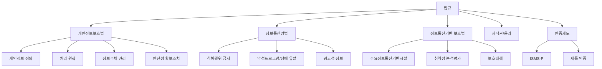
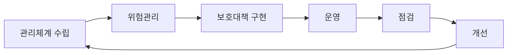
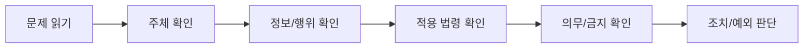

# 14. 법규·관리 최신체크

법규는 개정 가능성이 높습니다. 이 파일은 정보보안기사 범위에서 반복적으로 묻기 좋은 법규와 관리체계 키워드를 정리하되, 시험 직전에는 반드시 KCA 공지와 국가법령정보센터의 현행 조문을 다시 확인하는 것을 전제로 합니다.

확인 기준일: 2026-05-03

## 시험 직전 확인 링크

- KCA 정보보안 종목 출제기준: https://www.cq.or.kr/qh_cusgm10_002.do?bbscttNo=65
- 개인정보보호법: https://www.law.go.kr/법령/개인정보보호법
- 개인정보의 안전성 확보조치 기준: https://www.law.go.kr/LSW/admRulInfoP.do?admRulSeq=2100000265956
- 정보통신망 이용촉진 및 정보보호 등에 관한 법률: https://www.law.go.kr/법령/정보통신망%20이용촉진%20및%20정보보호%20등에%20관한%20법률
- 정보통신기반 보호법: https://www.law.go.kr/법령/정보통신기반%20보호법

## 법규 공부 지도

## 개인정보보호법 핵심

### 기본 용어

| 용어 | 핵심 |
| --- | --- |
| 개인정보 | 살아 있는 개인에 관한 정보로 개인을 알아볼 수 있는 정보 |
| 가명정보 | 추가정보 없이는 특정 개인을 알아보기 어렵게 처리한 정보 |
| 익명정보 | 더 이상 특정 개인을 알아볼 수 없도록 처리한 정보 |
| 민감정보 | 사상, 신념, 건강, 생체정보 등 사생활 침해 우려가 큰 정보 |
| 고유식별정보 | 주민등록번호, 여권번호, 운전면허번호, 외국인등록번호 등 |
| 개인정보처리자 | 업무 목적으로 개인정보파일을 운용하기 위해 개인정보를 처리하는 자 |
| 정보주체 | 처리되는 정보로 알아볼 수 있는 사람 |

### 처리 원칙

- 목적을 명확히 합니다.
- 필요한 범위에서 최소한으로 수집합니다.
- 목적 외 이용과 제공을 제한합니다.
- 정확성, 완전성, 최신성을 보장합니다.
- 안전성 확보조치를 적용합니다.
- 처리방침을 공개합니다.
- 정보주체 권리를 보장합니다.

### 정보주체 권리

- 열람 요구
- 정정 요구
- 삭제 요구
- 처리정지 요구
- 동의 철회
- 손해배상 청구

### 안전성 확보조치 암기

| 조치 | 내용 |
| --- | --- |
| 내부관리계획 | 개인정보 보호 조직, 역할, 절차 |
| 접근권한 관리 | 최소권한, 권한 부여/변경/말소 이력 |
| 접근통제 | 불법 접근과 침해사고 방지 |
| 암호화 | 중요 개인정보 저장/전송 보호 |
| 접속기록 | 접속기록 보관, 점검, 위변조 방지 |
| 악성프로그램 방지 | 백신, 보안 업데이트 |
| 물리적 조치 | 보관시설, 잠금, 출입통제 |
| 교육/감독 | 취급자 교육과 위탁자 관리 |

## 정보통신망법 핵심

### 침해행위 금지

- 정당한 접근권한 없이 정보통신망에 침입하는 행위
- 허용된 접근권한을 넘어 접근하는 행위
- 악성프로그램을 전달하거나 유포하는 행위
- 정보통신망의 안정적 운영을 방해하는 행위
- 타인의 정보를 훼손하거나 비밀을 침해하는 행위

### 침해사고 관련 키워드

- 해킹
- 컴퓨터바이러스
- 논리폭탄
- 메일폭탄
- 서비스 거부
- 고출력 전자기파
- 정보시스템 공격으로 발생한 사태

### 광고성 정보

- 수신 동의 여부
- 수신거부 또는 동의 철회 방법
- 전송자 명시
- 야간 광고성 정보 제한
- 수신거부 방해 금지

## 정보통신기반 보호법 핵심

| 용어 | 핵심 |
| --- | --- |
| 주요정보통신기반시설 | 국가사회적으로 중요한 정보통신 기반시설 |
| 취약점 분석평가 | 기술적·관리적 취약점 분석 |
| 보호대책 | 기반시설 보호를 위한 조치 |
| 침해사고 대응 | 예방, 탐지, 복구, 보고 |

출제 포인트는 `지정 -> 취약점 분석평가 -> 보호대책 수립 -> 이행점검 -> 사고대응` 흐름입니다.

## ISMS-P

### 관리체계 중심 사고

### 묻기 좋은 포인트

- 조직과 책임
- 정책과 지침
- 자산 식별
- 위험평가
- 인적 보안
- 외부자/위탁 보안
- 접근통제
- 암호화
- 로그와 모니터링
- 침해사고 대응
- 업무연속성
- 개인정보 처리 단계별 보호조치

## 업무연속성관리

| 용어 | 의미 |
| --- | --- |
| BIA | 업무영향분석 |
| BCP | 업무연속성계획 |
| DRP | 재해복구계획 |
| RTO | 목표 복구 시간 |
| RPO | 목표 복구 시점 |
| MTD | 최대 허용 중단 시간 |

시험 함정: RTO는 `얼마나 빨리 복구할 것인가`, RPO는 `어느 시점의 데이터까지 복구할 것인가`입니다.

## 디지털 포렌식

### 절차

1. 준비
2. 식별
3. 수집
4. 보존
5. 분석
6. 보고
7. 제출

### 원칙

- 원본 보존
- 무결성 유지
- 절차의 정당성
- 재현 가능성
- 연계보관성
- 분석 기록

## 법규형 문제 풀이법

## 법규 마지막 회독

- 개인정보, 가명정보, 익명정보 차이
- 민감정보와 고유식별정보
- 개인정보 처리 원칙
- 정보주체 권리
- 안전성 확보조치
- 개인정보 유출 대응
- 정보통신망 침해행위 금지
- 악성프로그램 유포 금지
- 주요정보통신기반시설 보호
- 위험관리와 ISMS-P
- BCP/DRP/RTO/RPO
- 디지털 포렌식 원칙
- 위 링크에서 시행일과 최신 개정 여부 확인
