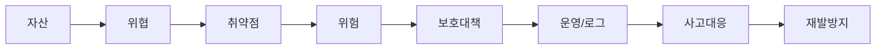
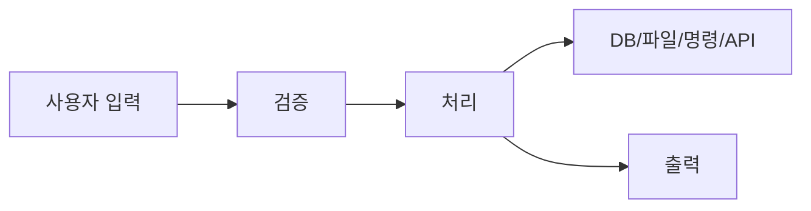

# 15. 합격권 해설형 통합이론서

이 문서는 키워드 암기표가 아니라, 정보보안기사 시험범위를 `왜 중요한지`, `어떻게 동작하는지`, `시험에서 어떻게 꼬이는지`, `실기 답안에는 어떻게 쓰는지`까지 설명하는 통합 이론서입니다.  
목표는 이 저장소의 자료만 반복해도 합격권에 들어갈 수 있도록 만드는 것입니다. 다만 실제 합격은 회차별 난이도, 기출 연습량, 당일 컨디션에 영향을 받으므로 이론서와 함께 문제풀이와 직접 답안 작성 훈련을 병행해야 합니다.

## 시험을 보는 관점

정보보안기사는 단순히 용어를 아는지보다 `보안 문제를 구조적으로 판단할 수 있는지`를 봅니다. 그래서 모든 과목은 아래 흐름으로 연결됩니다.



예를 들어 웹 서버는 자산입니다. SQL 삽입은 위협이자 공격 방식이고, 입력값 검증 미흡은 취약점입니다. 그 결과 개인정보 유출이라는 위험이 생깁니다. 보호대책은 Prepared Statement, DB 최소권한, 웹방화벽, 로그 모니터링입니다. 사고가 발생하면 차단, 증거 보존, 원인 제거, 복구, 재발방지까지 써야 실기 답안이 됩니다.

## 1과목 시스템보안

### 시스템보안의 큰 그림

시스템보안은 운영체제와 서버를 안전하게 운영하는 과목입니다. 시험에서는 `계정`, `권한`, `서비스`, `로그`, `패치`, `백업`, `악성코드`, `취약점 점검`을 거의 모든 문제의 재료로 사용합니다.

시스템보안 문제를 만나면 항상 다음 질문을 던집니다.

1. 누가 접근하는가?
2. 어떤 권한을 가지고 있는가?
3. 어떤 서비스가 열려 있는가?
4. 어떤 로그가 남는가?
5. 최신 패치와 보안설정이 되어 있는가?
6. 사고가 나면 복구할 수 있는가?

### 계정과 인증

계정은 시스템 사용자를 식별하는 수단입니다. 보안에서 식별성이 중요한 이유는 사고 발생 시 누가 무엇을 했는지 추적해야 하기 때문입니다. 공유 계정은 여러 사람이 같은 ID를 쓰므로 책임추적성이 떨어집니다. 따라서 관리자도 개인별 계정을 사용하고, 필요한 경우에만 권한 상승을 하도록 구성하는 것이 좋습니다.

암호 정책은 암호 길이, 복잡도, 재사용 제한, 변경 주기, 계정 잠금 정책으로 구성됩니다. 시험에서 자주 묻는 포인트는 `암호 복잡도만으로 충분하지 않다`는 점입니다. 약한 암호를 막는 것도 중요하지만, 반복 로그인 실패를 잠그는 정책, 다중인증, 접속 IP 제한, 로그인 로그 모니터링이 함께 필요합니다.

실기 답안에 쓸 문장:

```text
불필요 계정과 공유 계정은 비인가 접근과 책임추적 실패의 원인이 되므로 삭제하거나 잠금 처리하고, 사용자별 계정과 최소권한 원칙을 적용한다.
관리자 접속은 MFA와 접속 허용 IP 제한을 적용하고 인증 실패 로그를 주기적으로 점검한다.
```

### 권한과 접근통제

권한은 사용자가 자원에 대해 할 수 있는 행위를 제한합니다. 권한 문제는 시스템보안에서 가장 자주 실기형 문제로 변형됩니다. 윈도우에서는 공유 권한과 NTFS 권한이 함께 작용합니다. 공유 권한이 허용되어도 NTFS 권한이 거부하면 실제 접근은 제한됩니다. 리눅스에서는 소유자, 그룹, 기타 사용자 권한과 SUID, SGID, Sticky bit를 봐야 합니다.

SUID는 실행 파일을 실행할 때 파일 소유자의 권한으로 실행되게 합니다. 정상적으로는 `passwd` 명령처럼 일반 사용자가 자신의 비밀번호를 바꿀 수 있도록 돕지만, 취약한 SUID 프로그램은 권한 상승에 악용될 수 있습니다. 그래서 시험에서 SUID가 나오면 `권한 상승 위험`, `불필요 SUID 제거`, `정기 점검`을 떠올립니다.

### 서비스와 원격접속

서버에서 실행 중인 서비스는 공격 표면입니다. 사용하지 않는 서비스가 켜져 있으면 공격자는 그 서비스의 취약점을 이용할 수 있습니다. Telnet, FTP처럼 평문으로 인증정보가 오가는 서비스는 특히 위험합니다. SSH, SFTP, HTTPS처럼 암호화된 대체 수단을 쓰고, 관리 포트는 외부에 그대로 노출하지 않아야 합니다.

원격접속은 편리하지만 공격자가 가장 먼저 노리는 경로입니다. RDP, SSH, VPN 계정이 탈취되면 내부망 침투로 이어질 수 있습니다. 따라서 원격접속은 허용 IP 제한, MFA, 강한 암호정책, 접속 로그 점검, 계정 잠금 정책을 묶어서 설명해야 합니다.

### 로그

로그는 사고가 일어난 뒤 원인을 찾는 증거입니다. 로그가 없으면 사고 대응은 추측이 됩니다. 로그 문제에서는 `무엇을 남길 것인가`, `어디에 보관할 것인가`, `얼마나 보관할 것인가`, `위변조를 어떻게 막을 것인가`를 봅니다.

주요 로그:

- 인증 로그: 로그인 성공/실패, 계정 잠금, 원격접속
- 권한 로그: 관리자 권한 획득, 그룹 변경, 계정 생성/삭제
- 시스템 로그: 서비스 시작/중지, 오류, 재부팅
- 보안 솔루션 로그: 악성코드 탐지, 파일 변경, 정책 위반
- 웹/DB 로그: 공격 요청, SQL 오류, 대량 조회

실기 답안에 쓸 문장:

```text
로그는 침해사고 원인 분석과 책임추적의 핵심 자료이므로 인증, 권한 변경, 관리자 작업, 주요 서비스 접근 로그를 활성화하고 중앙 로그 서버에 전송한다.
시스템 시간을 NTP로 동기화하고 로그 접근권한을 제한하여 위변조를 방지한다.
```

### 패치와 취약점 관리

패치는 알려진 취약점을 제거하는 가장 기본적인 보호대책입니다. 공격자는 공개된 취약점과 자동화 도구를 이용해 패치되지 않은 시스템을 빠르게 찾습니다. 단, 운영 시스템은 패치가 장애를 일으킬 수 있으므로 테스트, 승인, 배포, 롤백 계획이 필요합니다.

취약점 관리는 단순 스캔이 아니라 `발견 -> 위험도 평가 -> 조치 -> 재점검 -> 이력관리`까지 포함합니다. 실기에서는 취약점을 발견했다는 사실보다 조치 결과와 재점검을 기록하는 것이 중요합니다.

### 악성코드와 랜섬웨어

악성코드는 시스템을 손상시키거나 정보를 훔치거나 원격제어를 가능하게 하는 프로그램입니다. 랜섬웨어는 파일을 암호화하고 금전을 요구하는 악성코드입니다. 랜섬웨어 문제에서는 백업이 핵심입니다. 백업이 있어도 같은 네트워크에 연결되어 있으면 함께 암호화될 수 있으므로 오프라인 백업 또는 불변 백업이 필요합니다.

사고 대응 순서:

1. 감염 시스템 격리
2. 증거 보존
3. 악성 프로세스와 외부 통신 확인
4. 원인 취약점 제거
5. 백업 복구
6. 재발방지 대책 적용

## 2과목 네트워크보안

### 네트워크보안의 큰 그림

네트워크보안은 패킷이 어떻게 이동하는지 이해하고, 그 이동 과정에서 발생하는 공격을 막는 과목입니다. 시험에서는 OSI 7계층, TCP/IP, 주소체계, 장비, 공격기법, 보안장비를 연결해서 묻습니다.

### OSI 7계층 이해

OSI 7계층은 문제를 분해하는 도구입니다. 공격이 어느 계층에서 일어나는지 알면 대응 방법도 좁혀집니다.

- 물리 계층: 케이블, 전기 신호, 물리적 접근
- 데이터링크 계층: MAC 주소, 스위치, ARP, VLAN
- 네트워크 계층: IP 주소, 라우터, ICMP
- 전송 계층: TCP, UDP, 포트
- 응용 계층: HTTP, DNS, FTP, SMTP

예를 들어 ARP 스푸핑은 데이터링크 계층 공격입니다. 대응은 정적 ARP, Dynamic ARP Inspection, 포트 보안처럼 스위치 수준 조치가 중심입니다. SQL 삽입은 응용 계층 공격이므로 Prepared Statement와 입력값 검증이 핵심입니다.

### TCP와 UDP

TCP는 연결형 프로토콜입니다. 연결을 맺고, 순서를 보장하고, 손실된 데이터를 재전송합니다. 그래서 신뢰성이 필요한 웹, 메일, 파일 전송에 사용됩니다. TCP 3-way handshake는 SYN, SYN/ACK, ACK 순서로 연결을 만듭니다. SYN Flood는 이 과정을 악용하여 마지막 ACK를 보내지 않고 서버의 연결 대기 자원을 고갈시키는 공격입니다.

UDP는 비연결형 프로토콜입니다. 빠르지만 신뢰성을 직접 보장하지 않습니다. DNS, DHCP, NTP, 스트리밍에서 사용됩니다. UDP는 출발지 위조가 쉽고 응답이 큰 서비스를 이용한 증폭 공격에 악용될 수 있습니다.

### 주소체계와 NAT

IPv4는 32비트 주소이고, IPv6는 128비트 주소입니다. 사설 IP 대역은 내부망에서 사용하며 인터넷에서는 직접 라우팅되지 않습니다. NAT는 사설 IP와 공인 IP를 변환합니다. NAT가 내부 주소를 숨기는 효과는 있지만, NAT 자체가 완전한 보안 대책은 아닙니다. 접근통제는 방화벽 정책으로 해야 합니다.

### 스캐닝

스캐닝은 공격 전 정찰입니다. 공격자는 열린 포트, 서비스 버전, 운영체제, 취약한 설정을 찾습니다. 방어자는 외부에서 보이는 포트를 최소화하고, 배너 정보를 줄이고, 취약 버전을 패치해야 합니다.

로그 특징:

- 하나의 출발지에서 여러 포트에 순차 접근
- 여러 목적지에 같은 포트를 반복 접근
- 짧은 시간에 연결 시도 증가

### 스푸핑, 스니핑, 세션 하이재킹

스푸핑은 속이는 공격입니다. ARP 스푸핑은 피해자의 ARP 캐시를 조작해 공격자가 게이트웨이인 것처럼 속입니다. 그러면 공격자는 중간자 위치에 서서 스니핑이나 패킷 변조를 할 수 있습니다.

스니핑은 트래픽을 훔쳐보는 것입니다. 평문 프로토콜을 쓰면 ID와 비밀번호가 그대로 노출될 수 있습니다. 그래서 HTTPS, SSH, SFTP, VPN 같은 암호화 통신이 중요합니다.

세션 하이재킹은 세션 쿠키나 세션 식별자를 탈취해 사용자인 것처럼 행동하는 공격입니다. 대응은 HTTPS, Secure/HttpOnly/SameSite 쿠키, 세션 재발급, 비정상 접속 탐지입니다.

### 방화벽, IDS, IPS, WAF

방화벽은 정책에 따라 트래픽을 허용하거나 차단합니다. 주로 출발지, 목적지, 포트, 프로토콜, 방향을 봅니다. 방화벽 정책에서 `Any Any Allow`는 매우 위험합니다.

IDS는 침입을 탐지하고 경고합니다. IPS는 탐지 후 차단까지 수행합니다. 두 장비는 오탐과 미탐 관리가 중요합니다. WAF는 웹 공격을 탐지/차단하는 장비로 SQL 삽입, XSS, 파일 업로드 공격 대응에 사용됩니다.

실기 답안에 쓸 문장:

```text
방화벽 정책은 출발지, 목적지, 포트, 방향, 허용 근거, 만료일, 로그 여부를 기준으로 검토한다.
업무상 필요한 최소 범위만 허용하고 임시 정책은 승인자와 만료일을 명시한다.
```

## 3과목 어플리케이션보안

### 어플리케이션보안의 큰 그림

어플리케이션보안은 서비스가 사용자의 입력을 어떻게 처리하고, 그 과정에서 어떤 취약점이 생기는지 보는 과목입니다. 대부분의 공격은 `신뢰할 수 없는 입력을 신뢰해서` 발생합니다.



입력 단계에서는 SQL 삽입, 명령 삽입, 경로 조작이 발생합니다. 파일 처리에서는 웹셸 업로드가 발생합니다. 출력 단계에서는 XSS가 발생합니다. 인증 상태를 악용하면 CSRF가 발생합니다.

### SQL 삽입

SQL 삽입은 사용자 입력이 SQL 문장 구조를 바꾸는 공격입니다. 예를 들어 로그인 쿼리에 입력값을 문자열로 직접 붙이면 공격자가 `' OR '1'='1` 같은 값을 넣어 조건을 항상 참으로 만들 수 있습니다.

핵심 대응은 Prepared Statement입니다. 입력값을 SQL 코드가 아니라 데이터로 취급하게 만들기 때문입니다. 입력값 검증도 필요하지만, 검증만으로 SQL 삽입을 완전히 막기는 어렵습니다. DB 계정 최소권한도 중요합니다. 웹 계정이 DBA 권한을 가지고 있으면 SQL 삽입 한 번으로 전체 DB가 위험해집니다.

### XSS

XSS는 악성 스크립트가 피해자의 브라우저에서 실행되는 공격입니다. 원인은 출력 인코딩 미흡입니다. 저장형 XSS는 악성 스크립트가 서버에 저장되어 여러 사용자에게 영향을 줍니다. 반사형 XSS는 요청에 포함된 스크립트가 응답에 반사되어 실행됩니다. DOM 기반 XSS는 클라이언트 스크립트가 DOM을 조작하는 과정에서 발생합니다.

대응은 출력 위치에 맞는 문맥별 인코딩입니다. HTML 본문, HTML 속성, JavaScript, URL은 각각 인코딩 방식이 다릅니다. 보조 대책으로 CSP, HttpOnly 쿠키, 입력값 검증을 사용합니다.

### CSRF

CSRF는 피해자가 로그인된 상태라는 점을 악용합니다. 공격자는 피해자가 의도하지 않은 요청을 보내게 하여 비밀번호 변경, 결제, 게시글 작성 같은 상태 변경을 유도합니다. XSS가 브라우저에서 스크립트를 실행하는 공격이라면, CSRF는 인증된 사용자의 권한을 빌려 요청을 보내는 공격입니다.

대응은 CSRF 토큰입니다. 서버가 예측 불가능한 토큰을 발급하고, 상태 변경 요청마다 토큰을 검증합니다. SameSite 쿠키와 중요 기능 재인증도 도움이 됩니다.

### 파일 업로드

파일 업로드 취약점은 웹셸과 연결됩니다. 공격자가 `.jsp`, `.php`, `.asp` 같은 실행 가능한 파일을 업로드하고 웹에서 실행하면 서버 명령 실행으로 이어질 수 있습니다. 확장자만 검사하면 우회될 수 있으므로 MIME, 파일 내용, 저장 위치, 실행 권한을 함께 봐야 합니다.

안전한 설계:

- 허용 확장자 방식 사용
- 파일명 난수화
- 웹 루트 밖 저장
- 실행 권한 제거
- 업로드 파일 백신/샌드박스 검사
- 다운로드는 직접 경로가 아니라 핸들러를 통해 제공

### DNS 보안

DNS는 도메인 이름을 IP 주소로 바꿉니다. DNS 문제는 영역전송, 캐시 오염, 재귀 질의, DNS 터널링을 중심으로 나옵니다. 영역전송이 외부에 허용되면 내부 도메인 구조가 노출됩니다. 재귀 질의가 아무에게나 열려 있으면 DNS 증폭 공격에 악용될 수 있습니다.

대응은 영역전송 허용 IP 제한, 불필요한 재귀 질의 차단, DNSSEC, DNS 로그 모니터링입니다.

### 메일 보안

메일 보안은 스팸, 피싱, 악성 첨부, 발신자 위조, 오픈 릴레이를 다룹니다. 오픈 릴레이는 외부 사용자가 메일 서버를 통해 제3자에게 메일을 보내게 허용하는 상태입니다. 스팸 발송에 악용되어 도메인 평판이 나빠질 수 있습니다.

SPF는 발신 IP를 검증합니다. DKIM은 메일에 전자서명을 붙여 위변조를 확인합니다. DMARC는 SPF/DKIM 실패 시 정책을 정하고 보고서를 받습니다.

### DB 보안

DB 보안의 기본은 계정 최소권한, 중요정보 암호화, 감사 로그, 백업 보호입니다. DB에 저장된 비밀번호는 복호화 가능한 암호화가 아니라 Salt와 느린 해시 함수로 저장해야 합니다. 주민등록번호나 결제정보 같은 중요정보는 저장 구간 암호화와 접근통제가 필요합니다.

## 4과목 정보보안일반

### 보안요소

정보보안일반은 보안의 이론적 기반입니다. 기밀성은 내용을 숨기는 것, 무결성은 변경되지 않았음을 보장하는 것, 가용성은 필요할 때 사용할 수 있게 하는 것입니다. 인증은 상대의 신원을 확인하는 것이고, 인가는 권한을 부여하는 것입니다. 부인방지는 나중에 행위를 부정하기 어렵게 만드는 것입니다.

### 대칭키와 공개키

대칭키는 같은 키로 암호화와 복호화를 합니다. 빠르지만 키를 안전하게 나누는 것이 어렵습니다. 공개키는 공개키와 개인키 쌍을 사용합니다. 키 분배와 전자서명에 유리하지만 느립니다. 실제 시스템은 하이브리드 방식을 씁니다. 공개키로 세션키를 안전하게 교환하고, 실제 데이터는 빠른 대칭키로 암호화합니다.

기밀성 목적이면 수신자의 공개키로 암호화하고 수신자의 개인키로 복호화합니다. 전자서명 목적이면 송신자의 개인키로 서명하고 송신자의 공개키로 검증합니다. 이 방향을 헷갈리면 암호학 문제를 많이 틀립니다.

### 해시, MAC, 전자서명

해시는 임의 길이 입력을 고정 길이 값으로 바꾸는 일방향 함수입니다. 복호화하지 않습니다. 무결성 검증에 사용하지만, 키가 없기 때문에 송신자 인증은 제공하지 않습니다.

MAC은 공유 비밀키를 이용합니다. 메시지가 변조되지 않았고 같은 키를 가진 사람이 만들었다는 것을 확인합니다. 하지만 송수신자가 같은 키를 공유하기 때문에 제3자에게 누가 만들었는지 강하게 증명하기 어렵습니다. 그래서 부인방지는 약합니다.

전자서명은 개인키와 공개키를 사용합니다. 문서의 해시값을 개인키로 서명하고 공개키로 검증합니다. 무결성, 서명자 인증, 부인방지를 제공합니다. 기밀성은 직접 제공하지 않으므로 내용을 숨기려면 별도 암호화가 필요합니다.

### 접근통제

DAC는 소유자가 권한을 부여하는 방식입니다. 유연하지만 권한 전파 위험이 있습니다. MAC은 보안 등급에 따라 중앙에서 통제합니다. 강하지만 유연성이 떨어집니다. RBAC는 역할 기반입니다. 기업 업무 환경에 적합합니다. ABAC는 사용자, 자원, 환경 속성을 조합해 판단합니다. 세밀하지만 정책이 복잡합니다.

보안 모델은 선택지에서 자주 헷갈립니다. Bell-LaPadula는 기밀성, Biba는 무결성, Clark-Wilson은 무결성과 직무분리, Chinese Wall은 이해충돌 방지입니다.

### PKI와 인증서

PKI는 공개키가 정말 그 사람의 것인지 보증하는 체계입니다. CA는 인증서를 발급하고 서명합니다. RA는 등록과 신원확인을 보조합니다. 인증서는 주체 정보와 공개키를 묶어 CA가 서명한 것입니다.

인증서 검증은 유효기간, 주체/도메인, 발급자 서명, 인증서 체인, 폐지 여부를 봅니다. 폐지 여부는 CRL 또는 OCSP로 확인합니다. 인증서 오류를 무시하면 중간자 공격에 취약해집니다.

## 5과목 정보보안관리 및 법규

### 관리 파트의 핵심

관리 과목은 기술보다 절차와 책임을 묻습니다. 정보보호 관리는 정책을 세우고, 자산을 식별하고, 위험을 평가하고, 대책을 구현하고, 운영 결과를 점검하며 계속 개선하는 과정입니다.

위험관리에서 가장 중요한 구분은 자산, 위협, 취약점, 위험입니다. 서버는 자산입니다. 해킹은 위협입니다. 패치 미흡은 취약점입니다. 해킹이 패치 미흡을 이용해 서버를 침해할 가능성과 영향이 위험입니다.

위험처리는 감소, 회피, 전가, 수용 네 가지입니다. 감소는 패치나 접근통제로 위험을 낮추는 것입니다. 회피는 위험한 활동을 중단하는 것입니다. 전가는 보험이나 계약으로 손실 부담을 옮기는 것입니다. 수용은 낮은 위험을 승인하고 받아들이는 것입니다.

### 보호대책

보호대책은 관리적, 물리적, 기술적으로 나눕니다. 관리적 보호대책은 정책, 교육, 절차, 외주관리, 내부감사입니다. 물리적 보호대책은 출입통제, CCTV, 잠금장치, 전원, 항온항습입니다. 기술적 보호대책은 암호화, 방화벽, 접근제어, 로그, 백업입니다.

시험에서는 기술적 대책만 쓰면 부족할 수 있습니다. 예를 들어 개인정보 유출 방지를 묻는다면 암호화뿐 아니라 접근권한 관리, 접속기록 점검, 취급자 교육, 위탁업체 관리까지 함께 생각해야 합니다.

### 침해사고 대응

침해사고 대응은 준비, 탐지/분석, 확산 차단, 제거, 복구, 사후개선 순서입니다. 실제 답안에서 중요한 것은 증거 보존입니다. 감염 시스템을 무작정 끄면 휘발성 증거가 사라질 수 있습니다. 네트워크 격리로 확산을 막고, 메모리, 프로세스, 네트워크 연결, 로그를 확보한 뒤 조치합니다.

### 개인정보보호법

개인정보는 살아 있는 개인에 관한 정보로 개인을 알아볼 수 있는 정보입니다. 다른 정보와 쉽게 결합해 개인을 알아볼 수 있어도 개인정보입니다. 민감정보와 고유식별정보는 더 엄격히 보호합니다.

개인정보 처리 원칙은 목적 명확화, 최소 수집, 목적 외 이용 제한, 정확성, 안전성 확보, 처리방침 공개, 정보주체 권리 보장입니다. 안전성 확보조치는 내부관리계획, 접근권한 관리, 접근통제, 암호화, 접속기록 보관과 점검, 악성프로그램 방지, 물리적 보호조치가 핵심입니다.

### 정보통신망법

정보통신망법에서는 침해행위 금지가 중요합니다. 정당한 접근권한 없이 정보통신망에 침입하거나, 허용된 권한을 넘어 접근하거나, 악성프로그램을 전달/유포하거나, 정보통신망 장애를 유발하거나, 타인의 정보를 훼손하고 비밀을 침해하는 행위가 핵심입니다.

광고성 정보 전송 제한도 출제될 수 있습니다. 수신 동의, 수신거부 방법, 전송자 표시, 수신거부 방해 금지를 묶어서 봅니다.

## 실기 답안 작성법

실기에서 좋은 답안은 키워드를 많이 쓰는 답안이 아니라 구조가 있는 답안입니다.

### 취약점 점검형

```text
해당 설정은 [취약점]에 해당한다.
이로 인해 [공격/위험]이 발생할 수 있다.
[구체 조치]를 적용하고, [로그/명령어/설정]으로 조치 여부를 확인한다.
재발 방지를 위해 [정기점검/정책/모니터링]을 수행한다.
```

### 로그 분석형

```text
로그에서 [시간/출발지/목적지/포트/행위]가 확인되므로 [공격명]이 의심된다.
근거는 [반복 실패, 특정 문자열, 비정상 트래픽, 권한 변경]이다.
즉시 [차단/격리/계정잠금]을 수행하고, 이후 [패치/설정변경/탐지룰/교육]을 적용한다.
```

### 위험분석형

```text
보호 대상 자산은 [자산]이다.
주요 위협은 [위협]이며 취약점은 [취약점]이다.
이 경우 [기밀성/무결성/가용성/법적 영향] 측면에서 위험이 발생한다.
위험처리 전략은 [감소/회피/전가/수용]이며 구체 대책은 [대책]이다.
```

## 최종 회독 순서

1. `10-빈출-그림요약.md`로 전체 구조를 본다.
2. 이 파일로 각 과목의 원리를 설명할 수 있을 때까지 읽는다.
3. `09-암호학-심화-그림정리.md`로 암호학을 따로 잡는다.
4. `12-공격-취약점-대응-매트릭스.md`로 공격별 대응을 외운다.
5. `13-실기-필답형-답안사례.md`를 보지 않고 직접 써본다.
6. `14-법규-관리-최신체크.md`로 시험 직전 법규를 확인한다.

