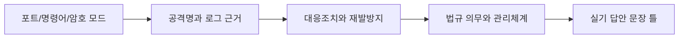

# 18. 최종암기장 120문답

이 문서는 시험 직전 회독용입니다. 단순 키워드가 아니라, 문제에서 어떤 식으로 판단해야 하는지까지 한 문장씩 붙였습니다.  
권장 방식은 `질문만 보고 답하기 -> 답 확인 -> 틀린 이유를 20-오답노트에 기록`입니다.

## 시스템보안

1. Q. 운영체제 보안의 핵심 목표는 무엇인가?  
   A. 사용자와 프로세스가 허가된 자원에만 접근하게 하고, 로그와 무결성 점검으로 이상행위를 추적 가능하게 만드는 것이다. 시험에서는 계정, 권한, 패치, 로그, 백업이 함께 묶여 나온다.

2. Q. 식별, 인증, 인가는 어떻게 다른가?  
   A. 식별은 사용자가 누구라고 주장하는 단계, 인증은 그 주장이 맞는지 검증하는 단계, 인가는 인증된 사용자에게 어떤 권한을 줄지 결정하는 단계다. 로그인은 인증이고, 특정 파일 읽기 허용은 인가다.

3. Q. 최소권한 원칙은 왜 중요한가?  
   A. 계정이 탈취되거나 프로세스가 악용되어도 피해 범위를 줄이기 위해 필요한 권한만 부여하는 원칙이다. 실기 답안에는 불필요한 관리자 권한 제거, 권한 분리, 정기 권한 검토를 함께 적으면 좋다.

4. Q. SUID가 위험한 이유는 무엇인가?  
   A. 실행 사용자가 아니라 파일 소유자의 권한으로 실행되기 때문에, root 소유 SUID 파일에 취약점이 있으면 일반 사용자가 관리자 권한을 얻을 수 있다. 점검 시 불필요한 SUID 파일을 찾고 제거해야 한다.

5. Q. `/etc/passwd`와 `/etc/shadow`의 차이는 무엇인가?  
   A. `/etc/passwd`는 계정 기본 정보를 저장하고 일반 사용자도 읽을 수 있으므로 비밀번호 해시는 `/etc/shadow`에 분리 저장한다. shadow 파일 권한이 느슨하면 오프라인 대입 공격 위험이 커진다.

6. Q. 패스워드 정책에서 길이만 강조하면 부족한 이유는 무엇인가?  
   A. 길이가 길어도 재사용, 사전 단어, 유출 비밀번호 사용이 있으면 쉽게 공격된다. 길이, 복잡도, 잠금정책, 다중인증, 유출 비밀번호 차단을 같이 봐야 한다.

7. Q. 계정 잠금 정책의 장점과 주의점은 무엇인가?  
   A. 무차별 대입 공격을 늦추는 효과가 있지만, 공격자가 일부러 실패 로그인을 반복하면 서비스 거부처럼 악용될 수 있다. 임계값, 지연시간, 모니터링을 균형 있게 설정한다.

8. Q. 로그 관리에서 가장 중요한 세 가지는 무엇인가?  
   A. 필요한 이벤트를 남기는 것, 위변조되지 않게 보호하는 것, 사고 분석에 필요한 기간 동안 보관하는 것이다. 시간 동기화가 안 되어 있으면 여러 장비 로그를 연결하기 어렵다.

9. Q. 루트킷은 무엇이며 어떻게 대응하는가?  
   A. 공격자가 침투 후 존재를 숨기고 권한을 유지하기 위한 도구다. 파일 무결성 점검, 커널 모듈 확인, 신뢰 가능한 매체 부팅 후 검사, 재설치와 계정 재발급이 대응에 포함된다.

10. Q. 백도어와 취약점은 어떻게 다른가?  
    A. 취약점은 보안 약점이고, 백도어는 우회 접근을 위해 의도적으로 남겨둔 통로다. 사고 대응에서는 백도어 제거만이 아니라 최초 침투 취약점도 함께 조치해야 한다.

11. Q. 윈도우 이벤트 로그에서 봐야 할 주요 범주는 무엇인가?  
    A. 로그온 성공/실패, 계정 생성/권한 변경, 서비스 설치, 정책 변경, 감사 로그 삭제 이벤트를 봐야 한다. 단일 이벤트보다 시간 순서와 계정 행위를 연결해 보는 것이 중요하다.

12. Q. 리눅스에서 비정상 접속을 볼 때 자주 쓰는 명령은 무엇인가?  
    A. `last`, `lastb`, `who`, `w`, `netstat` 또는 `ss`, `ps`, `crontab`, `/var/log/auth.log` 또는 `/var/log/secure` 확인이 기본이다. 명령만 외우지 말고 접속 계정, 시간, 원격 IP, 실행 프로세스를 연결해야 한다.

13. Q. 파일 무결성 점검은 무엇을 확인하는가?  
    A. 정상 상태의 해시값, 크기, 권한, 소유자와 현재 상태를 비교해 변경 여부를 확인한다. 웹셸, 변조 바이너리, 설정 파일 변경 탐지에 활용된다.

14. Q. 패치 관리가 보안에서 중요한 이유는 무엇인가?  
    A. 공개 취약점은 공격 코드가 빠르게 확산되므로 패치 지연은 곧 침해 가능성 증가로 이어진다. 자산 식별, 중요도 평가, 테스트, 배포, 예외관리까지 절차화해야 한다.

15. Q. 하드닝은 단순히 백신 설치와 같은 말인가?  
    A. 아니다. 하드닝은 불필요 서비스 제거, 기본 계정 비활성화, 권한 축소, 안전한 설정, 로깅 강화처럼 시스템 공격면을 줄이는 전체 작업이다.

16. Q. 가상화 환경에서 보안상 주의할 점은 무엇인가?  
    A. 하이퍼바이저 취약점, VM 간 격리 실패, 스냅샷 내 민감정보, 관리 콘솔 권한 탈취를 주의해야 한다. 관리망 분리와 패치, 접근통제가 중요하다.

17. Q. 악성코드 대응 절차는 어떻게 쓰는가?  
    A. 감염 의심 시스템 격리, 증거 보존, 악성 프로세스와 자동실행 항목 확인, 치료 또는 재설치, 패치와 계정 변경, 재발 방지 모니터링 순서로 쓴다.

18. Q. 스케줄러와 자동실행 영역은 왜 점검하는가?  
    A. 공격자가 재부팅 후에도 악성코드를 다시 실행하기 위해 등록하는 대표 위치이기 때문이다. 리눅스 cron, systemd, 윈도우 작업 스케줄러와 레지스트리 Run 키가 빈출이다.

19. Q. 서버 보안에서 네트워크 포트 점검이 필요한 이유는 무엇인가?  
    A. 열린 포트는 외부에서 접근 가능한 서비스의 목록이며 공격면을 의미한다. 업무상 필요한 포트만 허용하고, 불필요 서비스는 중지하거나 방화벽으로 차단해야 한다.

20. Q. 사고 후 시스템을 바로 재부팅하면 안 되는 이유는 무엇인가?  
    A. 메모리, 프로세스, 네트워크 연결 같은 휘발성 증거가 사라질 수 있기 때문이다. 실기에서는 증거 보존과 업무 영향 최소화를 함께 언급해야 점수가 안정적이다.

## 네트워크보안

21. Q. OSI 7계층을 외우는 것보다 중요한 것은 무엇인가?  
    A. 공격과 장비가 어느 계층에서 동작하는지 판단하는 것이다. 스니핑은 주로 링크/네트워크 흐름, TCP SYN Flood는 전송계층, SQL Injection은 응용계층 문제로 연결한다.

22. Q. TCP 3-way handshake는 왜 보안 문제와 연결되는가?  
    A. 연결 설정 과정의 상태 정보를 이용해 SYN Flood 같은 자원 고갈 공격이 가능하기 때문이다. 대응으로 SYN Cookie, 임계값 제한, 방화벽/IPS 정책이 나온다.

23. Q. UDP가 공격에 자주 악용되는 이유는 무엇인가?  
    A. 연결 설정이 없고 출발지 위조가 쉬워 반사 증폭 공격에 악용되기 쉽다. DNS, NTP, SSDP 같은 UDP 기반 서비스의 공개 노출이 위험하다.

24. Q. ARP Spoofing은 무엇을 노리는가?  
    A. IP와 MAC 주소 매핑을 속여 피해자의 트래픽이 공격자를 거치게 만드는 공격이다. 스니핑, 세션 탈취, 중간자 공격으로 이어질 수 있다.

25. Q. DNS Spoofing과 DNS Cache Poisoning의 차이는 무엇인가?  
    A. DNS Spoofing은 질의 응답을 속여 잘못된 주소로 유도하는 넓은 개념이고, Cache Poisoning은 DNS 서버 캐시에 거짓 정보를 저장시켜 다수 사용자에게 영향을 주는 방식이다.

26. Q. 스니핑과 스푸핑은 어떻게 구분하는가?  
    A. 스니핑은 트래픽을 엿보는 것이고, 스푸핑은 주소나 신원을 속이는 것이다. ARP Spoofing으로 트래픽을 우회시킨 뒤 스니핑하는 식으로 함께 사용될 수 있다.

27. Q. DoS와 DDoS의 핵심 차이는 무엇인가?  
    A. DoS는 단일 또는 제한된 공격원에서 서비스를 방해하는 것이고, DDoS는 다수의 분산 공격원을 이용한다. DDoS는 공격원 차단만으로 대응하기 어렵고 상위 사업자 협조와 트래픽 정화가 필요하다.

28. Q. 반사 증폭 공격의 원리는 무엇인가?  
    A. 공격자가 출발지 IP를 피해자로 위조해 공개 서버에 요청하면, 서버 응답이 피해자에게 집중된다. 작은 요청이 큰 응답으로 커지면 증폭 효과가 생긴다.

29. Q. 방화벽의 한계는 무엇인가?  
    A. 포트와 주소 기반 통제만으로는 정상 포트로 들어오는 웹 공격이나 암호화된 내부 악성 행위를 완전히 막기 어렵다. WAF, IDS/IPS, EDR, 로그분석과 함께 써야 한다.

30. Q. IDS와 IPS의 차이는 무엇인가?  
    A. IDS는 탐지와 경고가 중심이고, IPS는 인라인에서 차단까지 수행한다. IPS는 오탐 시 정상 트래픽 차단 위험이 있어 정책 튜닝이 중요하다.

31. Q. WAF는 일반 방화벽과 무엇이 다른가?  
    A. WAF는 HTTP 요청과 응답 내용을 분석해 SQL Injection, XSS 같은 웹 공격을 탐지/차단한다. 포트 80/443 허용 여부만 보는 일반 방화벽보다 응용계층 이해가 깊다.

32. Q. VPN은 무엇을 보장하는가?  
    A. 공용망 위에 암호화된 터널을 구성해 기밀성과 무결성을 높인다. 다만 VPN 계정이 탈취되면 내부 접근 통로가 되므로 MFA와 접근범위 제한이 필요하다.

33. Q. IPsec의 AH와 ESP는 어떻게 다른가?  
    A. AH는 인증과 무결성 중심이고 암호화는 제공하지 않으며, ESP는 암호화를 통한 기밀성과 인증/무결성을 제공할 수 있다. 실무에서는 ESP가 더 자주 언급된다.

34. Q. VLAN은 보안장비인가?  
    A. VLAN은 논리적 네트워크 분리 기술이며 그 자체로 완전한 보안장비는 아니다. VLAN 간 통신 통제에는 라우팅 정책, ACL, 방화벽이 필요하다.

35. Q. NAT는 보안기술인가?  
    A. NAT는 주소 변환 기술이고 내부 주소를 숨기는 부수 효과는 있지만 접근통제 정책을 대체하지 않는다. 시험에서는 NAT와 방화벽을 혼동시키는 선택지를 주의한다.

36. Q. 네트워크 접근제어 NAC는 무엇을 확인하는가?  
    A. 단말이 네트워크에 접속하기 전 사용자, 단말 상태, 백신, 패치, 보안정책 준수 여부를 확인한다. 미준수 단말은 격리망으로 보내거나 접속을 제한한다.

37. Q. 무선랜 보안에서 WEP가 취약한 이유는 무엇인가?  
    A. 짧은 IV와 취약한 키 운용으로 암호키 추정이 가능하기 때문이다. WPA2/WPA3, 강한 인증, 관리 프레임 보호를 사용하는 것이 안전하다.

38. Q. 포트 스캔을 탐지할 때 어떤 패턴을 보는가?  
    A. 짧은 시간에 여러 포트 또는 여러 호스트로 연결 시도가 반복되는지 본다. SYN Scan, FIN Scan, Xmas Scan처럼 플래그 조합이 비정상인 경우도 단서가 된다.

39. Q. 로그에서 외부 IP 하나가 다수 목적지 포트로 접근하면 무엇을 의심하는가?  
    A. 포트 스캔 또는 취약 서비스 탐색을 의심한다. 대응은 차단만이 아니라 스캔 대상 서비스의 노출 필요성과 패치 상태 확인까지 포함한다.

40. Q. TLS가 있어도 피싱이 가능한 이유는 무엇인가?  
    A. TLS는 통신 구간 암호화와 서버 인증을 제공하지만, 사용자가 공격자가 만든 정상 인증서 보유 피싱 사이트에 정보를 입력하는 행위 자체를 막지는 못한다.

41. Q. 네트워크 로그 분석 답안의 기본 구조는 무엇인가?  
    A. 공격 의심 근거, 공격명, 영향, 즉시 조치, 재발 방지 순서로 쓴다. IP, 포트, 시간, 프로토콜, 플래그 같은 관찰 사실을 먼저 제시하면 답안이 단단해진다.

42. Q. ICMP Flood와 Smurf 공격은 어떻게 연결되는가?  
    A. 둘 다 ICMP를 이용해 트래픽을 집중시키는 공격이지만, Smurf는 브로드캐스트 주소와 출발지 위조를 이용해 증폭 효과를 만든다.

43. Q. 세션 하이재킹은 어떤 조건에서 쉬워지는가?  
    A. 세션 ID가 예측 가능하거나 평문 전송되거나 XSS로 쿠키 탈취가 가능할 때 쉬워진다. 대응은 TLS, Secure/HttpOnly/SameSite 쿠키, 세션 재발급, 만료시간 관리다.

44. Q. 프록시와 리버스 프록시는 어떻게 다른가?  
    A. 프록시는 내부 사용자의 외부 접속을 대신하고, 리버스 프록시는 외부 사용자의 내부 서버 접근을 앞단에서 대신 받는다. WAF나 로드밸런서가 리버스 프록시 형태로 동작할 수 있다.

45. Q. 제로 트러스트의 핵심은 무엇인가?  
    A. 내부망이라는 이유만으로 신뢰하지 않고 사용자, 단말, 위치, 행위, 권한을 지속적으로 검증하는 접근이다. 네트워크 경계 중심 보안의 한계를 보완한다.

## 어플리케이션보안

46. Q. SQL Injection의 본질은 무엇인가?  
    A. 사용자 입력이 SQL 명령의 일부로 해석되어 의도하지 않은 쿼리가 실행되는 것이다. 대응의 핵심은 Prepared Statement와 입력 검증, 최소권한 DB 계정이다.

47. Q. XSS는 서버 공격인가 사용자 공격인가?  
    A. 악성 스크립트가 사용자의 브라우저에서 실행되므로 사용자 세션 탈취, 피싱, 화면 변조로 이어지는 클라이언트 측 공격이다. 저장형, 반사형, DOM 기반을 구분한다.

48. Q. CSRF가 성립하는 조건은 무엇인가?  
    A. 사용자가 이미 로그인한 상태이고, 공격자가 만든 요청이 피해자 권한으로 서버에 전달될 때 성립한다. CSRF 토큰, SameSite 쿠키, 재인증이 대응이다.

49. Q. 파일 업로드 취약점에서 확인할 것은 무엇인가?  
    A. 확장자만이 아니라 MIME, 파일 시그니처, 저장 경로, 실행 권한, 파일명 처리, 업로드 후 접근 URL을 확인해야 한다. 웹셸 업로드가 대표 위험이다.

50. Q. 경로 조작 취약점은 무엇인가?  
    A. `../` 같은 입력으로 허용된 디렉터리 밖 파일에 접근하는 취약점이다. 정규화 후 허용 경로 검증, 고정 저장소, 권한 제한이 필요하다.

51. Q. Command Injection과 Code Injection은 어떻게 다른가?  
    A. Command Injection은 운영체제 명령을 실행하게 만드는 것이고, Code Injection은 애플리케이션 언어 코드가 실행되게 만드는 것이다. 둘 다 입력이 명령/코드로 해석되는 것이 문제다.

52. Q. SSRF는 왜 클라우드에서 특히 위험한가?  
    A. 서버가 내부망이나 메타데이터 서비스에 대신 요청하게 되어 외부에서 접근 불가한 정보를 빼낼 수 있기 때문이다. URL 허용목록과 내부 주소 차단이 중요하다.

53. Q. 인증 우회 취약점의 흔한 원인은 무엇인가?  
    A. 클라이언트 검증만 믿거나, 세션 검증 누락, 직접 객체 참조, 관리자 URL 노출처럼 서버 측 권한 확인이 부족한 경우다. 모든 요청에서 서버가 권한을 검증해야 한다.

54. Q. 안전하지 않은 직접 객체 참조는 무엇인가?  
    A. 사용자가 URL이나 파라미터의 객체 ID를 바꾸어 다른 사람의 자원에 접근하는 문제다. 인증만으로는 부족하고 객체별 소유권 또는 권한 검사가 필요하다.

55. Q. 세션 고정 공격은 무엇인가?  
    A. 공격자가 미리 정한 세션 ID를 피해자가 로그인 후에도 계속 쓰게 만들어 세션을 탈취하는 공격이다. 로그인 성공 시 세션 ID를 재발급해야 한다.

56. Q. HTTPS 적용만으로 웹 보안이 끝나지 않는 이유는 무엇인가?  
    A. HTTPS는 전송구간 보호이고, 서버 로직 취약점이나 인증/인가 오류, XSS, SQL Injection을 막지는 못한다. 계층별 보안이 필요하다.

57. Q. DNS 보안에서 Zone Transfer가 왜 위험한가?  
    A. 도메인의 호스트 정보가 대량 노출되어 공격자가 내부 구조와 대상 시스템을 파악할 수 있다. 허용된 보조 DNS에만 전송을 제한해야 한다.

58. Q. 메일 보안에서 SPF, DKIM, DMARC는 어떤 역할을 하는가?  
    A. SPF는 발신 서버 허용 여부, DKIM은 메일 서명 검증, DMARC는 SPF/DKIM 실패 시 정책과 보고를 제공한다. 피싱과 도메인 위조 대응에 함께 사용한다.

59. Q. FTP가 위험한 이유는 무엇인가?  
    A. 기본 FTP는 계정과 데이터가 평문으로 전송된다. SFTP, FTPS, VPN, 접근 제한, 계정 권한 분리로 보완해야 한다.

60. Q. 데이터베이스 보안에서 최소권한이 중요한 이유는 무엇인가?  
    A. 웹 계정이 DBA 권한을 가지면 SQL Injection 성공 시 전체 DB 장악으로 이어진다. 업무별 계정 분리와 필요한 테이블/명령만 허용하는 것이 핵심이다.

61. Q. 보안코딩에서 입력값 검증과 출력값 인코딩은 각각 언제 쓰는가?  
    A. 입력값 검증은 허용된 형식만 받기 위한 것이고, 출력값 인코딩은 브라우저나 SQL 등 해석기가 데이터를 코드로 해석하지 않게 하는 것이다. XSS에는 출력 인코딩이 특히 중요하다.

62. Q. 에러 메시지 노출이 왜 취약점인가?  
    A. SQL 문, 경로, 프레임워크, 계정 정보가 노출되면 공격자가 정밀한 공격을 설계할 수 있다. 사용자에게는 일반 메시지를 보이고 상세 오류는 내부 로그에 남긴다.

63. Q. API 보안에서 자주 나오는 위험은 무엇인가?  
    A. 인증 토큰 노출, 과도한 데이터 반환, 객체 권한 검증 누락, 요청 제한 부재, 취약한 CORS 설정이 대표적이다. API는 화면이 없어도 서버 권한 검증이 반드시 필요하다.

64. Q. 취약한 CORS 설정은 왜 위험한가?  
    A. 임의 출처를 허용하면서 인증정보까지 포함하면 공격자 사이트가 피해자 권한으로 API 응답을 읽을 수 있다. 출처 허용목록과 인증정보 허용 여부를 엄격히 관리해야 한다.

65. Q. 웹 로그에서 `union select`가 보이면 무엇을 의심하는가?  
    A. SQL Injection을 의심한다. 입력 파라미터, 응답 코드, DB 오류, 비정상 대량 조회 여부를 함께 확인한다.

66. Q. 웹 로그에서 `<script>` 또는 `onerror=`가 보이면 무엇을 의심하는가?  
    A. XSS 시도를 의심한다. 입력값 저장 여부, 응답 화면 반영 위치, 쿠키 보호 속성, 출력 인코딩 적용 여부를 확인한다.

67. Q. 개발보안에서 위협 모델링은 무엇을 위한 것인가?  
    A. 설계 단계에서 자산, 공격자, 공격 경로, 보안 요구사항을 식별해 뒤늦은 수정 비용을 줄이는 활동이다. 개발 완료 후 취약점 스캔만 하는 것보다 선제적이다.

68. Q. 전자상거래 보안에서 부인방지가 중요한 이유는 무엇인가?  
    A. 거래 당사자가 나중에 주문이나 결제 사실을 부인하지 못하게 증거를 남겨야 하기 때문이다. 전자서명, 로그, 타임스탬프, 거래 무결성이 연결된다.

69. Q. 쿠키 보안 속성 세 가지는 무엇인가?  
    A. Secure는 HTTPS에서만 전송, HttpOnly는 스크립트 접근 제한, SameSite는 교차 사이트 요청 전송 제한을 의미한다. 세션 쿠키 보호에 자주 나온다.

70. Q. 소프트웨어 공급망 보안은 무엇을 보는가?  
    A. 개발자가 직접 작성한 코드뿐 아니라 오픈소스 라이브러리, 빌드도구, 배포 파이프라인, 서명, 저장소 권한까지 본다. 라이브러리 취약점 관리와 무결성 검증이 중요하다.

## 정보보안일반과 암호

71. Q. 기밀성, 무결성, 가용성은 각각 무엇인가?  
    A. 기밀성은 허가되지 않은 공개 방지, 무결성은 허가되지 않은 변경 방지, 가용성은 필요할 때 사용할 수 있는 상태다. 공격 영향을 분류할 때 가장 먼저 쓰는 기준이다.

72. Q. 대칭키 암호의 장점과 약점은 무엇인가?  
    A. 속도가 빠르고 대량 데이터 암호화에 적합하지만, 송수신자가 같은 키를 안전하게 공유해야 한다는 문제가 있다. 그래서 실제 프로토콜은 공개키로 키를 교환하고 대칭키로 데이터를 암호화한다.

73. Q. 공개키 암호의 장점과 약점은 무엇인가?  
    A. 키 분배 문제가 줄고 전자서명에 활용되지만 연산이 느리다. 기밀성 목적일 때는 수신자의 공개키로 암호화하고, 서명 목적일 때는 송신자의 개인키로 서명한다.

74. Q. 해시는 암호화와 어떻게 다른가?  
    A. 해시는 임의 길이 입력을 고정 길이 값으로 바꾸는 일방향 함수이며 복호화 개념이 없다. 무결성 확인, 비밀번호 저장, 전자서명 전 요약값 생성에 쓰인다.

75. Q. MAC과 전자서명은 어떻게 다른가?  
    A. MAC은 공유 비밀키 기반이라 무결성과 인증은 제공하지만 제3자에게 부인방지를 강하게 주장하기 어렵다. 전자서명은 개인키로 서명하고 공개키로 검증하므로 부인방지에 적합하다.

76. Q. HMAC은 왜 단순 해시보다 안전한가?  
    A. 비밀키를 포함해 메시지 인증값을 만들기 때문에 공격자가 메시지를 바꾸고 올바른 값을 만들기 어렵다. 단순 해시는 누구나 다시 계산할 수 있다.

77. Q. 비밀번호 저장에 단순 해시가 부족한 이유는 무엇인가?  
    A. 같은 비밀번호는 같은 해시가 되어 레인보우 테이블과 대량 대입 공격에 취약하다. Salt와 느린 해시 함수, 반복 연산을 사용해야 한다.

78. Q. Salt와 Pepper는 어떻게 다른가?  
    A. Salt는 사용자별로 저장되는 난수이고, Pepper는 별도 안전한 위치에 보관하는 공통 비밀값이다. Salt는 같은 비밀번호의 해시를 다르게 만들고, Pepper는 DB 유출만으로 공격하기 어렵게 한다.

79. Q. ECB 모드가 위험한 이유는 무엇인가?  
    A. 같은 평문 블록이 같은 암호문 블록으로 바뀌어 패턴이 드러난다. 이미지나 반복 데이터에서 구조가 노출되므로 보안 용도로 권장되지 않는다.

80. Q. CBC 모드에서 IV가 필요한 이유는 무엇인가?  
    A. 첫 블록이 항상 같은 방식으로 암호화되는 것을 막아 같은 평문이라도 다른 암호문이 나오게 한다. IV는 예측 불가능하거나 재사용되지 않도록 관리해야 한다.

81. Q. CTR 모드는 어떤 특징이 있는가?  
    A. 카운터 값을 암호화해 키스트림처럼 사용하므로 병렬 처리에 유리하다. 같은 키와 카운터 조합을 재사용하면 키스트림 재사용 문제가 생긴다.

82. Q. AEAD가 중요한 이유는 무엇인가?  
    A. 암호화와 인증을 함께 제공해 기밀성과 무결성을 동시에 보장한다. GCM 같은 모드는 실무 프로토콜에서 자주 쓰인다.

83. Q. RSA의 안전성은 어디에 기반하는가?  
    A. 큰 수의 소인수분해가 어렵다는 점에 기반한다. 공개키는 공개되어도 되지만 개인키와 소수 p, q는 절대 노출되면 안 된다.

84. Q. Diffie-Hellman의 목적은 무엇인가?  
    A. 안전하지 않은 통신로에서 양측이 같은 세션키를 합의하는 것이다. 인증 없는 DH는 중간자 공격에 취약하므로 인증서나 서명과 결합해야 한다.

85. Q. 전자서명 과정은 어떻게 설명하는가?  
    A. 송신자가 메시지 해시값을 개인키로 서명하고, 수신자는 송신자의 공개키로 검증한다. 메시지가 바뀌거나 서명자가 다르면 검증에 실패한다.

86. Q. PKI에서 인증기관 CA의 역할은 무엇인가?  
    A. 공개키가 특정 주체의 것임을 인증서로 보증한다. 브라우저가 HTTPS 서버를 신뢰할 수 있는 이유는 신뢰 체인과 인증서 검증 때문이다.

87. Q. 인증서 검증 시 확인할 항목은 무엇인가?  
    A. 유효기간, 도메인 이름, 발급자 신뢰 체인, 서명 검증, 폐지 여부를 확인한다. 하나라도 문제가 있으면 중간자 공격 가능성이 커진다.

88. Q. OCSP와 CRL은 무엇을 위한 것인가?  
    A. 인증서가 폐지되었는지 확인하기 위한 방식이다. CRL은 폐지 목록을 내려받고, OCSP는 특정 인증서 상태를 질의한다.

89. Q. Kerberos의 핵심 아이디어는 무엇인가?  
    A. 중앙 KDC가 티켓을 발급해 사용자가 서비스마다 비밀번호를 직접 보내지 않고 인증하게 하는 구조다. 시간 동기화가 중요하고 티켓 탈취에 주의해야 한다.

90. Q. 생체인증에서 FAR과 FRR은 무엇인가?  
    A. FAR은 허가되지 않은 사용자를 잘못 받아들이는 비율, FRR은 정상 사용자를 잘못 거부하는 비율이다. 보안성과 편의성의 균형점으로 EER이 언급된다.

91. Q. 접근통제 모델 DAC, MAC, RBAC는 어떻게 구분하는가?  
    A. DAC는 소유자가 권한을 정하고, MAC은 중앙 정책과 보안등급이 강제하며, RBAC는 역할에 따라 권한을 부여한다. 시험에서는 역할 기반과 등급 기반을 자주 혼동시킨다.

92. Q. Bell-LaPadula와 Biba는 무엇을 보호하는가?  
    A. Bell-LaPadula는 기밀성을 중시해 상위 읽기와 하위 쓰기를 제한하고, Biba는 무결성을 중시해 하위 읽기와 상위 쓰기를 제한한다. 둘의 목표가 다르다.

93. Q. 난수는 암호에서 왜 중요한가?  
    A. 키, IV, nonce가 예측 가능하면 강한 알고리즘을 써도 공격이 가능하다. 암호학적 난수 생성기를 사용해야 한다.

94. Q. 키 관리에서 가장 중요한 것은 무엇인가?  
    A. 키 생성, 저장, 배포, 사용, 교체, 폐기 전 과정이 안전해야 한다. 알고리즘보다 키 노출이 실제 사고 원인이 되는 경우가 많다.

95. Q. 양자컴퓨팅과 암호의 관계에서 시험에 나올 핵심은 무엇인가?  
    A. Shor 알고리즘은 RSA와 ECC 같은 공개키 암호에 위협이 되고, Grover 알고리즘은 대칭키 보안강도를 낮출 수 있다. 그래서 양자내성암호와 키 길이 강화가 논의된다.

## 정보보안관리 및 법규

96. Q. 정보보호 거버넌스는 무엇을 의미하는가?  
    A. 정보보호를 기술부서의 개별 활동이 아니라 조직 목표, 책임, 정책, 예산, 성과관리와 연결해 운영하는 체계다. 경영진 책임과 지속 개선이 중요하다.

97. Q. 위험관리는 어떤 순서로 설명하는가?  
    A. 자산 식별, 위협과 취약점 식별, 위험 분석과 평가, 위험 처리, 모니터링 순서로 설명한다. 실기에서는 현재 위험 수준과 수용 가능 수준의 차이를 줄이는 활동이라고 쓰면 좋다.

98. Q. 자산, 위협, 취약점, 위험은 어떻게 연결되는가?  
    A. 자산에 가치가 있고, 위협이 취약점을 이용해 손실을 일으킬 가능성이 있을 때 위험이 된다. 예를 들어 DB 서버라는 자산에 SQL Injection 취약점이 있고 공격자가 악용하면 개인정보 유출 위험이 된다.

99. Q. 위험 처리 방법 네 가지는 무엇인가?  
    A. 감소, 회피, 전가, 수용이다. 보안장비 도입은 감소, 서비스 중단은 회피, 보험은 전가, 비용 대비 효과가 낮은 낮은 위험을 인정하는 것은 수용이다.

100. Q. 정성적 위험분석과 정량적 위험분석은 어떻게 다른가?  
     A. 정성적 분석은 높음/중간/낮음처럼 등급화하고, 정량적 분석은 금액이나 수치로 손실을 추정한다. 실무에서는 둘을 혼합하는 경우가 많다.

101. Q. BCP와 DRP의 차이는 무엇인가?  
     A. BCP는 업무 연속성 전체 계획이고, DRP는 재해 발생 후 IT 시스템과 데이터 복구에 초점을 둔 하위 계획이다. RTO와 RPO는 둘 다 자주 연결된다.

102. Q. RTO와 RPO는 무엇인가?  
     A. RTO는 서비스 복구 목표 시간이고, RPO는 허용 가능한 데이터 손실 시점이다. RTO가 4시간이면 4시간 안에 서비스를 복구해야 하고, RPO가 1시간이면 최대 1시간 전 데이터까지 복구해야 한다.

103. Q. 침해사고 대응 단계는 어떻게 외우는가?  
     A. 준비, 탐지/분석, 억제, 제거, 복구, 사후조치로 정리한다. 답안에서는 증거 보존과 재발 방지를 빼먹지 않는 것이 중요하다.

104. Q. 증거 보존에서 무결성이 중요한 이유는 무엇인가?  
     A. 수집한 증거가 변경되지 않았음을 입증해야 법적/감사적 신뢰성이 생긴다. 해시값 산출, 수집자와 시간 기록, 보관 이력 관리가 필요하다.

105. Q. 관리적, 기술적, 물리적 보호대책 예시는 무엇인가?  
     A. 관리적 대책은 정책과 교육, 기술적 대책은 접근통제와 암호화, 물리적 대책은 출입통제와 CCTV가 대표적이다. 문제에서 대책 유형을 분류하게 자주 나온다.

106. Q. 보안정책과 절차의 차이는 무엇인가?  
     A. 정책은 조직이 지켜야 할 큰 원칙과 방향이고, 절차는 그 정책을 실제로 수행하는 단계별 방법이다. 정책만 있고 절차가 없으면 현장에서 일관되게 실행하기 어렵다.

107. Q. 개인정보의 핵심 판단 기준은 무엇인가?  
     A. 살아 있는 개인에 관한 정보로서 단독 또는 다른 정보와 쉽게 결합해 개인을 알아볼 수 있으면 개인정보에 해당한다. 이름이 없어도 식별 가능성이 있으면 주의해야 한다.

108. Q. 민감정보와 고유식별정보는 왜 별도로 관리하는가?  
     A. 유출 또는 오남용 시 개인에게 큰 피해가 생길 수 있어 법적으로 더 엄격한 처리가 요구된다. 수집 근거, 암호화, 접근권한, 보관기간을 엄격히 관리해야 한다.

109. Q. 개인정보 처리 단계별 핵심은 무엇인가?  
     A. 수집은 최소화와 동의/근거, 이용은 목적 내 처리, 제공은 법적 근거와 고지, 보관은 기간 준수, 파기는 복구 불가능한 방식이 핵심이다.

110. Q. 개인정보 안전성 확보조치에서 기술적으로 자주 나오는 것은 무엇인가?  
     A. 접근권한 관리, 접속기록 보관과 점검, 암호화, 악성프로그램 방지, 취약점 점검, 물리적 접근통제가 자주 나온다. 조문 번호보다 조치 내용을 설명할 수 있어야 한다.

111. Q. ISMS-P는 무엇을 평가하는가?  
     A. 정보보호 관리체계와 개인정보보호 관리체계가 조직 내에서 지속적으로 운영되는지 평가한다. 일회성 보안점검이 아니라 관리체계의 수립, 운영, 개선이 핵심이다.

112. Q. 내부자 위협 대응은 어떻게 써야 하는가?  
     A. 최소권한, 직무분리, 접근로그 모니터링, 반출통제, 퇴직자 계정 회수, 보안서약과 교육을 함께 제시한다. 내부자는 정상 권한을 가질 수 있어 행위 기반 탐지가 중요하다.

113. Q. 위탁과 제3자 제공은 어떻게 구분하는가?  
     A. 위탁은 개인정보 처리 업무를 대신 수행하게 하는 것이고, 제3자 제공은 제공받는 자의 목적을 위해 개인정보가 넘어가는 것이다. 관리 책임과 고지/동의 요건이 달라진다.

114. Q. 접근권한 검토는 왜 정기적으로 해야 하는가?  
     A. 부서 이동, 퇴직, 업무 변경 후 불필요 권한이 남으면 내부 사고와 계정 탈취 피해가 커진다. 권한 신청, 승인, 변경, 회수 이력을 관리해야 한다.

115. Q. 보안 교육이 단순 형식이 되지 않으려면 무엇이 필요한가?  
     A. 직무별 위험에 맞는 내용, 피싱 모의훈련, 사고 신고 절차, 교육 효과 측정이 필요하다. 모든 직원에게 같은 슬라이드만 보여주는 방식은 실효성이 낮다.

116. Q. 개인정보 파기에서 중요한 점은 무엇인가?  
     A. 보유기간이 끝나거나 목적이 달성되면 지체 없이 복구 불가능하게 파기해야 한다. 출력물, 백업, 로그, 위탁업체 보관본까지 확인해야 한다.

117. Q. 침해사고 신고와 보고는 왜 절차화해야 하는가?  
     A. 사고 직후 혼란 속에서도 법적 기한, 내부 책임, 대외 통지, 증거 보존을 놓치지 않기 위해서다. 연락망과 의사결정 권한이 사전에 정해져 있어야 한다.

118. Q. 보안 감사에서 문서와 로그가 중요한 이유는 무엇인가?  
     A. 실제로 정책이 운영되었는지 증명하는 근거가 되기 때문이다. 정책은 있는데 권한 검토 기록이나 접속기록 점검 근거가 없으면 관리체계가 약하다고 평가된다.

119. Q. 법규 문제를 공부할 때 조문 암기보다 중요한 것은 무엇인가?  
     A. 어떤 상황에서 어떤 의무가 발생하는지 판단하는 것이다. 수집, 제공, 위탁, 유출, 파기, 안전조치 같은 상황별 의무를 연결해서 외워야 한다.

120. Q. 실기 답안에서 점수를 안정적으로 받는 문장 구조는 무엇인가?  
     A. 원인, 위험, 즉시 조치, 확인 방법, 재발 방지를 순서대로 쓰는 구조다. 단답만 쓰면 부분점수에 그칠 수 있으므로 관찰 근거와 조치 이유를 함께 적는다.

## 마지막 30분 회독 순서

마지막에는 새로운 내용을 더 넣기보다, 위 120개 질문 중 바로 답이 안 나오는 항목만 표시하고 반복합니다.
