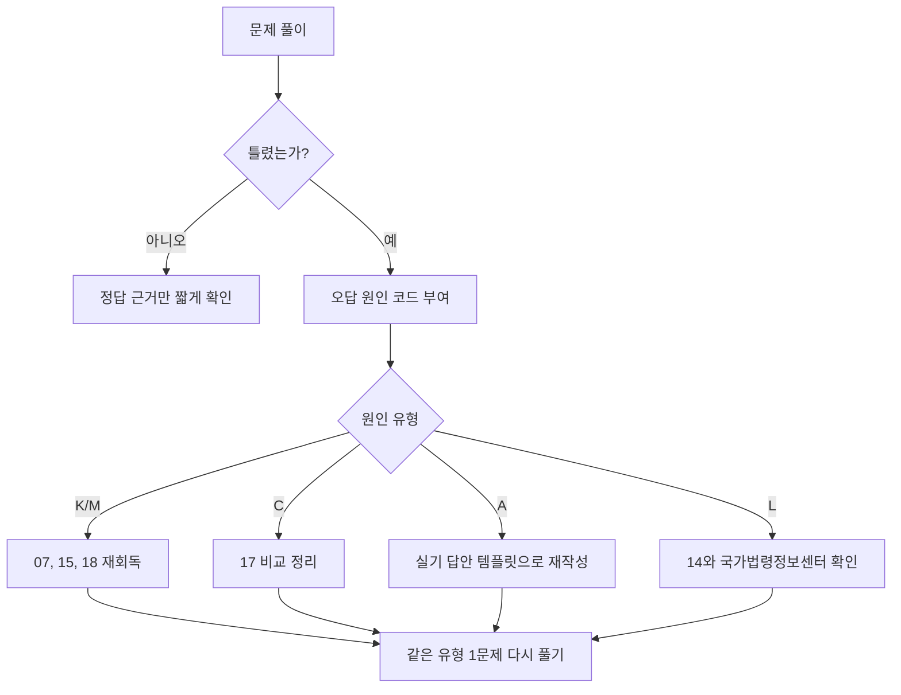

# 20. 오답노트와 약점추적 템플릿

이 문서는 공부 기록용입니다. 문제를 많이 푸는 것보다, 틀린 이유를 같은 형식으로 쌓는 것이 합격에 더 직접적으로 도움이 됩니다.

## 오답 원인 분류

| 코드 | 원인 | 설명 | 다음 행동 |
| --- | --- | --- | --- |
| K | 지식 부족 | 개념 자체를 몰랐음 | 기본 파일 또는 15-통합이론서 재회독 |
| C | 개념 혼동 | 비슷한 개념을 헷갈림 | 17-헷갈리는 개념과 비교표로 정리 |
| R | 지문 해석 실패 | 문제의 조건을 잘못 읽음 | 근거 단어에 밑줄 치는 훈련 |
| M | 암기 누락 | 포트, 명령어, 단계, 용어가 안 떠오름 | 07-암기표와 18-최종암기장 반복 |
| A | 답안 구조 부족 | 실기에서 조치 일부만 씀 | 원인-위험-조치-확인-재발방지 구조로 재작성 |
| L | 법규 최신성 | 법규 조항/의무를 확신하지 못함 | 14-법규 체크와 국가법령정보센터 재확인 |

## 과목별 약점 대시보드

| 과목 | 현재 체감 점수 | 약점 개념 | 마지막 회독일 | 다음 액션 |
| --- | --- | --- | --- | --- |
| 시스템보안 |  |  |  |  |
| 네트워크보안 |  |  |  |  |
| 어플리케이션보안 |  |  |  |  |
| 정보보안일반 |  |  |  |  |
| 관리 및 법규 |  |  |  |  |
| 실기 정보보안실무 |  |  |  |  |

## 오답 기록 템플릿

```text
날짜:
자료/문제:
과목:
정답:
내 답:
오답 원인 코드:

문제에서 봤어야 할 근거:
-

정답이 되는 이유:
-

내가 틀린 이유:
-

다음에 같은 유형을 만나면:
-

관련 파일:
-
```

## 실기 답안 재작성 템플릿

```text
문제 상황:

1. 공격명 또는 이슈명:

2. 판단 근거:
- 로그/패킷/설정/행위에서 확인한 근거를 쓴다.

3. 위험:
- 기밀성/무결성/가용성/법적 책임 중 무엇이 침해되는지 쓴다.

4. 즉시 조치:
- 격리, 차단, 계정 잠금, 로그 보존, 영향 범위 확인 등.

5. 확인 방법:
- 어떤 로그, 명령, 장비, DB, 계정을 확인할지 쓴다.

6. 재발방지:
- 패치, 설정 변경, 권한정리, 모니터링, 교육, 정책 보완 등.
```

## 실기 채점 자가점검표

| 항목 | 확인 |
| --- | --- |
| 공격명 또는 취약점명을 명확히 썼는가 |  |
| 로그나 상황에서 판단 근거를 제시했는가 |  |
| 피해 가능성을 기밀성/무결성/가용성과 연결했는가 |  |
| 즉시 조치와 장기 대책을 구분했는가 |  |
| 증거 보존과 영향 범위 확인을 빠뜨리지 않았는가 |  |
| 재발방지를 정책/기술/관리 측면으로 썼는가 |  |
| 답안이 단어 나열이 아니라 문장으로 완결되는가 |  |

## 7일 전 마무리 루틴

| D-day | 할 일 | 완료 |
| --- | --- | --- |
| D-7 | 19-최종모의고사 1회 풀기, 오답 원인 분류 |  |
| D-6 | 시스템보안과 네트워크보안 오답 재회독 |  |
| D-5 | 어플리케이션보안과 웹 취약점 답안 쓰기 |  |
| D-4 | 암호학 계산, PKI, 접근통제 모델 반복 |  |
| D-3 | 관리체계, 위험관리, 사고대응 문장형 암기 |  |
| D-2 | 법규 최신 확인, 포트/명령어/단계 암기 |  |
| D-1 | 18-최종암기장 중 틀린 항목만 회독, 새 내용 금지 |  |

## 시험장 직전 종이 한 장 구성

아래 항목을 손으로 한 장에 다시 쓰면 기억 고정에 도움이 됩니다.

```text
1. OSI 계층별 장비/공격
2. 주요 포트: FTP, SSH, Telnet, SMTP, DNS, HTTP, HTTPS, POP3, IMAP, SNMP, RDP
3. 공격별 핵심 대응: SQLi, XSS, CSRF, SSRF, DDoS, ARP Spoofing, DNS Poisoning
4. 암호 비교: 대칭키, 공개키, 해시, MAC, 전자서명
5. 접근통제: DAC, MAC, RBAC, Bell-LaPadula, Biba
6. 위험관리: 자산, 위협, 취약점, 위험, 감소/회피/전가/수용
7. 사고대응: 준비, 탐지/분석, 억제, 제거, 복구, 사후조치
8. 개인정보: 수집, 이용, 제공, 위탁, 보관, 파기, 안전조치
```

## 약점 회독 흐름도



## 커밋 예시

오답노트를 실제로 채우면 아래처럼 커밋하면 됩니다.

```text
study: 네트워크보안 오답 원인 정리
study: SQL Injection 실기 답안 재작성
study: 법규 최신 확인 결과 기록
```
