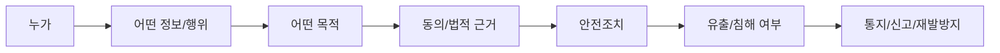

# 23. 법규 상황형 판단문제

법규 문제는 조문 번호 암기보다 `상황을 보고 어떤 의무와 위험이 생기는지 판단하는 능력`이 중요합니다.  
확인 기준일은 2026-05-03이며, 국가법령정보센터 검색 기준으로 개인정보보호법은 2026-09-11 및 2027-07-01 시행 예정 법령도 표시됩니다. 실제 시험 직전에는 반드시 KCA 공지와 국가법령정보센터에서 현행/시행 예정 조문을 다시 확인합니다.

## 공식 확인 링크

- KCA 정보보안 종목 출제기준: https://www.cq.or.kr/qh_cusgm10_002.do?bbscttNo=65
- 개인정보보호법 검색: https://www.law.go.kr/LSW/unSc.do?query=%EA%B0%9C%EC%9D%B8%EC%A0%95%EB%B3%B4%ED%98%B8%EB%B2%95&tabMenuId=tab73
- 개인정보의 안전성 확보조치 기준: https://law.go.kr/admRulLsInfoP.do?admRulSeq=2100000229672&chrClsCd=010202
- ISMS-P 제도소개: https://isms.kisa.or.kr/main/ispims/intro/

## 법규 판단 순서



## 1. 회원가입에 필요 없는 주민등록번호 수집

상황: 쇼핑몰이 일반 회원가입 단계에서 주민등록번호를 필수 입력값으로 요구한다.

판단:

- 주민등록번호는 고유식별정보에 해당하므로 일반 개인정보보다 엄격하게 관리해야 합니다.
- 회원가입 목적에 반드시 필요한 정보인지, 법적 근거가 있는지 확인해야 합니다.
- 목적 달성에 필요한 최소한의 개인정보만 수집해야 하므로 불필요한 주민등록번호 필수 수집은 부적절합니다.

답안 예시:

```text
회원가입 목적 달성에 주민등록번호가 반드시 필요한지 법적 근거를 확인해야 하며, 근거가 없다면 최소수집 원칙에 위배될 수 있다.
주민등록번호 수집 항목을 제거하거나 대체 식별수단을 사용하고, 이미 수집된 정보는 보유 필요성을 검토해 파기한다.
고유식별정보 처리 시에는 암호화, 접근권한 제한, 접속기록 관리 등 안전성 확보조치를 강화한다.
```

## 2. 마케팅 목적 이용

상황: 서비스 제공을 위해 수집한 이메일 주소를 별도 안내 없이 광고 발송에 사용한다.

판단:

- 수집 목적과 다른 마케팅 이용인지 확인해야 합니다.
- 광고성 정보 전송은 수신 동의, 전송자 표시, 수신거부 방법 제공 등과 연결됩니다.
- 정보주체가 동의 철회나 수신거부를 쉽게 할 수 있어야 합니다.

답안 예시:

```text
서비스 제공 목적으로 수집한 이메일을 광고 발송에 사용하려면 목적 외 이용 여부와 광고성 정보 수신 동의 여부를 확인해야 한다.
동의 없이 사용했다면 발송을 중단하고 수신 동의 절차, 수신거부 방법, 전송자 표시를 정비한다.
목적별 동의 이력과 철회 이력을 관리하고, 마케팅 대상자 추출 권한을 제한한다.
```

## 3. 위탁과 제3자 제공 혼동

상황: 고객센터 운영업체에 고객정보를 전달한다.

판단:

- 고객센터가 원래 회사의 업무를 대신 처리하면 위탁에 가깝습니다.
- 제공받는 업체가 자기 목적을 위해 정보를 사용하면 제3자 제공에 가깝습니다.
- 위탁은 수탁자 관리·감독과 계약 관리가 중요하고, 제3자 제공은 제공 목적과 법적 근거/동의가 중요합니다.

답안 예시:

```text
고객센터 운영업체가 개인정보 처리 업무를 대신 수행하는 경우 위탁에 해당할 수 있으며, 수탁자에 대한 관리·감독과 위탁 계약, 처리 범위 통제가 필요하다.
반면 제공받는 자가 자신의 목적을 위해 개인정보를 이용한다면 제3자 제공에 해당할 수 있으므로 제공 목적, 항목, 보유기간, 동의 또는 법적 근거를 확인해야 한다.
```

## 4. 개인정보 유출 의심

상황: 고객 DB가 외부 IP로 대량 조회되었고 일부 파일이 외부 저장소에 업로드되었다.

판단:

- 유출 여부, 유출 항목, 규모, 원인, 피해 가능성을 확인해야 합니다.
- 추가 유출 차단, 증거 보존, 정보주체 통지와 관계기관 신고 요건 검토가 필요합니다.
- 접근권한, 접속기록, 암호화, 위탁 관리 등 안전성 확보조치도 함께 점검합니다.

답안 예시:

```text
개인정보 유출 가능성이 있으므로 DB 감사 로그, 웹/서버 로그, 외부 전송 로그를 보존하고 유출 항목과 규모를 확인한다.
추가 유출을 차단하기 위해 관련 계정 세션 종료, 비밀번호 변경, 접근권한 회수, 외부 업로드 차단을 수행한다.
유출이 확인되면 현행 법령 기준의 통지·신고 요건을 확인하고, 재발방지를 위해 최소권한, 대량조회 탐지, 암호화, DLP, 접속기록 점검을 강화한다.
```

## 5. 접속기록 미보관

상황: 개인정보처리시스템 접속기록을 남기지 않거나 1주일만 보관한다.

판단:

- 개인정보처리시스템 접속기록은 사고 원인 분석과 책임추적에 필수입니다.
- 생성, 보관, 점검, 위변조 방지가 함께 관리되어야 합니다.

답안 예시:

```text
개인정보처리시스템 접속기록이 없거나 보관기간이 부족하면 유출 사고 발생 시 접근자, 조회 항목, 반출 여부를 확인하기 어렵다.
접속자, 접속일시, 처리 내용, 접속지 정보 등을 기록하고 정책에 맞는 기간 동안 안전하게 보관한다.
로그 접근권한을 제한하고 위변조 방지 및 정기 점검 절차를 운영한다.
```

## 6. 개인정보 파기 지연

상황: 이벤트 종료 후에도 응모자 개인정보를 계속 보관하고 있다.

판단:

- 수집 목적이 달성되었거나 보유기간이 끝났는지 확인합니다.
- 보관 근거가 없으면 복구 불가능한 방법으로 파기해야 합니다.
- 백업, 출력물, 위탁업체 보관본까지 확인해야 합니다.

답안 예시:

```text
이벤트 목적이 달성되고 별도 보관 근거가 없다면 개인정보는 지체 없이 파기해야 한다.
DB 데이터뿐 아니라 백업, 엑셀 파일, 출력물, 위탁업체 보관본을 확인하고 복구 불가능한 방식으로 파기한다.
파기 일시, 대상, 방법, 담당자를 기록하여 증적을 남긴다.
```

## 7. 내부자 대량조회

상황: 직원이 업무 시간 외 고객정보를 대량 조회했다.

판단:

- 내부자는 정상 권한을 보유할 수 있으므로 접근권한 적정성과 업무 목적성을 확인해야 합니다.
- 이상조회 탐지, 직무분리, 최소권한, 접속기록 점검이 중요합니다.

답안 예시:

```text
업무 시간 외 고객정보 대량 조회는 내부자 권한 남용 또는 계정 탈취 가능성이 있으므로 해당 계정의 세션, 조회 항목, 업무 목적, 외부 반출 여부를 확인한다.
필요 시 계정 접근을 제한하고 접속기록과 반출 로그를 보존한다.
재발방지를 위해 최소권한, 직무분리, 대량조회 알림, 정기 권한 검토, 내부자 보안교육을 강화한다.
```

## 8. 개인정보 처리방침 미공개

상황: 웹사이트가 개인정보를 수집하지만 처리방침을 찾을 수 없다.

판단:

- 개인정보 처리 목적, 항목, 보유기간, 제3자 제공, 위탁, 정보주체 권리 등을 알리는 투명성이 필요합니다.
- 처리방침은 실제 처리 현황과 일치해야 합니다.

답안 예시:

```text
개인정보를 수집·이용하는 서비스는 처리 목적, 항목, 보유기간, 제3자 제공, 위탁, 정보주체 권리 행사 방법 등을 정보주체가 확인할 수 있도록 공개해야 한다.
처리방침을 게시하고 실제 처리 현황과 불일치하는 항목이 없도록 정기 점검한다.
```

## 9. 민감정보 처리

상황: 건강정보를 수집하는 서비스가 일반 개인정보와 같은 방식으로 저장한다.

판단:

- 건강정보는 민감정보에 해당할 수 있어 처리 근거와 강화된 보호조치가 필요합니다.
- 접근권한, 암호화, 접속기록, 전송구간 보호를 우선 확인합니다.

답안 예시:

```text
건강정보는 사생활 침해 위험이 큰 민감정보에 해당할 수 있으므로 처리 근거와 수집 필요성을 엄격히 확인해야 한다.
저장 및 전송구간 암호화, 접근권한 최소화, 접속기록 점검, 취급자 교육, 위탁 관리 등 강화된 안전조치를 적용한다.
불필요한 항목은 수집하지 않고 목적 달성 후 파기한다.
```

## 10. 가명정보와 익명정보

상황: 분석 목적으로 고객 데이터를 이름만 삭제한 뒤 외부 연구기관에 제공하려 한다.

판단:

- 이름만 삭제해도 다른 정보와 결합해 개인을 알아볼 수 있으면 개인정보 또는 가명정보일 수 있습니다.
- 가명정보는 보호 대상이며 추가정보 분리 보관과 재식별 방지가 필요합니다.
- 익명정보는 더 이상 특정 개인을 알아볼 수 없도록 처리되어야 합니다.

답안 예시:

```text
이름만 삭제한 데이터라도 연락처, 주문내역, 위치정보 등과 결합해 개인을 식별할 수 있으면 개인정보 또는 가명정보에 해당할 수 있다.
분석 목적에 필요한 항목만 남기고 가명처리하며, 추가정보는 분리 보관하고 접근권한을 제한한다.
외부 제공 시 제공 근거, 재식별 금지, 안전조치, 계약 조건을 확인한다.
```

## 11. 정보통신망 침입

상황: 사용자가 관리자 URL을 추측해 권한 없이 관리자 페이지에 접속했다.

판단:

- 정당한 접근권한 없이 정보통신망 또는 정보시스템에 침입하거나 허용된 권한을 넘어 접근하는 행위가 문제될 수 있습니다.
- 서비스 측면에서는 인증·인가 검증 미흡도 함께 봐야 합니다.

답안 예시:

```text
정당한 접근권한 없이 관리자 페이지에 접근한 행위는 정보통신망 침입 또는 권한 초과 접근에 해당할 수 있다.
서비스 운영자는 관리자 URL 노출 여부뿐 아니라 서버 측 권한 검증, MFA, 접근 IP 제한, 관리자 접근 로그 모니터링을 적용해야 한다.
```

## 12. 악성프로그램 유포

상황: 게시판에 악성 파일을 업로드해 다른 이용자에게 내려받게 했다.

판단:

- 악성프로그램 전달·유포 행위와 서비스 보안 관리 미흡을 함께 판단합니다.
- 업로드 검증, 악성코드 탐지, 실행권한 차단, 신고와 차단이 필요합니다.

답안 예시:

```text
게시판을 통해 악성 파일을 배포한 행위는 악성프로그램 전달·유포와 관련될 수 있으며, 서비스 운영자는 즉시 해당 파일을 차단하고 다운로드 이력을 확인해야 한다.
파일 업로드 시 확장자와 시그니처 검증, 악성코드 검사, 실행권한 차단, 신고 절차, 재발방지 모니터링을 적용한다.
```

## 13. 광고성 정보 수신거부 방해

상황: 광고 메일 하단의 수신거부 링크가 동작하지 않는다.

판단:

- 광고성 정보는 수신거부 또는 동의 철회 방법을 명확히 제공해야 합니다.
- 수신거부 방해는 법규형 문제에서 자주 꼬기 좋습니다.

답안 예시:

```text
광고성 정보 전송 시 수신자가 쉽게 수신거부 또는 동의 철회를 할 수 있어야 하며, 수신거부 링크가 동작하지 않으면 부적절하다.
수신거부 기능을 정상화하고 처리 이력을 관리하며, 수신거부 후 재발송되지 않도록 발송 대상 추출 절차를 점검한다.
```

## 14. 주요정보통신기반시설

상황: 국가·사회적으로 중요한 서비스의 정보시스템 취약점 분석평가 결과가 반복적으로 미조치 상태다.

판단:

- 주요정보통신기반시설은 취약점 분석평가와 보호대책 수립·이행이 핵심입니다.
- 미조치 위험은 일정, 담당자, 예산, 우선순위와 함께 관리해야 합니다.

답안 예시:

```text
주요정보통신기반시설은 취약점 분석평가 결과에 따라 보호대책을 수립하고 이행 여부를 관리해야 한다.
반복 미조치 취약점은 위험도와 업무 영향을 기준으로 우선순위를 정하고 담당자, 일정, 예산, 검증 방법을 포함한 이행계획으로 관리한다.
```

## 15. ISMS-P 인증기준 상황

상황: 회사에 보안정책은 있지만 자산목록, 위험평가, 권한검토 기록이 없다.

판단:

- ISMS-P는 문서 존재만이 아니라 관리체계의 운영과 개선을 봅니다.
- KISA 제도소개 기준으로 관리체계 수립 및 운영, 보호대책 요구사항, 개인정보 처리단계별 요구사항으로 나누어 볼 수 있습니다.

답안 예시:

```text
보안정책만 존재하고 자산목록, 위험평가, 권한검토 기록이 없다면 관리체계가 실제로 운영된 증거가 부족하다.
자산 식별, 위험평가, 보호대책 이행, 점검 및 개선, 개인정보 처리단계별 보호조치를 절차화하고 증적을 남겨야 한다.
```

## 16. 디지털 포렌식

상황: 침해사고 PC를 분석하기 전에 담당자가 임의로 파일을 삭제하고 재부팅했다.

판단:

- 휘발성 증거와 원본 증거가 훼손될 수 있습니다.
- 포렌식은 원본 보존, 무결성, 절차의 정당성, 연계보관성이 중요합니다.

답안 예시:

```text
침해사고 시스템을 임의로 재부팅하거나 파일을 삭제하면 메모리, 프로세스, 네트워크 연결 등 휘발성 증거와 원본 증거가 훼손될 수 있다.
분석 전 증거 수집 절차에 따라 원본을 보존하고 해시값으로 무결성을 확인하며, 수집자·일시·보관 이력을 기록해야 한다.
```

## 17. 업무연속성

상황: 백업은 매일 수행하지만 복구훈련을 한 적이 없다.

판단:

- 백업 존재와 복구 가능성은 다릅니다.
- RTO/RPO를 만족하는지 실제 복구훈련으로 검증해야 합니다.

답안 예시:

```text
백업이 존재해도 복구훈련이 없으면 장애나 랜섬웨어 발생 시 목표 복구시간과 목표 복구시점을 만족하는지 확인할 수 없다.
업무영향분석을 통해 RTO와 RPO를 정하고 정기 복구훈련, 백업 무결성 검증, 오프라인 또는 불변 백업을 운영한다.
```

## 18. 위탁업체 보안관리

상황: 위탁업체 직원이 운영 DB에 직접 접속하지만 접속기록과 승인 이력이 없다.

판단:

- 외부자 보안, 위탁 관리, 접근권한, 접속기록 문제가 함께 발생합니다.
- 위탁업체도 처리 범위와 권한을 제한하고 감독해야 합니다.

답안 예시:

```text
위탁업체 직원의 운영 DB 직접 접속에 승인 이력과 접속기록이 없다면 외부자 보안과 개인정보 처리 위탁 관리가 미흡하다.
접근권한은 업무상 필요한 범위로 제한하고, 작업 승인, 계정 분리, 접속기록 보관, 정기 점검, 계약상 보안 의무와 재위탁 제한을 관리한다.
```

## 19. 로그에 개인정보 저장

상황: 로그인 실패 로그에 사용자가 입력한 비밀번호가 평문으로 남는다.

판단:

- 로그는 사고 분석에 필요하지만 민감한 인증정보를 남기면 유출 피해가 커집니다.
- 로그 마스킹과 접근권한 제한이 필요합니다.

답안 예시:

```text
로그에 비밀번호가 평문으로 저장되면 로그 유출만으로 계정 탈취가 가능하므로 부적절하다.
비밀번호, 인증토큰, 주민등록번호 등 민감한 값은 로그에 남기지 않거나 마스킹하고, 로그 접근권한과 보관기간을 제한한다.
```

## 20. 법규형 답안에서 피할 표현

| 피할 표현 | 문제점 | 더 좋은 표현 |
| --- | --- | --- |
| 법 위반이다 | 근거와 상황 판단 부족 | `현행 법령 기준으로 동의/근거/의무를 확인해야 한다` |
| 신고한다 | 신고 요건과 사실 확인 누락 | `유출 여부와 규모를 확인한 뒤 신고·통지 요건을 검토한다` |
| 암호화한다 | 안전조치 일부만 언급 | `암호화, 접근권한, 접속기록, 점검, 교육을 함께 적용한다` |
| 파기한다 | 백업/위탁본 누락 | `DB, 백업, 출력물, 위탁업체 보관본까지 파기 여부를 확인한다` |
| 동의받는다 | 법적 근거와 최소수집 누락 | `처리 목적, 항목, 보유기간, 동의 또는 법적 근거를 확인한다` |

## 상황형 미니문제

아래 상황을 보고 핵심 판단을 한 줄로 적어봅니다.

| 번호 | 상황 | 핵심 판단 |
| --- | --- | --- |
| 1 | 개인정보처리시스템 접속기록을 관리자만 수정 가능하게 했다 | 수정 가능성 자체보다 위변조 방지와 접근통제, 점검 이력이 필요 |
| 2 | 고객정보를 테스트 DB에 그대로 복사했다 | 목적과 권한을 검토하고 마스킹/가명처리 필요 |
| 3 | 퇴직자 계정으로 VPN 접속이 성공했다 | 계정 회수 미흡, 접근권한 정리와 접속 로그 분석 필요 |
| 4 | 개인정보 파일을 암호화했지만 키가 같은 서버에 평문 저장되어 있다 | 키관리 미흡, 키 접근권한 분리 필요 |
| 5 | 침해사고 후 로그가 3일치밖에 없다 | 원인분석과 책임추적 곤란, 보관기간 정책 필요 |
| 6 | 위탁업체가 재위탁했으나 원 회사가 모른다 | 위탁 계약과 재위탁 통제, 관리감독 미흡 |
| 7 | 광고성 문자에 발신자와 수신거부 방법이 없다 | 광고성 정보 표시와 수신거부 절차 문제 |
| 8 | 주요 서비스 복구 목표가 정의되어 있지 않다 | BIA 기반 RTO/RPO 수립 필요 |
| 9 | 보안정책은 있으나 교육 이력이 없다 | 관리적 보호대책 운영 증적 부족 |
| 10 | 개인정보 유출 의심인데 서버를 포맷했다 | 증거 보존 실패, 포렌식 절차 위반 가능 |

## 마지막 암기 문장

```text
개인정보: 목적 명확화, 최소수집, 목적 내 이용, 안전조치, 권리보장, 보관기간 준수, 안전한 파기.
유출 의심: 사실확인, 추가유출 차단, 증거보존, 통지/신고 요건 확인, 피해완화, 재발방지.
위탁: 업무 대행, 계약과 관리감독. 제3자 제공: 제공받는 자의 목적, 동의 또는 법적 근거.
ISMS-P: 정책 문서가 아니라 자산-위험-대책-운영-점검-개선의 증적.
포렌식: 원본 보존, 해시 무결성, 절차 정당성, 연계보관성.
```
