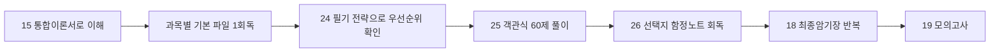

# 24. 필기 우선합격 전략

필기 목표는 `전 과목 평균 60점 이상`과 `각 과목 40점 이상`입니다. 즉, 한 과목을 완전히 버리면 평균이 높아도 합격 기준을 넘기 어렵습니다. 필기 대비는 고득점보다 먼저 과락 방지 구조로 잡아야 합니다.

## 필기 시험 구조

| 항목 | 내용 |
| --- | --- |
| 문항 수 | 총 100문항 |
| 과목 | 시스템보안, 네트워크보안, 어플리케이션보안, 정보보안일반, 정보보안관리 및 법규 |
| 과목별 문항 | 각 20문항 |
| 합격 기준 | 과목당 40점 이상, 전 과목 평균 60점 이상 |
| 시간 | 2시간 30분 |

과목당 20문항이므로 한 과목에서 8문항 이상은 맞혀야 과락을 피합니다. 안정권은 과목당 12문항 이상, 합격권은 전체 60문항 이상입니다.

## 점수 목표

| 과목 | 최소 목표 | 안정 목표 | 이유 |
| --- | ---: | ---: | --- |
| 시스템보안 | 10/20 | 13/20 | 계정, 권한, 로그, 패치 문제는 반복 학습으로 점수화 가능 |
| 네트워크보안 | 10/20 | 13/20 | OSI, TCP/IP, 공격유형, 장비 비교가 빈출 |
| 어플리케이션보안 | 10/20 | 13/20 | 웹 취약점과 서비스 보안은 원인-대응 연결이 명확 |
| 정보보안일반 | 9/20 | 12/20 | 암호와 접근통제에서 헷갈리는 선택지가 많음 |
| 관리 및 법규 | 9/20 | 12/20 | 법규 최신성보다 기본 원칙과 상황 판단이 중요 |

추천 목표는 `13 + 13 + 13 + 12 + 12 = 63점`입니다. 어느 한 과목이 흔들려도 과락만 피하면 합격권에 들어가기 쉽습니다.

## 필기 공부 순서



## 과목별 1회독 우선순위

### 시스템보안

반드시 맞혀야 할 범위:

- 계정 관리: 기본 계정, 퇴직자 계정, 공유 계정, 관리자 권한
- 인증과 원격접속: SSH, RDP, VPN, MFA, 계정 잠금
- 권한: SUID, SGID, Sticky bit, NTFS/공유 권한
- 로그: 인증 로그, 이벤트 로그, sudo, 서비스 변경, 로그 보관
- 악성코드: 랜섬웨어, 백도어, 루트킷, 트로이목마
- 패치와 취약점 점검: Nmap, 취약점 스캐너, 보완 이력

선택지 감각:

- `로그 삭제`는 대응이 아니라 증거 훼손입니다.
- `root 원격 로그인 허용`은 편의성은 있어도 보안상 위험합니다.
- `백업`은 랜섬웨어 대응에 중요하지만, 온라인 백업만 있으면 함께 암호화될 수 있습니다.

### 네트워크보안

반드시 맞혀야 할 범위:

- OSI 7계층과 TCP/IP 계층
- TCP 3-way handshake, TCP flags
- ARP, ICMP, DNS, NAT, VLAN, VPN
- DoS/DDoS, SYN Flood, UDP Flood, Smurf
- 스푸핑, 스니핑, 세션 하이재킹
- 방화벽, IDS, IPS, WAF, NAC, UTM, ESM/SIEM

선택지 감각:

- NAT는 주소 변환이지 접근통제 그 자체가 아닙니다.
- IDS는 탐지 중심, IPS는 차단까지 가능합니다.
- WAF는 웹 요청 내용을 보는 장비입니다. 포트만 보는 일반 방화벽과 구분합니다.

### 어플리케이션보안

반드시 맞혀야 할 범위:

- FTP: 익명 접속, 평문 전송, SFTP/FTPS
- 메일: 스팸, 오픈 릴레이, SPF, DKIM, DMARC
- DNS: 영역전송, 캐시 포이즈닝, 재귀 질의 제한
- 웹: SQL Injection, XSS, CSRF, 파일 업로드, 경로조작, SSRF
- DB: 최소권한, 암호화, 감사 로그, 백업 보호
- 개발보안: 입력값 검증, 출력 인코딩, 인증/인가, 오류 메시지 제한

선택지 감각:

- SQL Injection의 핵심 대응은 Prepared Statement입니다.
- XSS는 출력 인코딩, CSRF는 토큰과 SameSite가 핵심입니다.
- 확장자 차단만으로 파일 업로드 보안이 끝나지 않습니다.

### 정보보안일반

반드시 맞혀야 할 범위:

- CIA: 기밀성, 무결성, 가용성
- 인증: 지식, 소유, 존재, MFA
- 접근통제: DAC, MAC, RBAC, Bell-LaPadula, Biba
- 암호: 대칭키, 공개키, 해시, MAC, 전자서명
- 운영 모드: ECB, CBC, CFB, OFB, CTR, GCM
- PKI: 인증서, CA, RA, CRL, OCSP

선택지 감각:

- 해시는 복호화하지 않습니다.
- 전자서명은 기밀성을 직접 제공하지 않습니다.
- 공개키 암호에서 기밀성은 수신자의 공개키로 암호화합니다.

### 정보보안관리 및 법규

반드시 맞혀야 할 범위:

- 위험관리: 자산, 위협, 취약점, 위험, 가능성, 영향
- 위험처리: 감소, 회피, 전가, 수용
- 보호대책: 관리적, 물리적, 기술적
- 사고대응: 준비, 탐지/분석, 차단, 제거, 복구, 사후조치
- BCP/DRP, BIA, RTO, RPO
- 개인정보: 처리 원칙, 정보주체 권리, 안전성 확보조치, 유출 대응
- 인증제도: ISMS-P, 제품 인증

선택지 감각:

- RTO는 복구 시간, RPO는 데이터 시점입니다.
- 위탁은 업무 대행, 제3자 제공은 제공받는 자의 목적을 봅니다.
- ISMS-P는 제품 성능시험이 아니라 관리체계 인증입니다.

## 2주 필기 집중 계획

| 날짜 | 목표 | 자료 |
| --- | --- | --- |
| 1일차 | 출제범위와 필기 구조 확인 | 00, 24 |
| 2일차 | 시스템보안 1회독 | 01, 15 |
| 3일차 | 네트워크보안 1회독 | 02, 10 |
| 4일차 | 어플리케이션보안 1회독 | 03, 12 |
| 5일차 | 정보보안일반 1회독 | 04, 09 |
| 6일차 | 관리 및 법규 1회독 | 05, 14 |
| 7일차 | 객관식 60제 1차 풀이 | 25 |
| 8일차 | 틀린 과목만 재회독 | 17, 18 |
| 9일차 | 선택지 함정 정리 | 26 |
| 10일차 | 암호·접근통제 집중 | 09, 17 |
| 11일차 | 웹·네트워크 공격 집중 | 02, 03, 12 |
| 12일차 | 법규·위험관리 집중 | 05, 14, 23 |
| 13일차 | 최종모의고사 | 19 |
| 14일차 | 오답만 회독 | 20, 18, 26 |

## 필기 시간 배분

총 150분이므로 100문항을 모두 풀어야 합니다.

| 구간 | 시간 | 행동 |
| --- | ---: | --- |
| 1회전 | 70분 | 아는 문제를 빠르게 풀고 애매한 문제 표시 |
| 2회전 | 50분 | 표시한 문제 재검토, 계산/암호/법규 판단 |
| 3회전 | 20분 | 마킹 누락, 과목별 과락 위험 확인 |
| 예비 | 10분 | 헷갈리는 문제 최종 선택 |

한 문제에 2분 이상 붙잡히면 뒤 과목의 쉬운 문제를 놓칠 수 있습니다. 필기는 어려운 한 문제보다 전체 회전이 중요합니다.

## 선택지 제거법

1. 절대 표현 제거: `항상`, `절대`, `완전히`, `무조건`은 보안 문제에서 틀린 경우가 많습니다.
2. 보안 속성 확인: 기밀성, 무결성, 가용성 중 무엇을 묻는지 먼저 봅니다.
3. 기술 목적 확인: 암호화, 해시, 서명, MAC, 인증은 목적이 다릅니다.
4. 계층 확인: 웹 공격인지 네트워크 공격인지 계층을 먼저 잡습니다.
5. 대응 범위 확인: 단순 차단인지 원인 제거와 재발방지까지 묻는지 봅니다.

## 과락 위험 신호

| 신호 | 의미 | 바로 할 일 |
| --- | --- | --- |
| 네트워크에서 계층을 못 잡음 | OSI/TCP-IP 이해 부족 | 10 그림요약과 02 네트워크보안 재회독 |
| 암호 문제에서 키 방향이 헷갈림 | 공개키/전자서명 혼동 | 09 암호학 심화의 전자서명·하이브리드 암호 반복 |
| 웹 취약점 대응이 섞임 | SQLi/XSS/CSRF 구분 부족 | 17 헷갈리는 개념과 12 매트릭스 반복 |
| 법규 문제에서 주체를 못 봄 | 개인정보 처리 흐름 부족 | 23 법규 상황형 판단문제 반복 |
| 보기 2개까지 줄이고 틀림 | 선택지 함정 대응 부족 | 26 선택지 함정노트 반복 |

## 필기 직전 마지막 회독

```text
1. 포트와 프로토콜
2. OSI 계층별 공격
3. SQLi/XSS/CSRF/SSRF/파일업로드 차이
4. 대칭키/공개키/해시/MAC/전자서명 차이
5. DAC/MAC/RBAC, BLP/Biba
6. 위험처리 4가지와 RTO/RPO
7. 개인정보 처리 단계와 안전성 확보조치
8. IDS/IPS/WAF/VPN/NAC/UTM/SIEM 차이
```

필기 당일에는 새로운 주제를 늘리지 말고, `25 객관식 60제에서 틀린 문제`와 `26 선택지 함정노트`만 봅니다.
