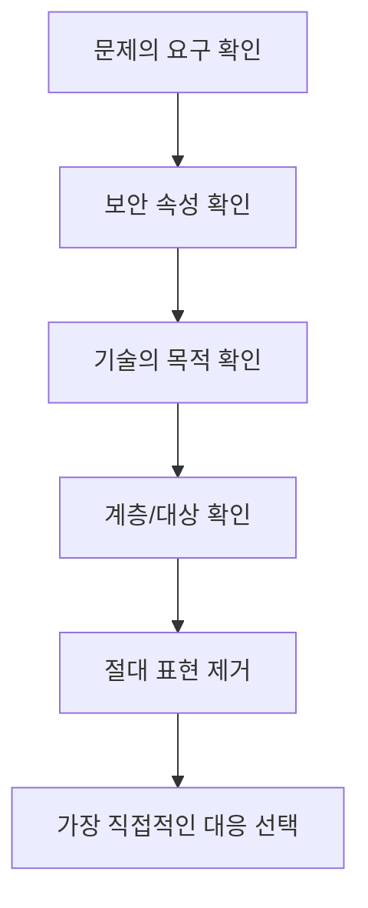

# 26. 필기 선택지 함정노트

필기 객관식은 아는 개념도 선택지 표현에서 흔들리기 쉽습니다. 이 문서는 `보기 2개까지 줄였는데 틀리는 문제`를 줄이기 위한 함정 정리입니다.

## 전체 선택지 판단법



## 자주 틀리는 표현

| 선택지 표현 | 판단 |
| --- | --- |
| 완전히 방지한다 | 보안에서 완전 방지는 드뭅니다. 위험 감소인지 확인합니다. |
| 암호화하면 무결성이 보장된다 | 암호화는 주로 기밀성입니다. 무결성은 MAC, 해시, 전자서명, AEAD를 봅니다. |
| 해시값은 복호화한다 | 해시는 일방향입니다. 복호화가 아닙니다. |
| 전자서명은 기밀성을 제공한다 | 전자서명은 무결성, 인증, 부인방지가 중심입니다. |
| NAT는 방화벽을 대체한다 | NAT는 주소 변환입니다. 접근통제 정책과 다릅니다. |
| IDS는 공격을 항상 차단한다 | IDS는 탐지가 중심입니다. 차단은 IPS입니다. |
| WAF는 모든 네트워크 공격을 차단한다 | WAF는 웹 애플리케이션 계층 공격 대응이 중심입니다. |
| 백업만 있으면 랜섬웨어 대응이 끝난다 | 백업 격리, 무결성 검증, 복구훈련이 필요합니다. |
| 법규 문제는 무조건 신고한다 | 유출 여부, 규모, 요건, 현행 법령 확인이 필요합니다. |

## 시스템보안 함정

### root 로그인

틀린 선택지:

```text
root 원격 로그인을 허용하면 관리가 편하므로 보안상 안전하다.
```

왜 틀렸나:

root는 최고권한 계정입니다. 원격에서 직접 접근이 가능하면 대입 공격이나 탈취 계정 악용 시 피해가 즉시 커집니다.

맞는 방향:

```text
root 직접 로그인을 금지하고 일반 계정 접속 후 sudo를 통해 필요한 명령만 수행하게 한다.
```

### 로그 보관

틀린 선택지:

```text
개인정보 보호를 위해 사고 후 로그를 삭제한다.
```

왜 틀렸나:

로그는 사고 원인 분석과 책임추적의 핵심 증거입니다. 삭제가 아니라 접근통제, 위변조 방지, 보관기간 관리가 필요합니다.

### 백신과 EDR

헷갈리는 점:

- 백신은 알려진 악성코드 탐지에 강합니다.
- EDR은 단말 행위 기반 탐지, 격리, 조사에 강합니다.

문제에서 `프로세스 행위`, `격리`, `조사`, `위협 헌팅`이 나오면 EDR 쪽을 떠올립니다.

### SUID와 Sticky bit

| 개념 | 핵심 | 함정 |
| --- | --- | --- |
| SUID | 파일 소유자 권한으로 실행 | root 소유 SUID는 권한상승 위험 |
| SGID | 파일 그룹 권한으로 실행 | 공유 디렉터리 그룹 권한과 연결 |
| Sticky bit | 디렉터리에서 소유자만 삭제 가능 | `/tmp`처럼 공동 쓰기 디렉터리 보호 |

## 네트워크보안 함정

### IDS, IPS, WAF

| 장비 | 핵심 | 선택지 단서 |
| --- | --- | --- |
| IDS | 탐지와 경고 | 모니터링, 알림, 미러링 |
| IPS | 인라인 차단 | 차단, drop, reset |
| WAF | 웹 공격 대응 | HTTP, SQLi, XSS, 업로드, 경로조작 |

함정:

```text
SQL Injection은 네트워크 계층 공격이므로 라우터 ACL만으로 근본 차단한다.
```

SQL Injection은 응용계층 공격입니다. Prepared Statement와 WAF가 더 직접적인 대응입니다.

### NAT와 방화벽

NAT는 내부 주소를 외부 주소로 바꾸는 기술입니다. 내부 주소가 숨겨지는 효과가 있지만 접근통제 자체는 아닙니다. 문제에서 `허용/차단 정책`을 묻는다면 방화벽, ACL을 봅니다.

### VLAN

VLAN은 논리 분리에 유용하지만, VLAN 간 라우팅이 열려 있으면 통신이 가능합니다. 분리만 했다고 접근통제가 끝나는 것은 아닙니다.

### DoS/DDoS

| 공격 | 단서 | 대응 |
| --- | --- | --- |
| SYN Flood | SYN 급증, ACK 부족 | SYN Cookie, rate limit |
| UDP Flood | UDP 대량 | 임계치, 불필요 UDP 차단 |
| Smurf | ICMP, 브로드캐스트, 출발지 위조 | 브로드캐스트 응답 차단 |
| DNS 증폭 | UDP 53, ANY 질의, 오픈 리졸버 | 재귀 제한, rate limit |
| HTTP Flood | 정상 HTTP 요청처럼 보임 | WAF, CDN, 행위 기반 제한 |

### VPN

틀린 선택지:

```text
VPN을 사용하면 계정 탈취 위험이 사라진다.
```

VPN은 통신 터널을 보호하지만 계정이 탈취되면 내부망 접근 통로가 됩니다. MFA, 단말 검증, 접근 범위 제한이 필요합니다.

## 어플리케이션보안 함정

### SQLi, XSS, CSRF

| 구분 | 원인 | 핵심 대응 |
| --- | --- | --- |
| SQL Injection | 입력이 SQL 문으로 해석 | Prepared Statement |
| XSS | 출력이 브라우저 코드로 해석 | 출력 인코딩, CSP |
| CSRF | 로그인 상태의 요청 위조 | CSRF 토큰, SameSite |

함정:

```text
CSRF는 출력 인코딩으로 방어한다.
```

출력 인코딩은 XSS 대응입니다. CSRF는 요청의 진정성을 검증해야 합니다.

### 파일 업로드

확장자 차단만으로 부족합니다. 파일 시그니처, MIME, 저장 위치, 실행권한, 파일명 재생성, 접근 URL 통제가 필요합니다.

### SSRF

단서:

- 서버가 URL을 받아 요청합니다.
- 내부 IP, `localhost`, `127.0.0.1`, `169.254.169.254` 같은 주소가 보입니다.
- 클라우드 메타데이터 접근이 언급됩니다.

대응:

- URL 허용목록
- 내부/메타데이터 주소 차단
- 리다이렉트 검증
- 서버 권한 최소화

### DNS 보안

| 문제 | 위험 | 대응 |
| --- | --- | --- |
| Zone Transfer 허용 | 내부 호스트 정보 노출 | 보조 DNS IP로 제한 |
| 재귀 질의 외부 허용 | 증폭 공격 악용 | 내부 대역만 허용 |
| Cache Poisoning | 잘못된 주소 응답 | 패치, DNSSEC 검토, 질의 무작위성 |

## 정보보안일반 함정

### 암호 기술 목적 구분

| 기술 | 주 목적 | 헷갈리는 지점 |
| --- | --- | --- |
| 대칭키 암호 | 빠른 기밀성 | 키 분배가 어려움 |
| 공개키 암호 | 키 분배, 서명 | 느림 |
| 해시 | 무결성 확인, 요약 | 복호화 불가 |
| MAC | 무결성 + 메시지 인증 | 공유키라 부인방지 약함 |
| 전자서명 | 무결성 + 인증 + 부인방지 | 기밀성 직접 제공 아님 |
| AEAD | 기밀성 + 무결성 | nonce 재사용 주의 |

### 공개키 방향

| 목적 | 사용하는 키 |
| --- | --- |
| 수신자만 읽게 암호화 | 수신자의 공개키로 암호화, 수신자의 개인키로 복호화 |
| 송신자 서명 | 송신자의 개인키로 서명, 송신자의 공개키로 검증 |

가장 많이 틀리는 지점입니다. `비밀로 보내기`와 `누가 보냈는지 증명`을 먼저 구분합니다.

### 접근통제 모델

| 모델 | 단서 |
| --- | --- |
| DAC | 소유자, 임의적, 권한 위임 |
| MAC | 보안등급, 중앙 강제, 군/정부 |
| RBAC | 역할, 직무, 권한 묶음 |
| ABAC | 속성, 시간, 위치, 환경 조건 |

### Bell-LaPadula와 Biba

| 모델 | 보호 목표 | 기억법 |
| --- | --- | --- |
| Bell-LaPadula | 기밀성 | 비밀문서 유출 방지 |
| Biba | 무결성 | 낮은 무결성 정보가 높은 무결성 정보 오염 방지 |

## 관리 및 법규 함정

### 위험관리 용어

| 용어 | 의미 |
| --- | --- |
| 자산 | 보호할 가치가 있는 대상 |
| 위협 | 손실을 일으킬 수 있는 원인 |
| 취약점 | 위협이 이용할 수 있는 약점 |
| 위험 | 위협이 취약점을 이용해 자산에 영향을 줄 가능성 |
| 잔여위험 | 대책 적용 후 남는 위험 |

함정:

```text
위험은 취약점 그 자체이다.
```

취약점은 위험의 구성요소입니다. 위험은 가능성과 영향까지 포함합니다.

### 위험처리

| 처리 | 예시 |
| --- | --- |
| 감소 | 패치, 암호화, 접근통제 |
| 회피 | 위험한 서비스 중단 |
| 전가 | 보험, 계약 |
| 수용 | 비용 대비 효과가 낮은 잔여위험 승인 |

`보험`이 나오면 전가입니다. `서비스 중단`은 회피입니다.

### RTO/RPO

| 용어 | 질문 | 예시 |
| --- | --- | --- |
| RTO | 얼마나 빨리 복구? | 4시간 안에 서비스 복구 |
| RPO | 어느 시점 데이터까지 복구? | 최대 1시간 전 데이터까지 허용 |

### 개인정보

| 개념 | 핵심 |
| --- | --- |
| 개인정보 | 살아 있는 개인을 알아볼 수 있는 정보 |
| 가명정보 | 추가정보 없이는 특정 개인을 알아보기 어려운 정보 |
| 익명정보 | 더 이상 개인을 알아볼 수 없는 정보 |
| 민감정보 | 사생활 침해 우려가 큰 정보 |
| 고유식별정보 | 주민등록번호, 여권번호, 운전면허번호, 외국인등록번호 등 |

함정:

```text
이름을 삭제하면 항상 익명정보가 된다.
```

다른 정보와 결합해 식별 가능하면 여전히 개인정보 또는 가명정보일 수 있습니다.

### 위탁과 제3자 제공

| 구분 | 판단 기준 |
| --- | --- |
| 위탁 | 내 업무를 대신 처리하게 함 |
| 제3자 제공 | 제공받는 자의 목적을 위해 넘김 |

고객센터, 배송, 문자 발송 대행은 보통 위탁 맥락으로 자주 나옵니다. 단, 제공받는 자가 자기 목적에 쓰면 제3자 제공 쪽을 봅니다.

## 보기 2개 남았을 때 최종 체크

1. 더 직접적인 대응인가?
   - SQLi에는 Prepared Statement가 WAF보다 근본 대응에 가깝습니다.
   - XSS에는 출력 인코딩이 입력값 검증보다 직접 대응에 가깝습니다.

2. 보안 속성이 맞는가?
   - 기밀성을 묻는데 해시를 고르면 틀릴 가능성이 큽니다.
   - 부인방지를 묻는데 MAC을 고르면 전자서명과 비교해야 합니다.

3. 계층이 맞는가?
   - TCP SYN Flood는 전송계층입니다.
   - SQL Injection은 응용계층입니다.

4. 관리/기술/물리 구분이 맞는가?
   - 교육과 정책은 관리적입니다.
   - 방화벽과 암호화는 기술적입니다.
   - 출입통제와 CCTV는 물리적입니다.

5. 문제의 단어가 함정인가?
   - `항상`, `무조건`, `완전히`는 의심합니다.
   - `가장 적절한 것`은 부분 대응보다 핵심 원인을 고릅니다.

## 최종 암기 한 장

```text
SQLi = Prepared Statement
XSS = 출력 인코딩
CSRF = 토큰/SameSite
SSRF = 내부주소 차단/URL 허용목록
파일업로드 = 웹루트 밖 저장/실행권한 제거
IDS = 탐지, IPS = 차단, WAF = 웹
NAT = 주소변환, VLAN = 논리분리, VPN = 암호화 터널
해시 = 복호화 없음, MAC = 공유키 인증, 전자서명 = 부인방지
BLP = 기밀성, Biba = 무결성
RTO = 시간, RPO = 시점
위험처리 = 감소/회피/전가/수용
개인정보 = 살아 있는 개인 식별 가능성
위탁 = 업무대행, 제3자 제공 = 제공받는 자 목적
```
