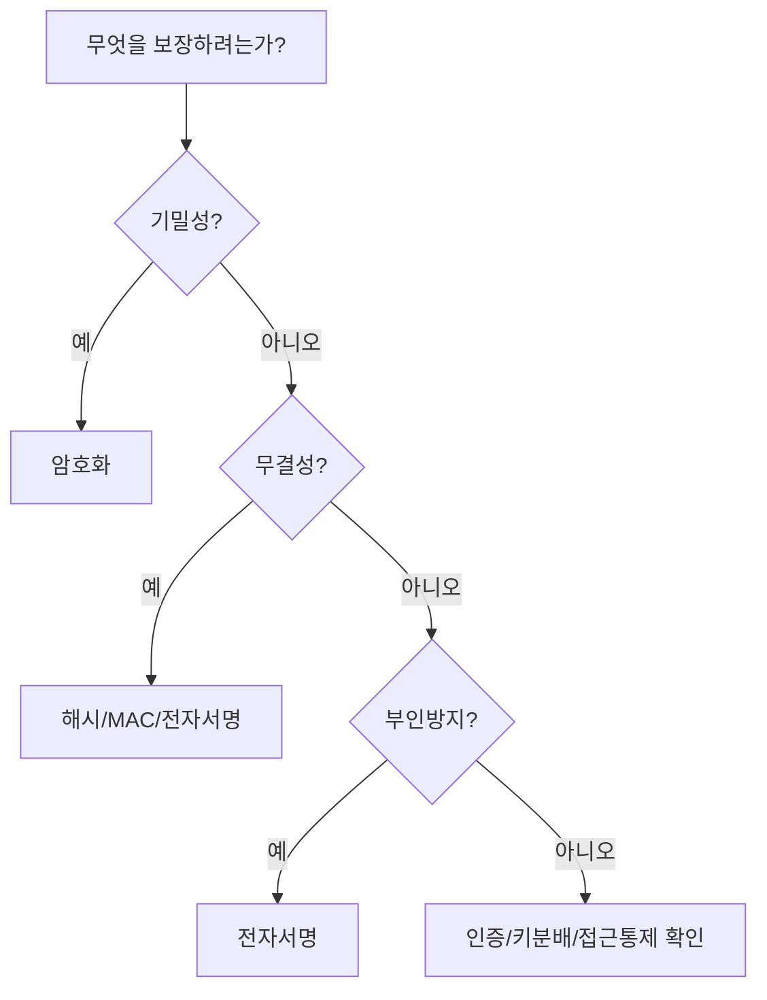
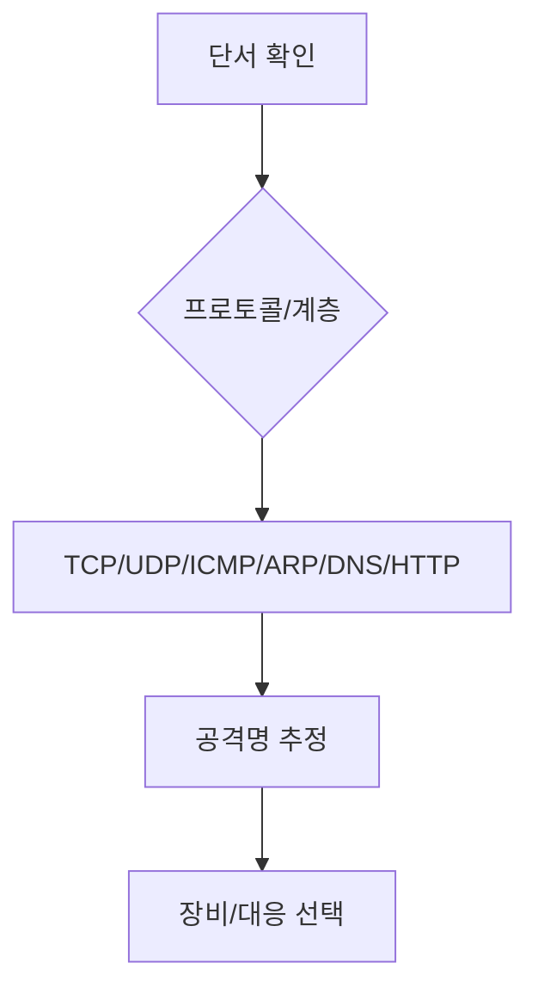

# 31. 필기 암호·네트워크 집중특훈

필기에서 재도전자가 가장 많이 흔들리는 두 축은 `암호`와 `네트워크`입니다. 둘 다 용어는 익숙하지만 선택지에서 목적과 계층이 바뀌면 틀리기 쉽습니다.

## 암호 문제 판단 순서



## 암호 핵심 비교

| 구분 | 키 | 제공 속성 | 함정 |
| --- | --- | --- | --- |
| 대칭키 암호 | 같은 비밀키 | 기밀성 | 키 분배가 어렵다 |
| 공개키 암호 | 공개키/개인키 | 기밀성, 키분배, 서명 기반 | 느리다 |
| 해시 | 키 없음 | 무결성 확인 | 인증과 부인방지 약함 |
| MAC | 공유 비밀키 | 무결성, 메시지 인증 | 부인방지 약함 |
| 전자서명 | 개인키/공개키 | 무결성, 인증, 부인방지 | 기밀성 직접 제공 아님 |
| AEAD | 대칭키와 nonce | 기밀성, 무결성 | nonce 재사용 위험 |

## 공개키 방향 특훈

| 상황 | 정답 |
| --- | --- |
| A가 B에게 비밀 메시지를 보냄 | B의 공개키로 암호화 |
| B가 비밀 메시지를 읽음 | B의 개인키로 복호화 |
| A가 문서에 서명 | A의 개인키로 서명 |
| B가 A의 서명을 검증 | A의 공개키로 검증 |

틀리는 이유:

- `누구의 키인가`보다 `비밀로 보내는가`, `누가 보냈는지 증명하는가`를 먼저 봐야 합니다.

## 운영 모드 특훈

| 모드 | 특징 | 시험 포인트 |
| --- | --- | --- |
| ECB | 블록 독립 암호화 | 패턴 노출 |
| CBC | 이전 암호문 블록과 XOR | IV 필요 |
| CFB | 스트림처럼 사용 가능 | 오류 전파 일부 |
| OFB | 키스트림 생성 | 동기화 중요 |
| CTR | 카운터 사용 | 병렬 처리, nonce 재사용 금지 |
| GCM | 인증 포함 | AEAD, 무결성 제공 |

## 접근통제 특훈

| 모델 | 한 줄 기억 | 보기 단서 |
| --- | --- | --- |
| DAC | 소유자가 권한을 준다 | 소유자, 임의적, 권한 위임 |
| MAC | 등급과 정책이 강제한다 | 보안등급, 중앙통제 |
| RBAC | 역할로 권한을 준다 | 직무, 역할, 그룹 |
| ABAC | 속성과 조건으로 판단한다 | 시간, 위치, 단말, 속성 |

| 모델 | 목표 | 기억 |
| --- | --- | --- |
| Bell-LaPadula | 기밀성 | No read up, No write down |
| Biba | 무결성 | 낮은 무결성 오염 방지 |

## 네트워크 문제 판단 순서



## 계층별 공격 정리

| 계층 | 단서 | 공격 |
| --- | --- | --- |
| 응용 | HTTP, DNS, SMTP | 웹 공격, DNS 공격, 메일 공격 |
| 전송 | TCP SYN, UDP | SYN Flood, UDP Flood, 포트 스캔 |
| 네트워크 | IP, ICMP | IP Spoofing, Smurf, ICMP Flood |
| 데이터링크 | ARP, MAC | ARP Spoofing, MAC Flooding |
| 물리 | 케이블, 전파 | 도청, 장애, 물리 침입 |

## 장비 비교 특훈

| 장비 | 목적 | 자주 나오는 함정 |
| --- | --- | --- |
| 방화벽 | 접근통제 | 웹 공격 근본 대응으로만 보기엔 부족 |
| IDS | 탐지 | 차단 장비로 단정하면 틀림 |
| IPS | 차단 | 오탐 시 업무 영향 |
| WAF | 웹 공격 대응 | 네트워크 전체 공격 대응 장비 아님 |
| VPN | 암호화 터널 | 계정 탈취는 별도 대응 |
| NAC | 접속 전 단말/사용자 검증 | 방화벽과 역할 다름 |
| SIEM | 로그 상관분석 | 단독 차단 장비 아님 |

## 암호 미니문제 20개

1. 전자서명이 직접 제공하지 않는 속성은?  
   정답: 기밀성. 전자서명은 무결성, 인증, 부인방지가 중심이다.

2. 비밀번호 저장에 Salt를 쓰는 이유는?  
   정답: 같은 비밀번호라도 다른 해시값이 나오게 하여 레인보우 테이블 공격을 어렵게 한다.

3. HMAC은 무엇을 제공하는가?  
   정답: 공유 비밀키 기반 메시지 무결성과 인증.

4. 공개키로 비밀 메시지를 보낼 때 어떤 키로 암호화하는가?  
   정답: 수신자의 공개키.

5. 전자서명 검증에는 어떤 키를 쓰는가?  
   정답: 서명자의 공개키.

6. ECB 모드의 대표 약점은?  
   정답: 같은 평문 블록이 같은 암호문 블록으로 나타나 패턴이 노출된다.

7. GCM의 장점은?  
   정답: 기밀성과 무결성을 함께 제공한다.

8. CRL과 OCSP의 목적은?  
   정답: 인증서 폐지 상태 확인.

9. Diffie-Hellman 단독 사용의 약점은?  
   정답: 인증이 없으면 중간자 공격에 취약하다.

10. RSA의 기반 난제는?  
    정답: 큰 수의 소인수분해.

11. 해시는 왜 암호화와 다른가?  
    정답: 복호화하지 않는 일방향 요약 함수다.

12. MAC이 부인방지에 약한 이유는?  
    정답: 송수신자가 같은 비밀키를 공유하기 때문이다.

13. DAC의 핵심은?  
    정답: 객체 소유자가 권한을 부여한다.

14. MAC 접근통제의 핵심은?  
    정답: 보안등급과 중앙 정책이 강제된다.

15. RBAC의 장점은?  
    정답: 직무 역할에 따라 권한을 관리해 대규모 조직에 적합하다.

16. Bell-LaPadula의 보호 목표는?  
    정답: 기밀성.

17. Biba의 보호 목표는?  
    정답: 무결성.

18. Kerberos에서 KDC의 역할은?  
    정답: 티켓 발급과 인증의 중심 역할.

19. 생체인증 FAR은 무엇인가?  
    정답: 비인가 사용자를 잘못 받아들이는 비율.

20. AEAD에서 nonce 재사용이 위험한 이유는?  
    정답: 같은 키스트림 또는 인증 구조 재사용으로 기밀성과 무결성이 약해질 수 있다.

## 네트워크 미니문제 20개

1. SYN Flood의 단서는?  
   정답: SYN 급증, ACK 부족, 반쪽 연결 증가.

2. ARP Spoofing의 목표는?  
   정답: IP-MAC 매핑을 속여 중간자 위치 확보.

3. DNS 증폭 공격의 핵심 조건은?  
   정답: 오픈 리졸버, 출발지 IP 위조, 큰 응답.

4. IDS와 IPS의 차이는?  
   정답: IDS는 탐지, IPS는 차단 가능.

5. WAF가 잘 막는 공격은?  
   정답: SQL Injection, XSS 등 웹 공격.

6. NAT는 왜 방화벽을 대체하지 못하는가?  
   정답: 주소 변환 기술이지 접근 허용/차단 정책 전체가 아니기 때문이다.

7. VLAN만으로 보안이 끝나지 않는 이유는?  
   정답: VLAN 간 라우팅과 접근통제 정책이 필요하다.

8. VPN의 한계는?  
   정답: 계정이 탈취되면 내부 접근 통로가 될 수 있다.

9. Smurf 공격의 단서는?  
   정답: ICMP, 브로드캐스트, 출발지 위조.

10. 포트 스캔의 로그 단서는?  
    정답: 짧은 시간 다수 포트 접근.

11. UDP가 반사 공격에 악용되기 쉬운 이유는?  
    정답: 비연결형이고 출발지 위조가 쉽기 때문이다.

12. NAC의 목적은?  
    정답: 단말 상태와 사용자 인증 기반 네트워크 접속 통제.

13. SIEM의 역할은?  
    정답: 로그 수집과 상관분석.

14. IPsec ESP의 기능은?  
    정답: 기밀성과 인증/무결성을 제공할 수 있다.

15. AH가 제공하지 않는 것은?  
    정답: 암호화를 통한 기밀성.

16. WEP가 취약한 이유는?  
    정답: 취약한 키 운용과 IV 문제로 키 추정이 가능하다.

17. Rogue AP의 위험은?  
    정답: 사용자를 속여 중간자 공격이나 피싱에 악용될 수 있다.

18. HTTP Flood가 어려운 이유는?  
    정답: 정상 HTTP 요청처럼 보여 단순 IP/포트 차단만으로 구분이 어렵다.

19. DNS Zone Transfer 위험은?  
    정답: 내부 호스트 정보와 구조 노출.

20. 세션 하이재킹 대응은?  
    정답: TLS, 세션ID 보호, 재발급, 쿠키 보안 속성, 만료 관리.

## 시험장에서의 빠른 판단 문장

```text
암호 문제는 먼저 기밀성/무결성/인증/부인방지 중 무엇을 묻는지 본다.
네트워크 문제는 먼저 TCP/UDP/ICMP/ARP/DNS/HTTP 중 어느 단서인지 본다.
장비 문제는 IDS=탐지, IPS=차단, WAF=웹, VPN=터널, NAC=접속통제로 정리한다.
```
