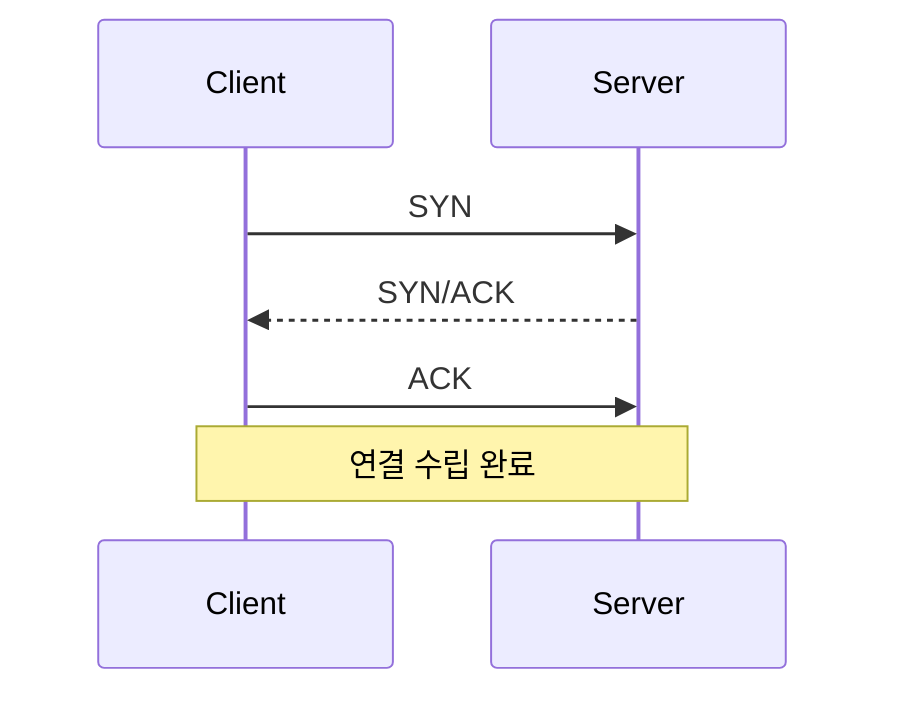

# 32. 네트워크보안 필기집중정리

네트워크보안은 `계층`, `프로토콜`, `공격 단서`, `보안장비 역할`을 연결해서 봐야 점수가 올라갑니다. 단어를 각각 외우면 선택지에서 흔들리고, 로그나 패킷 단서와 연결하면 정답을 고르기 쉬워집니다.

## 네트워크보안 점수 공식


필기에서 먼저 맞혀야 하는 순서는 다음과 같습니다.

1. OSI 7계층과 TCP/IP 계층
2. TCP, UDP, IP, ICMP, ARP, DNS 기능
3. DoS/DDoS, 스캔, 스푸핑, 스니핑, 세션 하이재킹
4. 방화벽, IDS, IPS, VPN, WAF, NAC, UTM, ESM/SIEM
5. NAT, VLAN, 무선, 보안 프로토콜
6. 로그와 패킷에서 공격명 맞히기

## OSI 7계층 빠른 연결

| 계층 | 데이터 단위 | 대표 기술 | 장비/개념 | 공격 단서 |
| --- | --- | --- | --- | --- |
| 7 응용 | 데이터 | HTTP, DNS, SMTP, FTP | WAF, Proxy | SQLi, XSS, DNS 공격, 메일 스푸핑 |
| 6 표현 | 데이터 | 인코딩, 압축, 암호 표현 | TLS 표현 계층 설명 | 인코딩 우회 |
| 5 세션 | 데이터 | 세션 관리 | 세션 유지/종료 | 세션 하이재킹 |
| 4 전송 | 세그먼트/데이터그램 | TCP, UDP | 포트, 방화벽 | SYN Flood, UDP Flood, 포트 스캔 |
| 3 네트워크 | 패킷 | IP, ICMP | 라우터, L3 스위치 | IP Spoofing, Smurf, ICMP Flood |
| 2 데이터링크 | 프레임 | Ethernet, ARP, VLAN | 스위치, 브리지 | ARP Spoofing, MAC Flooding, VLAN Hopping |
| 1 물리 | 비트 | 케이블, 전파 | 허브, 리피터 | 도청, 장애, 물리 침입 |

시험 감각:

- `포트`, `SYN`, `UDP`가 나오면 전송계층부터 봅니다.
- `IP`, `ICMP`, `라우팅`이 나오면 네트워크계층입니다.
- `ARP`, `MAC`, `VLAN`이 나오면 데이터링크 계층입니다.
- `HTTP`, `DNS`, `SMTP`, `FTP`는 응용계층입니다.

## TCP/IP 핵심

### TCP

TCP는 연결형, 신뢰성, 순서 보장, 흐름 제어, 혼잡 제어를 제공합니다.



TCP 문제에서 보는 것:

- SYN만 많고 ACK가 부족하면 SYN Flood를 의심합니다.
- FIN, Xmas, Null 같은 비정상 플래그 조합은 스캔 문제에 나옵니다.
- 포트 번호는 TCP/UDP 서비스를 구분하는 단서입니다.

### UDP

UDP는 비연결형이고 빠르지만 자체 신뢰성은 없습니다.

시험 포인트:

- DNS, DHCP, NTP, SNMP, 스트리밍 등에서 사용됩니다.
- 출발지 위조가 쉬워 반사 증폭 공격에 악용되기 쉽습니다.
- UDP Flood는 대역폭과 처리 자원 소모를 노립니다.

### ICMP

ICMP는 오류 보고와 진단용입니다.

시험 포인트:

- `ping`은 ICMP Echo Request/Reply와 관련됩니다.
- ICMP Flood는 대량 ICMP로 자원을 소모합니다.
- Smurf는 ICMP, 브로드캐스트, 출발지 위조가 핵심입니다.

### ARP

ARP는 IPv4 주소를 MAC 주소로 매핑합니다.

시험 포인트:

- 인증이 없어 ARP Spoofing에 취약합니다.
- ARP Spoofing은 중간자 공격, 스니핑, 세션 탈취로 이어질 수 있습니다.
- 대응은 Dynamic ARP Inspection, DHCP Snooping, 포트 보안, 정적 ARP입니다.

## 주소체계와 서브넷

### 사설 IP 대역

| 대역 | 범위 |
| --- | --- |
| 10.0.0.0/8 | 10.0.0.0 ~ 10.255.255.255 |
| 172.16.0.0/12 | 172.16.0.0 ~ 172.31.255.255 |
| 192.168.0.0/16 | 192.168.0.0 ~ 192.168.255.255 |

### CIDR 감각

| 표기 | 서브넷 마스크 | 주소 수 | 사용 가능 호스트 수 |
| --- | --- | ---: | ---: |
| /24 | 255.255.255.0 | 256 | 254 |
| /25 | 255.255.255.128 | 128 | 126 |
| /26 | 255.255.255.192 | 64 | 62 |
| /27 | 255.255.255.224 | 32 | 30 |
| /28 | 255.255.255.240 | 16 | 14 |
| /29 | 255.255.255.248 | 8 | 6 |
| /30 | 255.255.255.252 | 4 | 2 |

필기에서는 복잡한 계산보다 `CIDR이 작을수록 네트워크가 크다`, `호스트 비트 수가 많을수록 주소가 많다`는 감각이 중요합니다.

### NAT

| 구분 | 설명 | 시험 포인트 |
| --- | --- | --- |
| Static NAT | 1:1 고정 변환 | 서버 공개에 사용 가능 |
| Dynamic NAT | 주소 풀에서 변환 | 동적 매핑 |
| PAT/NAPT | 포트로 여러 내부 주소 구분 | 가정/기업 인터넷 공유 |

함정:

- NAT는 주소 변환 기술입니다.
- 내부 주소가 숨겨지는 효과는 있지만, 방화벽 정책을 완전히 대체하지 않습니다.

## 공격별 단서와 대응

| 공격 | 핵심 단서 | 위험 | 대응 |
| --- | --- | --- | --- |
| SYN Flood | SYN 급증, ACK 부족 | 연결 큐 고갈 | SYN Cookie, rate limit, IPS |
| UDP Flood | UDP 대량 | 대역폭/자원 소모 | 불필요 UDP 차단, 임계치 제한 |
| ICMP Flood | ping 대량 | 자원 소모 | ICMP 제한, rate limit |
| Smurf | ICMP, 브로드캐스트, 출발지 위조 | 피해자에게 응답 집중 | 브로드캐스트 응답 차단 |
| DNS 증폭 | UDP 53, ANY, 오픈 리졸버 | 반사 증폭 | 재귀 질의 제한, rate limit |
| 포트 스캔 | 다수 포트 접근 | 취약 서비스 탐색 | 차단, 배너 숨김, 포트 최소화 |
| ARP Spoofing | IP-MAC 매핑 변경 | MITM, 스니핑 | DAI, 포트 보안, 정적 ARP |
| DNS Spoofing | 잘못된 DNS 응답 | 악성 사이트 유도 | DNSSEC, 안전한 DNS |
| 스니핑 | 평문 트래픽 노출 | 계정/세션 탈취 | TLS, SSH, VPN |
| 세션 하이재킹 | 세션ID 탈취/예측 | 사용자 권한 탈취 | TLS, 쿠키 보호, 재발급 |
| 원격접속 공격 | 로그인 실패 반복, RDP/SSH 공격 | 계정 탈취 | MFA, 허용 IP 제한, 로그 점검 |

## 스캔 유형 빠른 구분

| 스캔 | 특징 | 단서 |
| --- | --- | --- |
| TCP Connect Scan | 완전한 TCP 연결 수립 | 로그에 연결 성공 흔적이 남기 쉬움 |
| SYN Scan | 반만 연결하고 RST | stealth scan으로 언급 |
| FIN Scan | FIN만 전송 | 비정상 플래그 |
| Xmas Scan | FIN, PSH, URG 조합 | 플래그가 켜진 모습이 트리 같다는 표현 |
| Null Scan | 플래그 없음 | 비정상 TCP |
| UDP Scan | UDP 응답/ICMP 오류로 판단 | 느리고 판단이 어려움 |

## 보안장비 비교

| 장비 | 핵심 역할 | 헷갈리는 선택지 |
| --- | --- | --- |
| 방화벽 | 정책 기반 허용/차단 | SQLi 근본 대응으로만 고르면 부족 |
| IDS | 탐지와 경고 | 차단한다고 단정하면 틀림 |
| IPS | 탐지 후 차단 | 오탐 시 정상 트래픽 차단 가능 |
| WAF | 웹 요청/응답 분석 | 네트워크 전체 공격 대응 장비 아님 |
| VPN | 암호화 터널 | 계정 탈취 방어는 MFA 필요 |
| NAC | 단말/사용자 상태 기반 접속 통제 | 방화벽과 목적이 다름 |
| UTM | 여러 보안 기능 통합 | 세부 전문장비보다 단일 성능은 제한 가능 |
| ESM/SIEM | 로그 수집과 상관분석 | 단독 차단 장비 아님 |
| Anti-DDoS | 대량 트래픽 완화 | 정상 트래픽 기준선 필요 |

## 보안 프로토콜

| 프로토콜 | 계층/영역 | 핵심 |
| --- | --- | --- |
| TLS | 전송구간 보호 | 서버 인증, 암호화, 무결성 |
| SSH | 안전한 원격접속 | Telnet 대체, 키 인증 |
| IPsec AH | 네트워크계층 | 인증, 무결성, 암호화 없음 |
| IPsec ESP | 네트워크계층 | 기밀성, 인증/무결성 가능 |
| WPA2/WPA3 | 무선 | 무선 구간 암호화와 인증 |
| DNSSEC | DNS | DNS 응답 무결성/출처 인증 |

함정:

- TLS를 사용해도 피싱 사이트 자체를 막지는 못합니다.
- VPN을 사용해도 계정이 탈취되면 내부 접근 통로가 됩니다.
- AH는 암호화를 제공하지 않습니다.

## VLAN과 무선

### VLAN

VLAN은 논리적 분리 기술입니다. 보안장비 자체는 아니며 VLAN 간 통신 통제에는 ACL이나 방화벽 정책이 필요합니다.

점검 포인트:

- 기본 VLAN 사용 여부
- 트렁크 허용 VLAN 범위
- 미사용 포트 차단
- VLAN Hopping 방지
- 관리망 분리

### 무선

| 항목 | 위험 | 대응 |
| --- | --- | --- |
| WEP | 키 추정 가능 | WPA2/WPA3 |
| 약한 PSK | 대입 공격 | 강한 키, 802.1X |
| Rogue AP | 피싱, MITM | 무선 IDS, AP 목록 관리 |
| 게스트망 미분리 | 내부망 접근 | VLAN 분리, 방화벽 |
| 관리자 기본 암호 | 설정 탈취 | 암호 변경, 관리망 제한 |

## 네트워크 도구

| 도구 | 목적 | 시험 단서 |
| --- | --- | --- |
| ping | 도달성 확인 | ICMP |
| traceroute/tracert | 경로 확인 | TTL, 중간 라우터 |
| arp | ARP 캐시 확인 | ARP Spoofing |
| netstat/ss | 연결/포트 확인 | 수상한 연결 |
| tcpdump | 패킷 캡처 | CLI 캡처 |
| Wireshark | 패킷 상세 분석 | GUI 분석 |
| nslookup/dig | DNS 질의 | DNS 설정 확인 |
| nmap | 포트/서비스 스캔 | 정찰 도구 |

## 네트워크 객관식 함정

| 보기 | 왜 조심해야 하는가 |
| --- | --- |
| NAT는 보안장비이므로 방화벽이 필요 없다 | NAT는 주소 변환이다 |
| IDS는 공격을 자동 차단한다 | IDS는 탐지 중심이다 |
| WAF는 SYN Flood를 근본적으로 막는다 | WAF는 웹 계층 중심이다 |
| VPN이면 내부망 접근통제는 불필요하다 | VPN 계정 탈취와 권한 과다가 남는다 |
| VLAN은 완전한 망분리다 | 논리 분리이며 정책이 필요하다 |
| TLS가 있으면 피싱도 방지된다 | TLS는 통신구간 보호와 서버 인증 중심이다 |
| UDP는 연결이 없어 공격에 안전하다 | 오히려 반사/증폭에 악용되기 쉽다 |

## 마지막 10분 암기

```text
SYN Flood = SYN 많고 ACK 부족
Smurf = ICMP + 브로드캐스트 + 출발지 위조
DNS 증폭 = UDP 53 + 오픈 리졸버 + 큰 응답
ARP Spoofing = IP-MAC 매핑 위조
IDS = 탐지, IPS = 차단, WAF = 웹, NAC = 접속통제
NAT = 주소변환, VLAN = 논리분리, VPN = 암호화 터널
AH = 인증/무결성, ESP = 암호화 가능
WEP = 취약, WPA2/WPA3 = 권장
```
