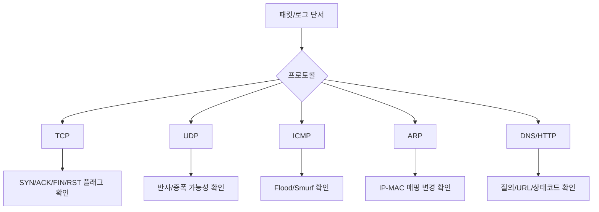
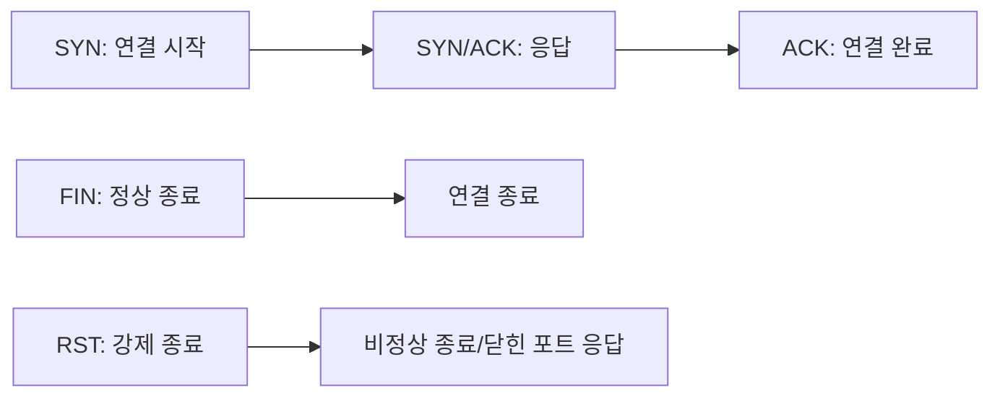
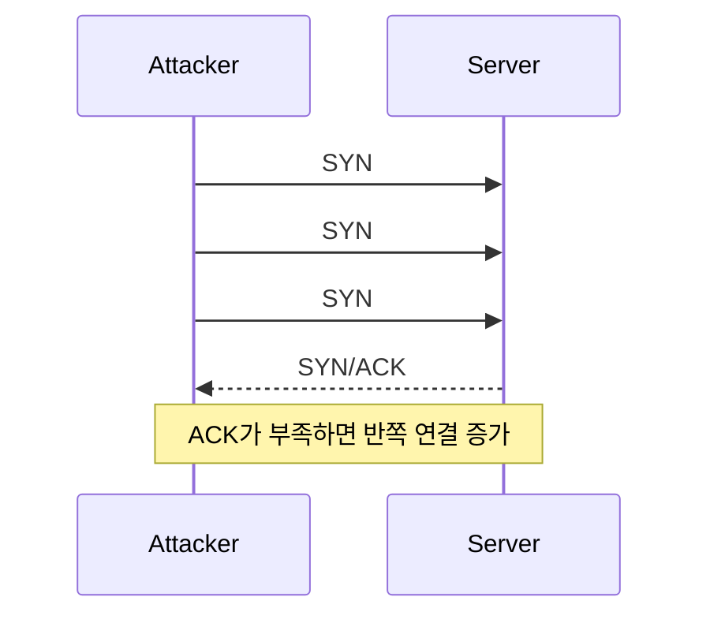
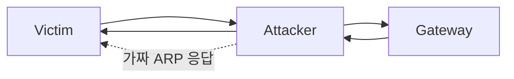
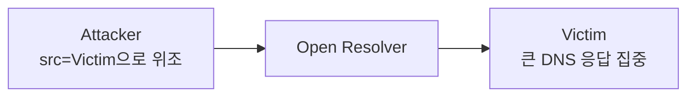
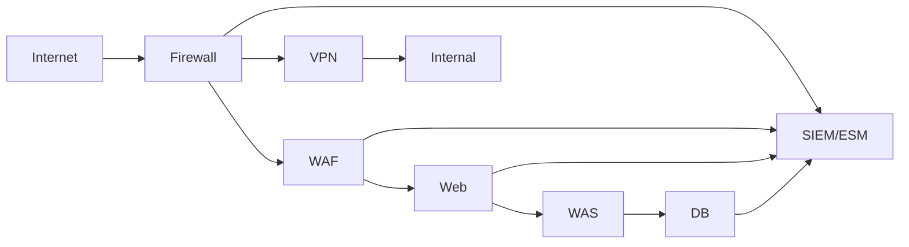

# 34. 네트워크보안 패킷·로그 그림훈련

네트워크보안 문제는 `패킷 단서 -> 공격명 -> 대응`으로 풀면 정답률이 올라갑니다. 이 문서는 필기 선택지와 실기형 로그 해석을 동시에 대비하기 위한 그림 중심 훈련자료입니다.

## 패킷 판단 기본 순서



## TCP 플래그 그림



| 플래그 | 의미 | 공격 연결 |
| --- | --- | --- |
| SYN | 연결 시작 | SYN Flood, SYN Scan |
| ACK | 확인 응답 | 정상 연결 여부 |
| FIN | 연결 종료 | FIN Scan |
| RST | 강제 종료 | 닫힌 포트 응답, 스캔 판단 |
| PSH | 즉시 전달 | Xmas Scan 조합 |
| URG | 긴급 데이터 | Xmas Scan 조합 |

## SYN Flood 판단



로그 단서:

```text
10:01:01 198.51.100.10:44111 -> 10.0.0.5:80 SYN
10:01:01 198.51.100.11:44112 -> 10.0.0.5:80 SYN
10:01:01 198.51.100.12:44113 -> 10.0.0.5:80 SYN
```

판단:

- 짧은 시간에 SYN이 집중됩니다.
- ACK가 뒤따르지 않으면 SYN Flood 가능성이 큽니다.

대응:

- SYN Cookie
- 연결 제한
- rate limit
- IPS/Anti-DDoS 정책
- 상위 회선 사업자 연계

## ARP Spoofing 판단



단서:

```text
정상:
10.0.0.1 -> aa:aa:aa:aa:aa:aa

이상:
10.0.0.1 -> bb:bb:bb:bb:bb:bb
10.0.0.55 -> bb:bb:bb:bb:bb:bb
```

판단:

- 게이트웨이 IP가 공격 의심 단말의 MAC과 매핑되었습니다.
- 피해자 트래픽이 공격자를 경유할 수 있습니다.

대응:

- 의심 단말 격리
- ARP 캐시 확인
- Dynamic ARP Inspection
- DHCP Snooping
- 포트 보안
- 중요 구간 암호화

## DNS 증폭 판단



단서:

```text
query: example.net ANY from 203.0.113.10
query: example.net ANY from 203.0.113.11
query: example.net ANY from 203.0.113.12
```

판단:

- 외부에서 ANY 질의가 반복됩니다.
- 재귀 질의가 외부에 열려 있으면 오픈 리졸버로 악용될 수 있습니다.

대응:

- 재귀 질의 내부 대역 제한
- ANY 응답 제한
- rate limit
- DNS 로그 모니터링

## 포트 스캔 판단

```text
203.0.113.5 -> 10.0.0.10:21 SYN
203.0.113.5 -> 10.0.0.10:22 SYN
203.0.113.5 -> 10.0.0.10:23 SYN
203.0.113.5 -> 10.0.0.10:80 SYN
203.0.113.5 -> 10.0.0.10:443 SYN
203.0.113.5 -> 10.0.0.10:3389 SYN
```

판단:

- 같은 출발지에서 여러 포트로 접근합니다.
- 열린 서비스 탐색 목적의 포트 스캔이 의심됩니다.

대응:

- 스캔 출발지 차단
- 외부 노출 포트 최소화
- 배너 정보 최소화
- 탐지 룰과 임계치 설정
- 취약 서비스 패치

## HTTP Flood 판단

```text
198.51.100.1 - - "GET /index.html HTTP/1.1" 200
198.51.100.2 - - "GET /index.html HTTP/1.1" 200
198.51.100.3 - - "GET /index.html HTTP/1.1" 200
198.51.100.4 - - "GET /index.html HTTP/1.1" 200
```

판단:

- 정상 URL 요청처럼 보이지만 짧은 시간 대량 요청이 발생합니다.
- 출발지가 분산되어 있으면 DDoS 가능성이 커집니다.

대응:

- WAF/CDN/Anti-DDoS 연동
- 요청 빈도 제한
- User-Agent와 쿠키 기반 행위 분석
- 캐싱과 우회 차단
- 정상 사용자 영향 확인

## VPN 이상 접속 판단

```text
09:00 user=lee src=203.0.113.10 country=KR result=success
09:05 user=lee src=198.51.100.20 country=US result=success
09:06 src=vpn-pool dst=10.0.20.5 service=RDP action=allow
```

판단:

- 같은 계정이 짧은 시간에 먼 지역에서 접속했습니다.
- VPN 접속 후 내부 RDP 접근이 이어졌습니다.
- 계정 탈취 가능성을 확인해야 합니다.

대응:

- 세션 종료
- 계정 비밀번호 변경
- MFA 재등록
- 내부 접근 범위 확인
- 지리적 이상접속 탐지

## 방화벽 정책 판단

나쁜 예:

```text
1 allow src=any dst=any service=any log=off
2 deny src=any dst=server service=3389
```

문제:

- 상단의 any-any allow 때문에 아래 deny가 의미 없어질 수 있습니다.
- 로그가 꺼져 있어 추적이 어렵습니다.

좋은 방향:

```text
1 allow src=admin-net dst=server service=ssh log=on expire=2026-06-01
2 allow src=web dst=db service=3306 log=on
3 deny src=any dst=any service=any log=on
```

점검 기준:

- 허용 근거
- 출발지/목적지 최소화
- 포트 최소화
- 정책 순서
- 로그 여부
- 임시 정책 만료일

## 네트워크 장비별 점검 그림



질문이 나오면 이렇게 고릅니다.

| 문제 단서 | 우선 떠올릴 장비 |
| --- | --- |
| IP/Port 허용 차단 | 방화벽 |
| 공격 탐지 경보 | IDS |
| 공격 탐지 후 차단 | IPS |
| SQLi/XSS/웹 요청 | WAF |
| 외부에서 내부망 접속 | VPN |
| 단말 보안상태 검사 | NAC |
| 로그 상관분석 | SIEM/ESM |
| 대량 트래픽 완화 | Anti-DDoS |

## 상태코드와 네트워크 로그

| 코드 | 의미 | 네트워크/보안 판단 |
| --- | --- | --- |
| 200 | 성공 | 공격 요청 성공 여부 확인 |
| 301/302 | 리다이렉트 | 피싱/우회 여부는 추가 확인 |
| 400 | 잘못된 요청 | 스캐너/비정상 페이로드 가능 |
| 401 | 인증 필요 | 로그인 공격과 연결 |
| 403 | 금지/차단 | WAF/권한 정책 차단 가능 |
| 404 | 없음 | 경로 탐색/스캔 가능 |
| 500 | 서버 오류 | 공격 시도에 따른 오류 가능 |

## 20개 빠른 판별 훈련

| 번호 | 단서 | 판단 |
| --- | --- | --- |
| 1 | SYN 많고 ACK 부족 | SYN Flood |
| 2 | ICMP + 브로드캐스트 + 출발지 위조 | Smurf |
| 3 | UDP 53 + ANY 질의 + 큰 응답 | DNS 증폭 |
| 4 | IP-MAC 매핑 변경 | ARP Spoofing |
| 5 | 여러 포트 순차 접근 | 포트 스캔 |
| 6 | FIN/PSH/URG 조합 | Xmas Scan |
| 7 | 플래그 없음 | Null Scan |
| 8 | FIN만 반복 | FIN Scan |
| 9 | HTTP GET 대량 | HTTP Flood |
| 10 | 긴 무작위 DNS 질의 반복 | DNS 터널링 |
| 11 | 같은 VPN 계정의 불가능한 이동 | 계정 탈취 의심 |
| 12 | any-any allow 상단 정책 | 과도한 허용 |
| 13 | WEP 사용 | 무선 암호 취약 |
| 14 | SNMP public 사용 | 장비 정보 노출 |
| 15 | 게스트망에서 내부 DB 접근 | 망분리 미흡 |
| 16 | WAF SQLi 차단 + 403 | 공격 차단 가능성 |
| 17 | 웹셸 의심 URL + 200 | 실행 성공 가능성 확인 |
| 18 | 외부 재귀 DNS 허용 | 오픈 리졸버 |
| 19 | 관리 페이지 인터넷 노출 | 관리자 탈취 위험 |
| 20 | 미인가 MAC 다수 학습 | MAC Flooding/미인가 단말 |

## 시험장용 압축 문장

```text
네트워크 문제는 공격명보다 단서를 먼저 본다.
SYN/ACK/FIN/RST는 TCP, UDP 53은 DNS, ARP는 MAC 매핑, ICMP는 ping과 Smurf다.
장비는 방화벽=정책, IDS=탐지, IPS=차단, WAF=웹, VPN=터널, NAC=접속통제, SIEM=상관분석이다.
```
